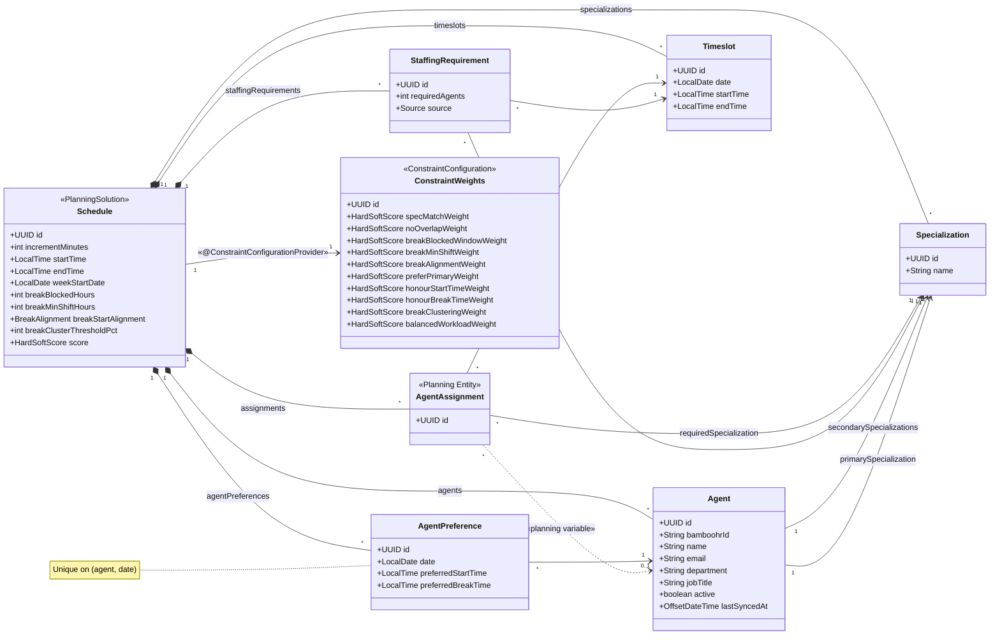

# WFM Service — System Specification

## 1. Overview

WFM Service is a workforce management system that allocates **agents** to **timeslots** using constraint-based optimisation. The solver is powered by [Timefold](https://timefold.ai/) (Java). The application exposes a REST API via Spring Boot and persists state in PostgreSQL. Agent data is sourced from **BambooHR** via its REST API and synchronised into the local database.

## 2. Tech Stack

| Layer | Technology |
|---|---|
| UI | React |
| API / Controllers | Spring Boot (Java 21+) |
| Business Logic / Services | Spring Boot |
| ORM | Hibernate (via Spring Data JPA) |
| Database | PostgreSQL |
| Solver | Timefold Solver (Java) |
| Agent Data Source | BambooHR REST API |

## 3. Architecture

```
                    ┌─────────────────────────────────────────────┐
┌───────────┐       │              Spring Boot                    │       ┌────────────┐
│           │       │                                             │       │            │
│   React   │◄─JSON─┤  Controller ─► Service ─► Repository       │◄─JPA──┤ PostgreSQL │
│           │       │                  │                          │       │            │
└───────────┘       │            Timefold Solver                  │       └────────────┘
                    │                  │                          │
                    │         BambooHR Client (sync)              │
                    └──────────────────┼──────────────────────────┘
                                       │
                                       ▼
                                ┌─────────────┐
                                │  BambooHR   │
                                │  REST API   │
                                └─────────────┘
```

The backend is organised into three packages mirroring the standard layered pattern:

- **`model`** — JPA entities and Timefold planning model annotations.
- **`service`** — Business logic, solver lifecycle management, and transaction orchestration.
- **`controller`** — REST endpoints that accept and return JSON.

## 4. Solver Inputs

Each solve run is configured by a set of inputs that define the problem space. These inputs are provided by the user before the solver is invoked.

### 4.1 Timeslot Increment

All timeslots in a given solution share a uniform duration. Supported values:

| Increment | Example slots (8 am–9 am) |
|---|---|
| 15 minutes | 08:00–08:15, 08:15–08:30, 08:30–08:45, 08:45–09:00 |
| 30 minutes | 08:00–08:30, 08:30–09:00 |
| 60 minutes | 08:00–09:00 |

### 4.2 Time Range

The contiguous window of time to be covered, expressed as a start time and end time (e.g. 08:00–18:00). Timeslots are **generated** by subdividing this range into intervals of the configured increment. For example, 08:00–18:00 at 15-minute increments produces 40 timeslots per day.

### 4.3 Specializations

Each agent has one primary and one or more secondary specialization assignments:

- **Primary specialization** — the agent's main area of expertise (exactly one).
- **Secondary specializations** — additional areas the agent can cover (one or more).

The set of available specializations is an input (e.g. "Billing", "Technical Support", "Sales"). Each timeslot may require coverage from multiple specializations simultaneously; the solver prefers assigning agents whose primary specialization matches the need, but may fall back to any of their secondary specializations.

### 4.4 Staffing Demand

The number of agents required **per timeslot, per specialization**. Because call volumes vary throughout the day, staffing demand is expressed at timeslot granularity — not as a flat daily total. This allows peak periods to be staffed more heavily than quiet periods.

| Field | Example |
|---|---|
| Timeslot | Monday 09:00–09:15 |
| Specialization | Billing |
| Required agents | 8 |

Demand can be:

1. **Directly input** — the customer provides agent counts per timeslot per specialization.
2. **Calculated via Erlang X** — derived from forecasted call volume per interval, average handle time (AHT), caller patience (abandonment), retry rate, and target service level. Erlang X accounts for caller abandonment and redials, producing more accurate staffing numbers than Erlang C. The calculation is performed per timeslot before the solver is invoked.

### 4.5 Agent Preferences

Agents may submit preferences for each day of the upcoming week. These are **soft inputs** — the solver tries to honour them but will override them when staffing demands require it. Two preferences are supported:

- **Preferred start time** — the time the agent would like their first assignment to begin (e.g. 09:00). The solver attempts to avoid assigning the agent to timeslots before this time.
- **Preferred break time** — the time the agent would like a break (e.g. 12:00). The solver attempts to leave the agent unassigned during timeslots that overlap this time.

Preferences are optional. An agent with no submitted preferences is scheduled purely based on staffing demand and hard constraints.

| Field | Example |
|---|---|
| Agent | Jane Smith |
| Date | Monday |
| Preferred start | 09:00 |
| Preferred break | 12:30 |

### 4.6 Break Rules

Configurable rules that govern when an agent may take a break. A "break" is a gap — one or more consecutive timeslots during an agent's shift where they are not assigned. An agent's **shift** on a given day is defined as the span from their earliest assignment to their latest assignment.

#### 4.6.1 Blocked window (hard)

By default, the first **1 hour** and last **1 hour** of an agent's shift are blocked — no break may occur during these periods. The blocked duration is configurable per schedule.

Example: an agent's shift runs 08:00–17:00. Breaks are forbidden before 09:00 and after 16:00; the eligible break window is 09:00–16:00.

#### 4.6.2 Minimum shift duration (hard)

Breaks are not permitted if an agent's shift is shorter than **4 hours**. This threshold is configurable per schedule.

#### 4.6.3 Break start alignment (hard)

The break start time must align to a configured boundary:

| Setting | Allowed break starts (examples) |
|---|---|
| `ON_HOUR` | 10:00, 11:00, 12:00 |
| `ON_HALF_HOUR` | 10:00, 10:30, 11:00, 11:30 |
| `ON_QUARTER_HOUR` | 10:00, 10:15, 10:30, 10:45 |

The default is `ON_HALF_HOUR`. An agent's preferred break time (section 4.5) must conform to the active alignment — the system validates or rounds at input time.

#### 4.6.4 Break clustering penalty (soft)

When too many agents take their break during the same timeslot, coverage suffers. A soft penalty is applied when the number of agents on break in a single timeslot exceeds a configurable threshold (expressed as a percentage of agents on shift that day, default **20%**). The penalty scales with the number of agents over the threshold.

### 4.7 Constraint Weights

Each constraint (section 6) has an associated **weight** that controls how much a violation affects the solver score. Weights are stored per tenant and loaded as part of the planning solution via Timefold's `@ConstraintConfiguration` mechanism.

Weights allow per-tenant customisation without changing constraint code:

- **Disable a constraint** — set its weight to zero.
- **Prioritise constraints** — give one soft constraint a weight of 10 and another a weight of 1.
- **Promote soft to hard (or vice versa)** — change a weight from `HardSoftScore.ofSoft(n)` to `HardSoftScore.ofHard(n)`.

The constraint table in section 6 documents the **default** level and weight for each constraint. A tenant's saved weights override these defaults at solve time.

## 5. Domain Model



### 5.1 Specialization

A reference entity representing a named area of expertise (e.g. "Billing", "Technical Support", "Sales"). The set of specializations is configured as a solver input.

| Field | Type | Notes |
|---|---|---|
| `id` | `UUID` | Primary key |
| `name` | `String` | Unique specialization name |

### 5.2 Agent

An agent is a person who can be assigned to work during one or more timeslots. Agent records are imported from BambooHR and treated as **read-only** within this system, except for specialization assignments which are managed locally.

| Field | Type | Notes |
|---|---|---|
| `id` | `UUID` | Primary key (internal) |
| `bamboohrId` | `String` | BambooHR employee id (unique, external key) |
| `name` | `String` | Display name (from BambooHR) |
| `email` | `String` | Work email (from BambooHR) |
| `department` | `String` | Department (from BambooHR) |
| `jobTitle` | `String` | Job title (from BambooHR) |
| `primarySpecialization` | `Specialization` | Main area of expertise (managed locally) |
| `secondarySpecializations` | `List<Specialization>` | Additional areas the agent can cover (managed locally, one or more) |
| `active` | `boolean` | Whether the employee is active in BambooHR |
| `lastSyncedAt` | `OffsetDateTime` | Timestamp of last successful sync |

### 5.3 Timeslot

A timeslot is a single time interval within the coverage window. Timeslots are **generated** from the configured time range and increment — they are not created manually. A timeslot is specialization-agnostic; multiple agents with different specializations may be needed in the same timeslot.

| Field | Type | Notes |
|---|---|---|
| `id` | `UUID` | Primary key |
| `date` | `LocalDate` | The day this slot belongs to |
| `startTime` | `LocalTime` | Start of the interval |
| `endTime` | `LocalTime` | End of the interval |

### 5.4 StaffingRequirement

Represents the demand for a given specialization in a given timeslot. There is one StaffingRequirement per timeslot/specialization combination. Each row directly states how many concurrent agents are needed, enabling non-uniform staffing across the day.

| Field | Type | Notes |
|---|---|---|
| `id` | `UUID` | Primary key |
| `timeslot` | `Timeslot` | The specific interval |
| `specialization` | `Specialization` | Which specialization is needed |
| `requiredAgents` | `int` | Number of concurrent agents needed |
| `source` | `enum(DIRECT, ERLANG_X)` | How the value was determined |

**Generating seats:** For each StaffingRequirement, the system creates `requiredAgents` AgentAssignment instances for that timeslot and specialization. This is a direct 1-to-N expansion — no averaging or division needed.

Example: Monday 09:00–09:15 needs 8 Billing agents and 3 Tech Support agents → the system generates **8 + 3 = 11 AgentAssignment** instances for that single timeslot. Across 40 timeslots in a day, the total seat count varies per slot based on the individual StaffingRequirement values.

### 5.5 AgentAssignment (Planning Entity)

The central Timefold planning entity. Each instance represents one **seat** — a need for one agent with a particular specialization in a particular timeslot. The solver decides which agent fills each seat.

Multiple AgentAssignment instances may reference the same timeslot, each for a different (or the same) specialization. This is how a single timeslot is staffed by several agents across multiple specializations.

| Field | Type | Notes |
|---|---|---|
| `id` | `UUID` | Primary key |
| `timeslot` | `Timeslot` | The time interval to fill |
| `requiredSpecialization` | `Specialization` | The specialization this seat demands |
| `agent` | `Agent` | **Planning variable** — assigned by the solver |

### 5.6 AgentPreference

An agent's scheduling preferences for a specific day. These are loaded as problem facts and referenced by soft constraints during solving.

| Field | Type | Notes |
|---|---|---|
| `id` | `UUID` | Primary key |
| `agent` | `Agent` | The agent expressing the preference |
| `date` | `LocalDate` | The day the preference applies to |
| `preferredStartTime` | `LocalTime` | Desired start of first assignment (nullable) |
| `preferredBreakTime` | `LocalTime` | Desired break time (nullable) |

A unique constraint on (`agent`, `date`) ensures one preference record per agent per day.

### 5.7 ConstraintWeights

A Timefold `@ConstraintConfiguration` class that holds a `@ConstraintWeight` field for every constraint defined in section 6. Persisted per tenant so each tenant can tune solver behaviour independently.

| Field | Type | Default | Notes |
|---|---|---|---|
| `id` | `UUID` | — | Primary key |
| `specMatchWeight` | `HardSoftScore` | `hard(1)` | Specialization match |
| `noOverlapWeight` | `HardSoftScore` | `hard(1)` | No overlapping assignments |
| `breakBlockedWindowWeight` | `HardSoftScore` | `hard(1)` | Break blocked window |
| `breakMinShiftWeight` | `HardSoftScore` | `hard(1)` | Break minimum shift |
| `breakAlignmentWeight` | `HardSoftScore` | `hard(1)` | Break start alignment |
| `preferPrimaryWeight` | `HardSoftScore` | `soft(1)` | Prefer primary specialization |
| `honourStartTimeWeight` | `HardSoftScore` | `soft(1)` | Honour preferred start time |
| `honourBreakTimeWeight` | `HardSoftScore` | `soft(1)` | Honour preferred break time |
| `breakClusteringWeight` | `HardSoftScore` | `soft(2)` | Break clustering |
| `balancedWorkloadWeight` | `HardSoftScore` | `soft(1)` | Balanced workload |

The "One agent per seat" constraint is structural (enforced by the planning variable) and has no configurable weight.

### 5.8 Schedule (Planning Solution)

The top-level Timefold `@PlanningSolution` that aggregates all facts and planning entities for a single solve run.

| Field | Type | Notes |
|---|---|---|
| `id` | `UUID` | Primary key |
| `incrementMinutes` | `int` | 15, 30, or 60 |
| `startTime` | `LocalTime` | Coverage window start |
| `endTime` | `LocalTime` | Coverage window end |
| `weekStartDate` | `LocalDate` | Monday of the target week |
| `breakBlockedHours` | `int` | Hours blocked at start and end of shift for breaks (default 1) |
| `breakMinShiftHours` | `int` | Minimum shift length in hours before breaks are allowed (default 4) |
| `breakStartAlignment` | `enum(ON_HOUR, ON_HALF_HOUR, ON_QUARTER_HOUR)` | Required alignment for break start times (default `ON_HALF_HOUR`) |
| `breakClusterThresholdPct` | `int` | Max percentage of on-shift agents on break per timeslot before soft penalty applies (default 20) |
| `constraintWeights` | `ConstraintWeights` | `@ConstraintConfigurationProvider` — per-tenant weights applied at solve time |
| `specializations` | `List<Specialization>` | Problem facts |
| `agents` | `List<Agent>` | Problem facts |
| `staffingRequirements` | `List<StaffingRequirement>` | Problem facts |
| `agentPreferences` | `List<AgentPreference>` | Problem facts |
| `timeslots` | `List<Timeslot>` | Generated problem facts |
| `assignments` | `List<AgentAssignment>` | Planning entities |
| `score` | `HardSoftScore` | Populated by solver |

## 6. Constraints

Constraints are defined in a `ConstraintProvider` implementation. The **Level** column shows the default; per-tenant `ConstraintWeights` (section 5.7) can override levels and magnitudes at solve time.

| Constraint | Default Level | Description |
|---|---|---|
| Specialization match | Hard | An agent's primary specialization or one of their secondary specializations must match the assignment's required specialization. |
| No overlapping assignments | Hard | An agent cannot be assigned to two seats whose timeslots overlap in time on the same day. |
| One agent per seat | Hard | Each AgentAssignment (seat) is filled by exactly one agent (enforced by the planning variable). |
| Break blocked window | Hard | An agent's break must not fall within the first or last N hours of their shift (configurable, default 1 hour). |
| Break minimum shift | Hard | An agent whose shift is shorter than the configured threshold (default 4 hours) must not have a break. |
| Break start alignment | Hard | A break must start on a timeslot boundary that matches the configured alignment (hour, half-hour, or quarter-hour). |
| Prefer primary specialization | Soft | Prefer assigning agents to seats matching their primary specialization over any of their secondary specializations. |
| Honour preferred start time | Soft | Penalise assigning an agent to a timeslot that starts before their preferred start time on that day. |
| Honour preferred break time | Soft | Penalise assigning an agent to a timeslot that overlaps their preferred break time on that day. |
| Break clustering | Soft | Penalise when the number of agents on break in a single timeslot exceeds the configured threshold percentage of agents on shift. Penalty scales with excess. |
| Balanced workload | Soft | Prefer an even distribution of assignments across agents. |

## 7. API

All endpoints are served under the base path `/api/v1`.

### 7.1 Agents

Agent records originate from BambooHR. The API is read-only except for local specialization assignments.

| Method | Path | Description |
|---|---|---|
| `GET` | `/agents` | List all agents |
| `GET` | `/agents/{id}` | Get agent by id |
| `PUT` | `/agents/{id}/specializations` | Set primary and secondary specializations for an agent |
| `POST` | `/agents/sync` | Trigger an on-demand sync from BambooHR |

### 7.2 Specializations

| Method | Path | Description |
|---|---|---|
| `GET` | `/specializations` | List all specializations |
| `POST` | `/specializations` | Create specialization |
| `DELETE` | `/specializations/{id}` | Delete specialization |

### 7.3 Agent Preferences

| Method | Path | Description |
|---|---|---|
| `GET` | `/agents/{id}/preferences` | List preferences for an agent (optionally filtered by date range) |
| `PUT` | `/agents/{id}/preferences` | Create or update preferences for an agent (batch by week) |

### 7.4 Constraint Weights

| Method | Path | Description |
|---|---|---|
| `GET` | `/constraint-weights` | Get the current tenant's constraint weights |
| `PUT` | `/constraint-weights` | Update constraint weights (partial updates allowed; omitted fields keep defaults) |

### 7.5 Staffing Requirements

| Method | Path | Description |
|---|---|---|
| `GET` | `/staffing-requirements` | List all staffing requirements |
| `POST` | `/staffing-requirements` | Create or update requirements (batch by week) |
| `POST` | `/staffing-requirements/erlang-x` | Calculate per-timeslot requirements from Erlang X inputs (call volume forecast, AHT, patience, retry rate, service level) |

### 7.6 Solver

| Method | Path | Description |
|---|---|---|
| `POST` | `/schedules/solve` | Start a solve run (async). Accepts solver inputs. Returns schedule id. |
| `GET` | `/schedules/{id}` | Get schedule with output views: staffing summary, agent schedule, preference report, and constraint violations (section 8). |
| `PUT` | `/schedules/{id}/stop` | Terminate a running solve early. |
| `GET` | `/schedules/{id}/export` | Download schedule as a multi-tab `.xlsx` spreadsheet (section 8.5). |

## 8. Schedule Output

When a solve completes (or while in progress), `GET /schedules/{id}` returns the full schedule along with derived output views. These views are also available as a multi-tab spreadsheet export.

### 8.1 Staffing Summary

A per-day comparison of **predicted** staffing hours (derived from staffing requirements) versus **actual** staffing hours (derived from agent assignments).

| Field | Type | Description |
|---|---|---|
| `date` | `LocalDate` | Day of the week |
| `specialization` | `String` | Specialization name |
| `predictedHours` | `BigDecimal` | Sum of `requiredAgents × incrementMinutes / 60` across all timeslots for that day and specialization |
| `actualHours` | `BigDecimal` | Sum of `(assigned agents) × incrementMinutes / 60` across all timeslots for that day and specialization |
| `deltaHours` | `BigDecimal` | `actualHours − predictedHours` (positive = overstaffed, negative = understaffed) |
| `coveragePct` | `BigDecimal` | `actualHours / predictedHours × 100` |

A `totals` row per day aggregates across all specializations. A weekly grand-total row aggregates across all days.

### 8.2 Agent Schedule

A per-agent, per-day view of every assignment, the specialization used, and break periods.

Each entry in the list represents one agent-day:

| Field | Type | Description |
|---|---|---|
| `agent` | `Agent` | The assigned agent |
| `date` | `LocalDate` | Day |
| `shiftStart` | `LocalTime` | Start time of earliest assignment |
| `shiftEnd` | `LocalTime` | End time of latest assignment |
| `totalHours` | `BigDecimal` | Total assigned hours (excluding breaks) |
| `assignments` | `List<SlotDetail>` | Ordered list of timeslot assignments |
| `breaks` | `List<BreakDetail>` | Gaps within the shift where the agent is unassigned |

**SlotDetail:**

| Field | Type | Description |
|---|---|---|
| `timeslot` | `Timeslot` | The assigned timeslot |
| `requiredSpecialization` | `String` | Specialization the seat demanded |
| `matchType` | `enum(PRIMARY, SECONDARY)` | Whether the agent's primary or secondary specialization was used |

**BreakDetail:**

| Field | Type | Description |
|---|---|---|
| `startTime` | `LocalTime` | Break start |
| `endTime` | `LocalTime` | Break end |
| `durationMinutes` | `int` | Break length |

### 8.3 Preference Report

A per-agent, per-day report showing which preferences were honoured and which were overridden.

| Field | Type | Description |
|---|---|---|
| `agent` | `Agent` | The agent |
| `date` | `LocalDate` | Day |
| `preferredStartTime` | `LocalTime` | Submitted preference (null if none) |
| `actualStartTime` | `LocalTime` | Earliest assignment start time |
| `startTimeHonoured` | `boolean` | `true` if `actualStartTime >= preferredStartTime` (or no preference was set) |
| `preferredBreakTime` | `LocalTime` | Submitted preference (null if none) |
| `actualBreakTime` | `LocalTime` | Start of actual break closest to the preferred time (null if no break) |
| `breakTimeHonoured` | `boolean` | `true` if the agent's break overlaps the preferred break timeslot (or no preference was set) |

Summary counters are included at the schedule level:

| Field | Type | Description |
|---|---|---|
| `totalPreferences` | `int` | Total agent-day preferences submitted |
| `startTimeHonouredCount` | `int` | Number where start time was respected |
| `breakTimeHonouredCount` | `int` | Number where break time was respected |
| `overallHonouredPct` | `BigDecimal` | Percentage of all preference fields honoured |

### 8.4 Constraint Violations

A breakdown of every constraint violation in the current best solution, grouped by constraint and score level.

| Field | Type | Description |
|---|---|---|
| `constraint` | `String` | Constraint name (matches section 6 names) |
| `level` | `enum(HARD, SOFT)` | Score level of the violation |
| `weight` | `HardSoftScore` | Active weight from ConstraintWeights |
| `violationCount` | `int` | Number of times this constraint was violated |
| `totalPenalty` | `HardSoftScore` | `weight × violationCount` — total score impact |
| `violations` | `List<ViolationDetail>` | Individual violation instances |

**ViolationDetail:**

| Field | Type | Description |
|---|---|---|
| `agent` | `Agent` | Affected agent (if applicable) |
| `timeslot` | `Timeslot` | Affected timeslot (if applicable) |
| `description` | `String` | Human-readable explanation (e.g. "Agent Jane Smith assigned to Billing but has no matching specialization") |

The response also includes score totals:

| Field | Type | Description |
|---|---|---|
| `hardScore` | `int` | Total hard score (0 = all hard constraints satisfied) |
| `softScore` | `int` | Total soft score (higher = better) |
| `feasible` | `boolean` | `true` if `hardScore == 0` |

### 8.5 Spreadsheet Export

The schedule can be exported as a multi-tab spreadsheet (`.xlsx`). Each tab corresponds to one of the output views above.

| Tab | Contents | Source |
|---|---|---|
| **Staffing Summary** | Predicted vs actual hours per day per specialization, with totals | Section 8.1 |
| **Agent Schedule** | One row per agent per timeslot: agent name, date, timeslot start/end, specialization, match type (primary/secondary), and a "Break" flag for gap slots | Section 8.2 |
| **Preference Report** | One row per agent per day: preferences submitted, actual values, honoured flags | Section 8.3 |

Constraint violations (section 8.4) are not included in the spreadsheet — they are diagnostic data consumed via the API and displayed in the UI.

Export is triggered via a dedicated endpoint (see section 7.6). The response streams the `.xlsx` file with `Content-Type: application/vnd.openxmlformats-officedocument.spreadsheetml.sheet`.

## 9. BambooHR Integration

### 9.1 Overview

Agent data is sourced from BambooHR via its REST API. The integration keeps the local `agent` table in sync with the BambooHR employee directory.

### 9.2 Data Source

Initially the BambooHR client will operate against an **in-memory mock** that returns static employee data. This allows development and testing to proceed without a live BambooHR account. The mock will be swapped for a real HTTP client behind a common interface when credentials are available.

### 9.3 Client Interface

```java
public interface BambooHRClient {
    List<BambooEmployee> listEmployees();
    BambooEmployee getEmployee(String bamboohrId);
}
```

Two implementations:

| Implementation | Purpose |
|---|---|
| `MockBambooHRClient` | Returns hard-coded employee data from memory. Active by default via a Spring profile (`bamboohr.mock=true`). |
| `HttpBambooHRClient` | Calls the live BambooHR REST API. Activated when `bamboohr.mock=false` and credentials are configured. |

### 9.4 Sync Behaviour

- **Scheduled sync** — A `@Scheduled` job runs at a configurable interval (default: every 6 hours) and calls `BambooHRClient.listEmployees()`.
- **On-demand sync** — `POST /api/v1/agents/sync` triggers an immediate sync.
- **Upsert logic** — Employees are matched by `bamboohrId`. New employees are inserted; existing employees have their name, email, department, and job title updated. Employees no longer present in BambooHR are marked `active = false` (soft-delete).
- **Specializations are preserved** — Locally assigned specializations are never overwritten by a sync.

### 9.5 Configuration

| Property | Description | Default |
|---|---|---|
| `bamboohr.mock` | Use in-memory mock client | `true` |
| `bamboohr.api-key` | BambooHR API key (required when mock=false) | — |
| `bamboohr.subdomain` | BambooHR company subdomain | — |
| `bamboohr.sync-cron` | Cron expression for scheduled sync | `0 0 */6 * * *` |

## 10. Package Layout

```
src/main/java/com/wfm/
├── model/
│   ├── Specialization.java
│   ├── Agent.java
│   ├── Timeslot.java
│   ├── StaffingRequirement.java
│   ├── AgentPreference.java
│   ├── AgentAssignment.java
│   ├── ConstraintWeights.java
│   └── Schedule.java
├── repository/
│   ├── SpecializationRepository.java
│   ├── AgentRepository.java
│   ├── AgentPreferenceRepository.java
│   ├── TimeslotRepository.java
│   ├── StaffingRequirementRepository.java
│   ├── ConstraintWeightsRepository.java
│   └── ScheduleRepository.java
├── service/
│   ├── AgentService.java
│   ├── AgentPreferenceService.java
│   ├── SpecializationService.java
│   ├── ConstraintWeightsService.java
│   ├── StaffingRequirementService.java
│   ├── TimeslotGeneratorService.java
│   ├── ErlangXService.java
│   ├── ScheduleOutputService.java
│   ├── ScheduleExportService.java
│   └── SolverService.java
├── controller/
│   ├── AgentController.java
│   ├── SpecializationController.java
│   ├── StaffingRequirementController.java
│   ├── ConstraintWeightsController.java
│   └── ScheduleController.java
├── integration/
│   ├── BambooHRClient.java
│   ├── BambooEmployee.java
│   ├── MockBambooHRClient.java
│   ├── HttpBambooHRClient.java
│   └── BambooSyncService.java
├── solver/
│   └── ScheduleConstraintProvider.java
└── WfmApplication.java
```

## 11. Database

PostgreSQL is the sole data store. Hibernate generates the schema from the JPA entity annotations. A migration tool (Flyway or Liquibase) should be added before the first production deployment.

### Key tables

- `specialization`
- `agent` (FK → `specialization` for primary)
- `agent_secondary_specialization` (join table: FK → `agent`, FK → `specialization`)
- `agent_preference` (FK → `agent`, unique on `agent` + `date`)
- `timeslot`
- `staffing_requirement` (FK → `timeslot`, FK → `specialization`)
- `agent_assignment` (FK → `timeslot`, FK → `specialization`, FK → `agent`)
- `constraint_weights` (one row per tenant; FK from `schedule`)
- `schedule` (FK → `constraint_weights`)

## 12. React UI

The React front end communicates exclusively through the REST API described in section 7. Core views:

| View | Purpose |
|---|---|
| Agent list | View agents synced from BambooHR; assign primary specialization and one or more secondary specializations; submit start-time and break-time preferences per day |
| Specializations | Manage the list of available specializations |
| Staffing requirements | Enter or calculate (Erlang X) required agents per timeslot per specialization |
| Constraint weights | View and adjust per-tenant constraint weights |
| Schedule | Configure solver inputs (increment, time range), trigger a solve, view resulting assignments |
| Schedule results | After a solve, displays tabbed sub-views for: **Staffing Summary** (predicted vs actual hours), **Agent Schedule** (per-agent timeslot grid with specialization match type and breaks), **Preference Report** (honoured/overridden preferences per agent), and **Constraint Violations** (hard/soft breakdown with scores). Includes an "Export to Excel" button that downloads the `.xlsx` spreadsheet (section 8.5). |

## 13. Open Questions

- Authentication and authorisation mechanism (e.g. Spring Security + OAuth2).
- Solver time limit and termination strategy defaults.
- Multi-tenancy requirements.
- Deployment topology (single JAR, containers, cloud provider).
- Erlang X input parameters to expose (call volume forecast per interval, AHT, caller patience, retry rate, service level target).
