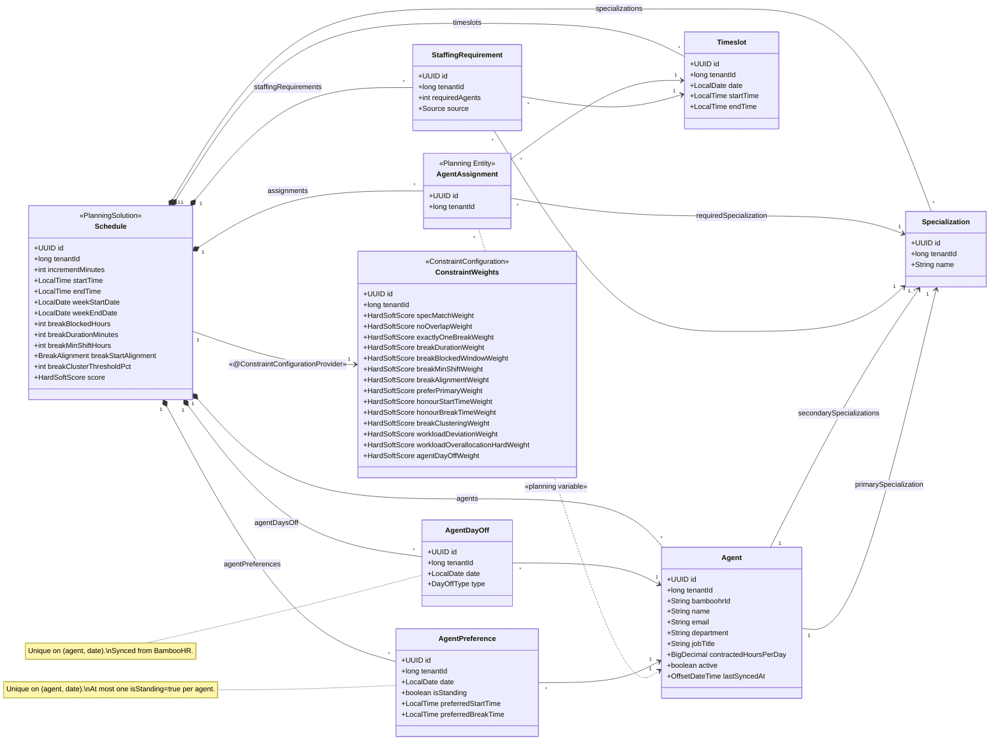

# WFM Service — System Specification

## 1. Overview

WFM Service is a workforce management system that allocates **agents** to **timeslots** using constraint-based optimisation. The solver is powered by [Timefold](https://timefold.ai/) (Java). The application exposes a REST API via Spring Boot and persists state in PostgreSQL. Agent data is sourced from **BambooHR** via its REST API and synchronised into the local database.

The service is **multi-tenant**. Tenant identity and authentication are managed by an external **AI service platform** (a separate project, out of scope for this document). Every API request includes a `tenant_id` (`BIGINT`) provided by the platform. All data is isolated per tenant at the database level — see section 3.1.

### Assumptions

1. Agents work a contiguous block of hours each day (their "shift"), which includes a break.
2. Each agent has exactly one primary specialization and one or more secondary specializations.
3. The time period to be scheduled is made up of a contiguous sequence of timeslots.
4. The solver will be configured to solve for a maximum of five minutes per run.
5. All times are in a single tenant-local time zone. No time zone conversion or storage is performed. Multi-zone tenants are out of scope.

## 2. Tech Stack

| Layer | Technology |
|---|---|
| UI | React |
| API / Controllers | Spring Boot (Java 21+) |
| Business Logic / Services | Spring Boot |
| ORM | Hibernate (via Spring Data JPA) |
| Database | PostgreSQL |
| Solver | Timefold Solver (Java) |
| Agent Data Source | BambooHR REST API |

## 3. Architecture

```
                    ┌─────────────────────────────────────────────┐
┌───────────┐       │              Spring Boot                    │       ┌────────────┐
│           │       │                                             │       │            │
│   React   │◄─JSON─┤  Controller ─► Service ─► Repository       │◄─JPA──┤ PostgreSQL │
│           │       │                  │                          │       │            │
└───────────┘       │            Timefold Solver                  │       └────────────┘
                    │                  │                          │
                    │         BambooHR Client (sync)              │
                    └──────────────────┼──────────────────────────┘
                                       │
                                       ▼
                                ┌─────────────┐
                                │  BambooHR   │
                                │  REST API   │
                                └─────────────┘
```

The backend is organised into three packages mirroring the standard layered pattern:

- **`model`** — JPA entities and Timefold planning model annotations.
- **`service`** — Business logic, solver lifecycle management, and transaction orchestration.
- **`controller`** — REST endpoints that accept and return JSON.

### 3.1 Multi-Tenancy

All data is scoped to a tenant via a `tenant_id` column (`BIGINT`) present on every tenant-owned table. The value is assigned and supplied by the external AI service platform — WFM Service never generates tenant ids itself.

- **Inbound requests** — The platform authenticates each request and forwards the resolved `tenant_id` to WFM Service (e.g. via a request header or token claim). The exact mechanism is owned by the platform and is out of scope for this document.
- **Data isolation** — Every query filters by `tenant_id`. An entity created by one tenant is never visible to another.
- **Database strategy** — Shared schema, shared tables, discriminated by `tenant_id`. No per-tenant schemas or databases.

## 4. Solver Inputs

Each solve run is configured by a set of inputs that define the problem space. These inputs are provided by the user before the solver is invoked.

### 4.1 Timeslot Increment

All timeslots in a given solution share a uniform duration. Supported values:

| Increment | Example slots (8 am–9 am) |
|---|---|
| 15 minutes | 08:00–08:15, 08:15–08:30, 08:30–08:45, 08:45–09:00 |
| 30 minutes | 08:00–08:30, 08:30–09:00 |
| 60 minutes | 08:00–09:00 |

### 4.2 Time Range

The contiguous window of time to be covered, expressed as a start time and end time (e.g. 08:00–18:00). Timeslots are **generated** by subdividing this range into intervals of the configured increment. For example, 08:00–18:00 at 15-minute increments produces 40 timeslots per day.

### 4.3 Specializations

Each agent has one primary and one or more secondary specialization assignments:

- **Primary specialization** — the agent's main area of expertise (exactly one).
- **Secondary specializations** — additional areas the agent can cover (one or more).

The set of available specializations is an input (e.g. "Billing", "Technical Support", "Sales"). Each timeslot may require coverage from multiple specializations simultaneously; the solver prefers assigning agents whose primary specialization matches the need, but may fall back to any of their secondary specializations.

### 4.4 Staffing Demand

The number of agents required **per timeslot, per specialization**. Because call volumes vary throughout the day, staffing demand is expressed at timeslot granularity — not as a flat daily total. This allows peak periods to be staffed more heavily than quiet periods.

| Field | Example |
|---|---|
| Timeslot | Monday 09:00–09:15 |
| Specialization | Billing |
| Required agents | 8 |

Demand can be:

1. **Directly input** — the customer provides agent counts per timeslot per specialization.
2. **Calculated via Erlang X** — derived from forecasted call volume per interval, average handle time (AHT), caller patience (abandonment), retry rate, and target service level. Erlang X accounts for caller abandonment and redials, producing more accurate staffing numbers than Erlang C. The calculation is performed per timeslot before the solver is invoked.

### 4.5 Agent Preferences

Agents may submit scheduling preferences. These are **soft inputs** — the solver tries to honour them but will override them when staffing demands require it. Two preferences are supported:

- **Preferred start time** — the time the agent would like their first assignment to begin (e.g. 09:00). The solver attempts to avoid assigning the agent to timeslots before this time.
- **Preferred break time** — the time the agent would like a break (e.g. 12:00). The solver attempts to leave the agent unassigned during timeslots that overlap this time.

Preferences are optional. An agent with no submitted preferences is scheduled purely based on staffing demand and hard constraints.

#### Standing vs weekly preferences

Every preference record has a date and a boolean `isStanding` flag:

- **Standing preference** (`isStanding = true`) — applies as the default for every day the agent is scheduled. At most **one** preference per agent may be standing at any time. When a different preference is marked as standing, the previous standing preference has its flag set to `false` automatically.
- **Weekly preference** (`isStanding = false`) — applies only to its specific date and **overrides** the standing preference for that day.

When the solver resolves preferences for a given agent-day: if a weekly (non-standing) preference exists for that date, use it; otherwise fall back to the standing preference (if one exists); otherwise the agent has no preference for that day. Resolution is **per-record** — a weekly override replaces the standing preference entirely for that day (individual fields are not merged).

| Field | Example (standing) | Example (weekly override) |
|---|---|---|
| Agent | Jane Smith | Jane Smith |
| Date | 2026-02-23 | 2026-02-25 |
| Is standing | `true` | `false` |
| Preferred start | 09:00 | 10:00 |
| Preferred break | 12:30 | *(null — no break preference this day)* |

### 4.6 Break Rules

Configurable rules that govern when an agent may take a break. Each agent receives **exactly one break** per shift — a contiguous block of unassigned timeslots. An agent's **shift** on a given day is defined as the span from their earliest assignment to their latest assignment.

#### 4.6.1 Blocked window (hard)

By default, the first **1 hour** and last **1 hour** of an agent's shift are blocked — no break may occur during these periods. The blocked duration is configurable per schedule.

Example: an agent's shift runs 08:00–17:00. Breaks are forbidden before 09:00 and after 16:00; the eligible break window is 09:00–16:00.

#### 4.6.2 Minimum shift duration (hard)

Breaks are not permitted if an agent's shift is shorter than **4 hours**. This threshold is configurable per schedule.

#### 4.6.3 Break duration (hard)

The break duration is configurable per schedule, expressed in minutes. It must be a **multiple of the schedule's timeslot increment** (section 4.1). Typical values are 30, 45, or 60 minutes. The solver assigns exactly this many contiguous unassigned timeslots as the agent's break.

| Schedule increment | Valid break durations (examples) |
|---|---|
| 15 minutes | 15, 30, 45, 60, 75, … |
| 30 minutes | 30, 60, 90, … |
| 60 minutes | 60, 120, … |

The default break duration is **60 minutes**. Pre-solve validation rejects a break duration that is not a multiple of the increment.

#### 4.6.4 Break start alignment (hard)

The break start time must align to a configured boundary:

| Setting | Allowed break starts (examples) |
|---|---|
| `ON_HOUR` | 10:00, 11:00, 12:00 |
| `ON_HALF_HOUR` | 10:00, 10:30, 11:00, 11:30 |
| `ON_QUARTER_HOUR` | 10:00, 10:15, 10:30, 10:45 |

The default is `ON_HALF_HOUR`. Preferred break times (section 4.5) are stored **without** alignment validation — an agent may submit any valid time. Alignment is checked at **solve time**: if an agent's effective preferred break time does not conform to the schedule's active alignment, the pre-solve validation (section 7.7) flags the offending preferences and the solve is blocked until they are corrected. In practice, the alignment setting rarely changes for a given tenant.

#### 4.6.5 Break clustering penalty (soft)

When too many agents take their break during the same timeslot, coverage suffers. A soft penalty is applied when the number of agents on break in a single timeslot exceeds a configurable threshold (expressed as a percentage of agents **assigned during that same timeslot**, default **20%**). The penalty scales linearly with the number of agents over the threshold — e.g. if the threshold allows 8 agents on break and 10 are on break, the penalty is 2 × the constraint weight.

### 4.7 Constraint Weights

Each constraint (section 6) has an associated **weight** that controls how much a violation affects the solver score. Weights are stored per tenant and loaded as part of the planning solution via Timefold's `@ConstraintConfiguration` mechanism.

Weights allow per-tenant customisation without changing constraint code:

- **Disable a constraint** — set its weight to zero.
- **Prioritise constraints** — give one soft constraint a weight of 10 and another a weight of 1.
- **Promote soft to hard (or vice versa)** — change a weight from `HardSoftScore.ofSoft(n)` to `HardSoftScore.ofHard(n)`.

The constraint table in section 6 documents the **default** level and weight for each constraint. A tenant's saved weights override these defaults at solve time.

### 4.8 Agent Days Off

Agents have designated days off that are synced from BambooHR as explicit dates. The solver must not assign an agent to any timeslot on a day off. Two types are supported:

- **Mandatory day off** — the agent's regular non-working days (the equivalent of weekends; typically two per week). These recur weekly but are stored as explicit dates per scheduling period.
- **PTO (Paid Time Off)** — approved leave days. Only pre-approved PTO is considered; sick days are out of scope and not modelled.

Both types have the same effect on the solver: the agent is **completely unavailable** for the day. The distinction is informational — it appears in the UI and agent schedule output so managers can see *why* an agent is absent.

Days off are **read-only** within WFM Service — they originate from BambooHR and are synced alongside agent data (see section 9).

## 5. Domain Model



### 5.1 Specialization

A reference entity representing a named area of expertise (e.g. "Billing", "Technical Support", "Sales"). The set of specializations is configured as a solver input.

| Field | Type | Notes |
|---|---|---|
| `id` | `UUID` | Primary key |
| `tenantId` | `long` | Tenant identifier (from platform) |
| `name` | `String` | Unique specialization name (unique per tenant) |

### 5.2 Agent

An agent is a person who can be assigned to work during one or more timeslots. Agent records are imported from BambooHR and treated as **read-only** within this system, except for specialization assignments which are managed locally.

**Specialization requirement:** Every active agent must have a primary specialization and at least one secondary specialization assigned before the agent can participate in a solve run. Freshly synced agents from BambooHR arrive without specializations — an administrator must assign them via the UI or API before scheduling. The solver will refuse to start if any active agent lacks specializations (see section 7.7).

| Field | Type | Notes |
|---|---|---|
| `id` | `UUID` | Primary key (internal) |
| `tenantId` | `long` | Tenant identifier (from platform) |
| `bamboohrId` | `String` | BambooHR employee id (unique per tenant, external key) |
| `name` | `String` | Display name (from BambooHR) |
| `email` | `String` | Work email (from BambooHR) |
| `department` | `String` | Department (from BambooHR) |
| `jobTitle` | `String` | Job title (from BambooHR) |
| `primarySpecialization` | `Specialization` | Main area of expertise (managed locally) |
| `secondarySpecializations` | `List<Specialization>` | Additional areas the agent can cover (managed locally, one or more) |
| `contractedHoursPerDay` | `BigDecimal` | The agent's contracted daily working hours (e.g. 8.0 for full-time, 4.0 for part-time). Defaults to the tenant-level `defaultContractedHoursPerDay` (see section 5.9) and can be overridden per agent. Managed locally via the API. |
| `active` | `boolean` | Whether the employee is active in BambooHR |
| `lastSyncedAt` | `OffsetDateTime` | Timestamp of last successful sync |

### 5.3 Timeslot

A timeslot is a single time interval within the coverage window. Timeslots are **generated** from the configured time range and increment — they are not created manually. A timeslot is specialization-agnostic; multiple agents with different specializations may be needed in the same timeslot.

| Field | Type | Notes |
|---|---|---|
| `id` | `UUID` | Primary key |
| `tenantId` | `long` | Tenant identifier (from platform) |
| `date` | `LocalDate` | The day this slot belongs to |
| `startTime` | `LocalTime` | Start of the interval |
| `endTime` | `LocalTime` | End of the interval |

### 5.4 StaffingRequirement

Represents the demand for a given specialization in a given timeslot. There is one StaffingRequirement per timeslot/specialization combination. Each row directly states how many concurrent agents are needed, enabling non-uniform staffing across the day.

| Field | Type | Notes |
|---|---|---|
| `id` | `UUID` | Primary key |
| `tenantId` | `long` | Tenant identifier (from platform) |
| `timeslot` | `Timeslot` | The specific interval |
| `specialization` | `Specialization` | Which specialization is needed |
| `requiredAgents` | `int` | Number of concurrent agents needed |
| `source` | `enum(DIRECT, ERLANG_X)` | How the value was determined |

**Generating seats:** For each StaffingRequirement, the system creates `requiredAgents` AgentAssignment instances for that timeslot and specialization. This is a direct 1-to-N expansion — no averaging or division needed.

Example: Monday 09:00–09:15 needs 8 Billing agents and 3 Tech Support agents → the system generates **8 + 3 = 11 AgentAssignment** instances for that single timeslot. Across 40 timeslots in a day, the total seat count varies per slot based on the individual StaffingRequirement values.

### 5.5 AgentAssignment (Planning Entity)

The central Timefold planning entity. Each instance represents one **seat** — a need for one agent with a particular specialization in a particular timeslot. The solver decides which agent fills each seat.

Multiple AgentAssignment instances may reference the same timeslot, each for a different (or the same) specialization. This is how a single timeslot is staffed by several agents across multiple specializations.

| Field | Type | Notes |
|---|---|---|
| `id` | `UUID` | Primary key |
| `tenantId` | `long` | Tenant identifier (from platform) |
| `timeslot` | `Timeslot` | The time interval to fill |
| `requiredSpecialization` | `Specialization` | The specialization this seat demands |
| `agent` | `Agent` | **Planning variable** (not nullable) — assigned by the solver. Every seat must be filled; the solver will never leave a seat unassigned. |

### 5.6 AgentPreference

An agent's scheduling preferences. Each record is tied to a specific date. The `isStanding` flag marks one preference as the agent's default that applies to every day unless overridden. These are loaded as problem facts and referenced by soft constraints during solving.

| Field | Type | Notes |
|---|---|---|
| `id` | `UUID` | Primary key |
| `tenantId` | `long` | Tenant identifier (from platform) |
| `agent` | `Agent` | The agent expressing the preference |
| `date` | `LocalDate` | The day the preference was set for |
| `isStanding` | `boolean` | `true` = this preference applies as the default for every day. At most one per agent. Default `false`. |
| `preferredStartTime` | `LocalTime` | Desired start of first assignment (nullable) |
| `preferredBreakTime` | `LocalTime` | Desired break time (nullable) |

**Uniqueness constraints:**

- Unique on (`agent`, `date`) — one preference record per agent per day.
- At most one `isStanding = true` per agent — enforced by application logic (and optionally by a partial unique index on (`agent`) where `is_standing = true`).

**Solver resolution:** When building the problem facts for a solve run, the service resolves each agent-day to a single **effective** preference: if a non-standing preference exists for that date, use it; otherwise use the standing preference (if one exists); otherwise the agent has no preference for that day. Resolution is per-record — the entire standing record is replaced, not merged field-by-field. The solver receives only the resolved effective preferences.

### 5.7 AgentDayOff

A day on which an agent is unavailable for scheduling. Days off are synced from BambooHR (see section 9) and treated as read-only within WFM Service.

| Field | Type | Notes |
|---|---|---|
| `id` | `UUID` | Primary key |
| `tenantId` | `long` | Tenant identifier (from platform) |
| `agent` | `Agent` | The unavailable agent |
| `date` | `LocalDate` | The day the agent is off |
| `type` | `enum(MANDATORY, PTO)` | Reason for the day off — `MANDATORY` for regular non-working days (e.g. weekends), `PTO` for approved leave |

**Uniqueness constraint:** Unique on (`agent`, `date`) — an agent has at most one day-off record per date.

**Solver usage:** When building the planning solution, the service loads all `AgentDayOff` records that fall within the schedule's period. These are included as problem facts and referenced by the "Agent day off" hard constraint (section 6).

### 5.8 ConstraintWeights

A Timefold `@ConstraintConfiguration` class that holds a `@ConstraintWeight` field for every constraint defined in section 6. One row per tenant (identified by `tenantId`) so each tenant can tune solver behaviour independently.

| Field | Type | Default | Notes |
|---|---|---|---|
| `id` | `UUID` | — | Primary key |
| `tenantId` | `long` | — | Tenant identifier (from platform); unique — one row per tenant |
| `agentDayOffWeight` | `HardSoftScore` | `hard(1)` | Agent day off |
| `specMatchWeight` | `HardSoftScore` | `hard(1)` | Specialization match |
| `noOverlapWeight` | `HardSoftScore` | `hard(1)` | No overlapping assignments |
| `exactlyOneBreakWeight` | `HardSoftScore` | `hard(1)` | Exactly one break per shift |
| `breakDurationWeight` | `HardSoftScore` | `hard(1)` | Break duration |
| `breakBlockedWindowWeight` | `HardSoftScore` | `hard(1)` | Break blocked window |
| `breakMinShiftWeight` | `HardSoftScore` | `hard(1)` | Break minimum shift |
| `breakAlignmentWeight` | `HardSoftScore` | `hard(1)` | Break start alignment |
| `preferPrimaryWeight` | `HardSoftScore` | `soft(1)` | Prefer primary specialization |
| `honourStartTimeWeight` | `HardSoftScore` | `soft(1)` | Honour preferred start time |
| `honourBreakTimeWeight` | `HardSoftScore` | `soft(1)` | Honour preferred break time |
| `breakClusteringWeight` | `HardSoftScore` | `soft(2)` | Break clustering |
| `contractedHoursWeight` | `HardSoftScore` | `hard(1)` | Contracted hours (hard — every agent must work exactly their contracted hours) |
| `bulkOverallocationLimitWeight` | `HardSoftScore` | `hard(1)` | Bulk over-allocation limit (hard — total staffing hours must not exceed predicted demand by more than `overallocationHardLimitPct`) |
| `preferDemandCoverageWeight` | `HardSoftScore` | `soft(1)` | Prefer demand coverage (soft — when agents have surplus hours, prefer assigning them to real demand timeslots) |

The "One agent per seat" constraint is structural (enforced by the planning variable) and has no configurable weight.

### 5.9 Schedule (Planning Solution)

The top-level Timefold `@PlanningSolution` that aggregates all facts and planning entities for a single solve run.

| Field | Type | Notes |
|---|---|---|
| `id` | `UUID` | Primary key |
| `tenantId` | `long` | Tenant identifier (from platform) |
| `incrementMinutes` | `int` | 15, 30, or 60 |
| `startTime` | `LocalTime` | Coverage window start |
| `endTime` | `LocalTime` | Coverage window end |
| `weekStartDate` | `LocalDate` | First day of the schedule period |
| `weekEndDate` | `LocalDate` | Last day of the schedule period (inclusive). The period must be contiguous and can span any range of days (e.g. Mon–Fri, Mon–Thu, Sat–Sun, or a full Mon–Sun week). Timeslots are generated for every day from `weekStartDate` to `weekEndDate`. |
| `breakBlockedHours` | `int` | Hours blocked at start and end of shift for breaks (default 1) |
| `breakDurationMinutes` | `int` | Length of each agent's break in minutes (default 60). Must be a multiple of `incrementMinutes`. |
| `breakMinShiftHours` | `int` | Minimum shift length in hours before breaks are allowed (default 4) |
| `breakStartAlignment` | `enum(ON_HOUR, ON_HALF_HOUR, ON_QUARTER_HOUR)` | Required alignment for break start times (default `ON_HALF_HOUR`) |
| `breakClusterThresholdPct` | `int` | Max percentage of on-shift agents on break per timeslot before soft penalty applies (default 20) |
| `defaultContractedHoursPerDay` | `BigDecimal` | Tenant-level default contracted daily hours (default 8.0). Applied to any agent whose `contractedHoursPerDay` is not explicitly set. |
| `overallocationHardLimitPct` | `int` | Maximum percentage by which total assigned staffing hours across all agents may exceed total predicted demand hours before triggering a hard constraint violation (default 10) |
| `constraintWeights` | `ConstraintWeights` | `@ConstraintConfigurationProvider` — per-tenant weights applied at solve time |
| `specializations` | `List<Specialization>` | Problem facts |
| `agents` | `List<Agent>` | Problem facts — **only active agents with specializations assigned** are loaded (inactive agents are excluded at input time, not by constraint) |
| `staffingRequirements` | `List<StaffingRequirement>` | Problem facts |
| `agentPreferences` | `List<AgentPreference>` | Problem facts |
| `agentDaysOff` | `List<AgentDayOff>` | Problem facts — days off within the schedule period |
| `timeslots` | `List<Timeslot>` | Generated problem facts |
| `assignments` | `List<AgentAssignment>` | Planning entities |
| `score` | `HardSoftScore` | Populated by solver; set to `null` if the schedule has been manually edited after solving |
| `status` | `enum(RUNNING, COMPLETED, STOPPED)` | Current solver status |
| `manuallyEdited` | `boolean` | `true` if any assignment has been changed after the solve completed. When `true`, the `score` is no longer valid and the UI displays a "manually edited" warning. Default `false`. |

## 6. Constraints

Constraints are defined in a `ConstraintProvider` implementation. The **Level** column shows the default; per-tenant `ConstraintWeights` (section 5.8) can override levels and magnitudes at solve time.

| Constraint | Default Level | Description |
|---|---|---|
| Agent day off | Hard | An agent must not be assigned to any timeslot on a day they have a day off (mandatory or PTO). |
| Specialization match | Hard | An agent's primary specialization or one of their secondary specializations must match the assignment's required specialization. |
| No overlapping assignments | Hard | An agent cannot be assigned to two seats whose timeslots overlap in time on the same day. |
| One agent per seat | Hard | Each AgentAssignment (seat) is filled by exactly one agent (enforced by the planning variable). |
| Exactly one break | Hard | An agent with a shift at or above the minimum shift threshold must have exactly one contiguous break of the configured duration. An agent below the threshold must have no break. |
| Break duration | Hard | An agent's break must be exactly the configured number of contiguous timeslots (`breakDurationMinutes / incrementMinutes`). |
| Break blocked window | Hard | An agent's break must not fall within the first or last N hours of their shift (configurable, default 1 hour). |
| Break minimum shift | Hard | An agent whose shift is shorter than the configured threshold (default 4 hours) must not have a break. |
| Break start alignment | Hard | A break must start on a timeslot boundary that matches the configured alignment (hour, half-hour, or quarter-hour). |
| Prefer primary specialization | Soft | Prefer assigning agents to seats matching their primary specialization over any of their secondary specializations. |
| Honour preferred start time | Soft | Penalise assigning an agent to a timeslot that starts before their preferred start time on that day. |
| Honour preferred break time | Soft | Penalise assigning an agent to a timeslot that overlaps their preferred break time on that day. |
| Break clustering | Soft | Penalise when the number of agents on break in a single timeslot exceeds the configured threshold percentage of agents **assigned during that same timeslot** (not the whole day). Penalty scales linearly with the number of agents over the threshold. |
| Contracted hours | Hard | Every agent must be assigned exactly their contracted hours per day (`contractedHoursPerDay`, or the schedule's `defaultContractedHoursPerDay` if not set). The solver must not leave an agent with fewer or more hours than their contract specifies. |
| Bulk over-allocation limit | Hard | The total assigned staffing hours across all agents for the schedule period must not exceed the total predicted demand hours (derived from staffing requirements) by more than the configured `overallocationHardLimitPct` (default 10%). For example, if staffing requirements predict 200 total hours of demand, the solver must not assign more than 220 total hours across all agents. |
| Prefer demand coverage | Soft | When agents must be assigned hours to fulfil their contracted hours but demand does not require them, prefer over-assigning agents to real demand timeslots rather than leaving demand uncovered. The solver accepts the over-staffing soft penalty to ensure agents work their contracted hours while maximising useful coverage. |

## 7. API

All endpoints are served under the base path `/api/v1`. Every request is scoped to a single tenant — the `tenant_id` is extracted from the authenticated context provided by the AI service platform (see section 3.1). Responses only include data belonging to the requesting tenant.

### 7.1 Agents

Agent records originate from BambooHR. The API is read-only except for local specialization assignments.

| Method | Path | Description |
|---|---|---|
| `GET` | `/agents` | List all agents |
| `GET` | `/agents/{id}` | Get agent by id |
| `PUT` | `/agents/{id}/specializations` | Set primary and secondary specializations for an agent |
| `PUT` | `/agents/{id}/contracted-hours` | Set the agent's contracted hours per day. Accepts `{ "contractedHoursPerDay": 8.0 }`. If not set, the tenant-level default is used. |
| `POST` | `/agents/sync` | Trigger an on-demand sync from BambooHR |

### 7.2 Agent Days Off

Days off are synced from BambooHR (section 9) and are read-only.

| Method | Path | Description |
|---|---|---|
| `GET` | `/agents/{id}/days-off` | List days off for an agent. Optionally filtered by date range via query parameters (`from`, `to`). Returns each record with `date` and `type` (MANDATORY or PTO). |
| `GET` | `/days-off` | List all agent days off, optionally filtered by date range. Useful for the schedule setup page to show availability across all agents for a given period. |

### 7.3 Specializations

| Method | Path | Description |
|---|---|---|
| `GET` | `/specializations` | List all specializations |
| `POST` | `/specializations` | Create specialization |
| `DELETE` | `/specializations/{id}` | Delete specialization |

### 7.4 Agent Preferences

| Method | Path | Description |
|---|---|---|
| `GET` | `/agents/{id}/preferences` | List **raw** preference records for an agent. Optionally filtered by date range via query parameters. Always includes the standing preference (if one exists) alongside any date-specific preferences in the range. Each record includes `isStanding`. The client is responsible for computing the effective preference per day (standing-vs-weekly resolution described in section 5.6). |
| `PUT` | `/agents/{id}/preferences` | Create or update preferences for an agent (batch). Each entry includes `date`, `preferredStartTime`, `preferredBreakTime`, and `isStanding`. If `isStanding` is set to `true` on a record, the server sets the previous standing preference (if any) to `false`. |
| `DELETE` | `/agents/{id}/preferences/{date}` | Delete a specific day's preference. If the deleted preference was standing, the agent will have no standing preference until one is set. |

### 7.5 Constraint Weights

| Method | Path | Description |
|---|---|---|
| `GET` | `/constraint-weights` | Get the current tenant's constraint weights |
| `PUT` | `/constraint-weights` | Update constraint weights (partial updates allowed; omitted fields keep defaults) |

### 7.6 Staffing Requirements

| Method | Path | Description |
|---|---|---|
| `GET` | `/staffing-requirements` | List all staffing requirements |
| `POST` | `/staffing-requirements` | Create or replace requirements for a schedule period. The payload contains the complete set of requirements for the specified date range — any existing requirements for that range not present in the payload are **deleted**. This is a full replace, not a merge. |
| `POST` | `/staffing-requirements/erlang-x` | Calculate per-timeslot requirements from Erlang X inputs (call volume forecast, AHT, patience, retry rate, service level) |

### 7.7 Solver

| Method | Path | Description |
|---|---|---|
| `POST` | `/schedules/solve` | Start a solve run (async). Returns schedule id. Request body contains schedule configuration (see below). |
| `GET` | `/schedules/{id}` | Get schedule with output views: staffing summary, agent schedule, preference report, and constraint violations (section 8). |
| `PUT` | `/schedules/{id}/stop` | Terminate a running solve early. |
| `PUT` | `/schedules/{id}/assignments/{assignmentId}` | Manually reassign a seat to a different agent. Accepts `{ "agentId": "..." }`. Only allowed on completed schedules. Sets the schedule's `manuallyEdited` flag to `true` and invalidates the score (section 8). |
| `GET` | `/schedules/{id}/export` | Download schedule as a multi-tab `.xlsx` spreadsheet (section 8.5). |

**Request body for `POST /schedules/solve`:**

```json
{
  "weekStartDate": "2026-02-23",
  "weekEndDate": "2026-02-27",
  "startTime": "08:00",
  "endTime": "18:00",
  "incrementMinutes": 15,
  "breakBlockedHours": 1,
  "breakDurationMinutes": 60,
  "breakMinShiftHours": 4,
  "breakStartAlignment": "ON_HALF_HOUR",
  "breakClusterThresholdPct": 20,
  "defaultContractedHoursPerDay": 8.0,
  "overallocationHardLimitPct": 10
}
```

All fields with defaults (section 5.9) are optional in the request — omitted fields use their default values. The server assembles the `Schedule` by loading agents, specializations, staffing requirements, preferences, and days off from the database for the specified date range.

**Concurrent solves:** Only one solve may be running per tenant at a time. If a tenant attempts to start a solve while another is already running, the endpoint returns `409 Conflict`. To start a new solve the running one must first be stopped via `PUT /schedules/{id}/stop`.

**Pre-solve validation:** `POST /schedules/solve` performs the following validation before starting the solver. If any check fails, the endpoint returns `400 Bad Request` with a descriptive error:

- Every active agent must have a primary specialization and at least one secondary specialization assigned.
- At least one staffing requirement must exist for the target period.
- At least one active agent must be available (i.e. not on a day off for every day of the period).
- `breakDurationMinutes` must be a positive multiple of `incrementMinutes`.
- Every agent with an effective preferred break time for a day in the schedule period must have that time conform to the schedule's `breakStartAlignment`. Non-conforming preferences are listed in the error response so they can be corrected.

## 8. Schedule Output

When a solve completes (or while in progress), `GET /schedules/{id}` returns the full schedule along with derived output views. These views are also available as a multi-tab spreadsheet export.

### 8.1 Staffing Summary

A per-day comparison of **predicted** staffing hours (derived from staffing requirements) versus **actual** staffing hours (derived from agent assignments).

| Field | Type | Description |
|---|---|---|
| `date` | `LocalDate` | Day |
| `specialization` | `String` | Specialization name |
| `predictedHours` | `BigDecimal` | Sum of `requiredAgents × incrementMinutes / 60` across all timeslots for that day and specialization |
| `actualHours` | `BigDecimal` | Sum of `(assigned agents) × incrementMinutes / 60` across all timeslots for that day and specialization |
| `deltaHours` | `BigDecimal` | `actualHours − predictedHours` (positive = overstaffed, negative = understaffed) |
| `coveragePct` | `BigDecimal` | `actualHours / predictedHours × 100` |

A `totals` row per day aggregates across all specializations. A grand-total row aggregates across all days.

### 8.2 Agent Schedule

A per-agent, per-day view of every assignment, the specialization used, and break periods. Agents who are available (active, specializations assigned, not on a day off) but receive **zero assignments** on a given day are included with an empty assignments list and `totalHours = 0`, so managers can spot under-utilisation.

Each entry in the list represents one agent-day:

| Field | Type | Description |
|---|---|---|
| `agent` | `Agent` | The assigned agent |
| `date` | `LocalDate` | Day |
| `shiftStart` | `LocalTime` | Start time of earliest assignment |
| `shiftEnd` | `LocalTime` | End time of latest assignment |
| `totalHours` | `BigDecimal` | Total assigned hours (excluding breaks) |
| `assignments` | `List<SlotDetail>` | Ordered list of timeslot assignments |
| `breaks` | `List<BreakDetail>` | Gaps within the shift where the agent is unassigned |

**SlotDetail:**

| Field | Type | Description |
|---|---|---|
| `timeslot` | `Timeslot` | The assigned timeslot |
| `requiredSpecialization` | `String` | Specialization the seat demanded |
| `matchType` | `enum(PRIMARY, SECONDARY)` | Whether the agent's primary or secondary specialization was used |

**BreakDetail:**

| Field | Type | Description |
|---|---|---|
| `startTime` | `LocalTime` | Break start |
| `endTime` | `LocalTime` | Break end |
| `durationMinutes` | `int` | Break length |

### 8.3 Preference Report

A per-agent, per-day report showing which preferences were honoured and which were overridden. Preference values shown are the **effective (resolved)** values after standing-vs-weekly resolution (see section 5.6), not the raw stored records.

| Field | Type | Description |
|---|---|---|
| `agent` | `Agent` | The agent |
| `date` | `LocalDate` | Day |
| `preferenceSource` | `enum(WEEKLY, STANDING, NONE)` | Whether the effective preference came from a date-specific record, the standing default, or no preference existed |
| `preferredStartTime` | `LocalTime` | Effective preferred start time (null if none) |
| `actualStartTime` | `LocalTime` | Earliest assignment start time |
| `startTimeHonoured` | `boolean` | `true` if `actualStartTime >= preferredStartTime` (or no preference was set) |
| `preferredBreakTime` | `LocalTime` | Effective preferred break time (null if none) |
| `actualBreakTime` | `LocalTime` | Start of actual break closest to the preferred time (null if no break) |
| `breakTimeHonoured` | `boolean` | `true` if the agent's break overlaps the preferred break timeslot (or no preference was set) |

Summary counters are included at the schedule level:

| Field | Type | Description |
|---|---|---|
| `totalPreferences` | `int` | Total agent-day preferences submitted |
| `startTimeHonouredCount` | `int` | Number where start time was respected |
| `breakTimeHonouredCount` | `int` | Number where break time was respected |
| `overallHonouredPct` | `BigDecimal` | Percentage of all preference fields honoured |

### 8.4 Constraint Violations

A breakdown of every constraint violation in the current best solution, grouped by constraint and score level.

| Field | Type | Description |
|---|---|---|
| `constraint` | `String` | Constraint name (matches section 6 names) |
| `level` | `enum(HARD, SOFT)` | Score level of the violation |
| `weight` | `HardSoftScore` | Active weight from ConstraintWeights |
| `violationCount` | `int` | Number of times this constraint was violated |
| `totalPenalty` | `HardSoftScore` | Sum of individual match scores across all violations of this constraint. For fixed-penalty constraints this equals `weight × violationCount`; for variable-penalty constraints (e.g. workload deviation, break clustering) each match contributes a different score. |
| `violations` | `List<ViolationDetail>` | Individual violation instances |

**ViolationDetail:**

| Field | Type | Description |
|---|---|---|
| `agent` | `Agent` | Affected agent (if applicable) |
| `timeslot` | `Timeslot` | Affected timeslot (if applicable) |
| `description` | `String` | Human-readable explanation (e.g. "Agent Jane Smith assigned to Billing but has no matching specialization") |

The response also includes score totals:

| Field | Type | Description |
|---|---|---|
| `hardScore` | `int` | Total hard score (0 = all hard constraints satisfied) |
| `softScore` | `int` | Total soft score (higher = better) |
| `feasible` | `boolean` | `true` if `hardScore == 0` |

### 8.5 Spreadsheet Export

The schedule can be exported as a multi-tab spreadsheet (`.xlsx`). Each tab corresponds to one of the output views above.

| Tab | Contents | Source |
|---|---|---|
| **Staffing Summary** | Predicted vs actual hours per day per specialization, with totals | Section 8.1 |
| **Agent Schedule** | One row per agent per timeslot: agent name, date, timeslot start/end, specialization, match type (primary/secondary), and a "Break" flag for gap slots | Section 8.2 |
| **Preference Report** | One row per agent per day: preferences submitted, actual values, honoured flags | Section 8.3 |

Constraint violations (section 8.4) are not included in the spreadsheet — they are diagnostic data consumed via the API and displayed in the UI.

Export is triggered via a dedicated endpoint (see section 7.7). The response streams the `.xlsx` file with `Content-Type: application/vnd.openxmlformats-officedocument.spreadsheetml.sheet`.

## 9. BambooHR Integration

### 9.1 Overview

Agent data is sourced from BambooHR via its REST API. The integration keeps the local `agent` table in sync with the BambooHR employee directory.

### 9.2 Data Source

Initially the BambooHR client will operate against an **in-memory mock** that returns static employee data. This allows development and testing to proceed without a live BambooHR account. The mock will be swapped for a real HTTP client behind a common interface when credentials are available.

### 9.3 Client Interface

```java
public interface BambooHRClient {
    List<BambooEmployee> listEmployees();
    BambooEmployee getEmployee(String bamboohrId);
    List<BambooTimeOff> listTimeOff(LocalDate from, LocalDate to);
}
```

`BambooTimeOff` represents a single day-off record: employee id, date, and type (`MANDATORY` or `PTO`).

Two implementations:

| Implementation | Purpose |
|---|---|
| `MockBambooHRClient` | Returns hard-coded employee data from memory. Active by default via a Spring profile (`bamboohr.mock=true`). |
| `HttpBambooHRClient` | Calls the live BambooHR REST API. Activated when `bamboohr.mock=false` and credentials are configured. |

### 9.4 Sync Behaviour

- **Scheduled sync** — A `@Scheduled` job runs at a configurable interval (default: every 6 hours) and calls `BambooHRClient.listEmployees()`. Synced employees are written to the default tenant.
- **On-demand sync** — `POST /api/v1/agents/sync` triggers an immediate sync.
- **Upsert logic** — Employees are matched by `bamboohrId`. New employees are inserted; existing employees have their name, email, department, and job title updated. Employees no longer present in BambooHR are marked `active = false` (soft-delete).
- **Specializations are preserved** — Locally assigned specializations are never overwritten by a sync.
- **Days off sync** — The sync also calls `listTimeOff` for a configurable lookahead window (default: 8 weeks from today). Returned day-off records are upserted into the `agent_day_off` table, matched by (`agent`, `date`). Days off no longer present in BambooHR for the synced date range are deleted.

### 9.5 Configuration

| Property | Description | Default |
|---|---|---|
| `bamboohr.mock` | Use in-memory mock client | `true` |
| `bamboohr.api-key` | BambooHR API key (required when mock=false) | — |
| `bamboohr.subdomain` | BambooHR company subdomain | — |
| `bamboohr.sync-cron` | Cron expression for scheduled sync | `0 0 */6 * * *` |

## 10. Package Layout

```
src/main/java/com/wfm/
├── model/
│   ├── Specialization.java
│   ├── Agent.java
│   ├── Timeslot.java
│   ├── StaffingRequirement.java
│   ├── AgentPreference.java
│   ├── AgentDayOff.java
│   ├── AgentAssignment.java
│   ├── ConstraintWeights.java
│   └── Schedule.java
├── repository/
│   ├── SpecializationRepository.java
│   ├── AgentRepository.java
│   ├── AgentPreferenceRepository.java
│   ├── AgentDayOffRepository.java
│   ├── TimeslotRepository.java
│   ├── StaffingRequirementRepository.java
│   ├── ConstraintWeightsRepository.java
│   └── ScheduleRepository.java
├── service/
│   ├── AgentService.java
│   ├── AgentPreferenceService.java
│   ├── SpecializationService.java
│   ├── ConstraintWeightsService.java
│   ├── StaffingRequirementService.java
│   ├── TimeslotGeneratorService.java
│   ├── ErlangXService.java
│   ├── ScheduleOutputService.java
│   ├── ScheduleExportService.java
│   └── SolverService.java
├── controller/
│   ├── AgentController.java
│   ├── SpecializationController.java
│   ├── StaffingRequirementController.java
│   ├── ConstraintWeightsController.java
│   └── ScheduleController.java
├── integration/
│   ├── BambooHRClient.java
│   ├── BambooEmployee.java
│   ├── BambooTimeOff.java
│   ├── MockBambooHRClient.java
│   ├── HttpBambooHRClient.java
│   └── BambooSyncService.java
├── solver/
│   └── ScheduleConstraintProvider.java
└── WfmApplication.java
```

## 11. Database

PostgreSQL is the sole data store. Hibernate generates the schema from the JPA entity annotations. A migration tool (Flyway or Liquibase) should be added before the first production deployment.

Every tenant-owned table carries a `tenant_id BIGINT NOT NULL` column. All queries filter on `tenant_id` to enforce data isolation (see section 3.1).

### Key tables

- `specialization` (`tenant_id`, unique on `tenant_id` + `name`)
- `agent` (`tenant_id`, FK → `specialization` for primary, unique on `tenant_id` + `bamboohr_id`)
- `agent_secondary_specialization` (join table: FK → `agent`, FK → `specialization`)
- `agent_preference` (`tenant_id`, FK → `agent`, `date`, `is_standing`, unique on `tenant_id` + `agent` + `date`; partial unique on `tenant_id` + `agent` where `is_standing = true` to enforce at most one standing preference per agent)
- `agent_day_off` (`tenant_id`, FK → `agent`, `date`, `type`, unique on `tenant_id` + `agent` + `date`)
- `timeslot` (`tenant_id`, unique on `tenant_id` + `date` + `start_time` + `end_time`)
- `staffing_requirement` (`tenant_id`, FK → `timeslot`, FK → `specialization`, unique on `tenant_id` + `timeslot` + `specialization`)
- `agent_assignment` (`tenant_id`, FK → `timeslot`, FK → `specialization`, FK → `agent`)
- `constraint_weights` (`tenant_id`, unique on `tenant_id` — one row per tenant; FK from `schedule`)
- `schedule` (`tenant_id`, FK → `constraint_weights`)

## 12. React UI

The React front end communicates exclusively through the REST API described in section 7. A persistent sidebar or top-level navigation provides access to each page. All pages operate within the authenticated tenant context.

### 12.1 Specializations Page

Manages the set of available specializations (section 4.3).

| Control | Type | Description |
|---|---|---|
| Specializations table | Table | Lists all specializations by name. One row per specialization. |
| Add specialization | Text input + button | Text field for the specialization name and an "Add" button. Creates a new specialization via `POST /specializations`. |
| Delete button | Icon button (per row) | Deletes the specialization via `DELETE /specializations/{id}`. Disabled or shows a warning if the specialization is in use by agents or staffing requirements. |

### 12.2 Agents Page

Displays agents synced from BambooHR and allows local specialization assignment (sections 5.2, 7.1).

| Control | Type | Description |
|---|---|---|
| Agent table | Table | Columns: name, email, department, job title, primary specialization, secondary specializations, contracted hours/day, active status, last synced timestamp. Sortable and filterable. |
| Sync button | Button | Triggers `POST /agents/sync`. Displays a loading indicator while the sync runs and refreshes the table on completion. |
| Active/inactive filter | Toggle or dropdown | Filters the table to show active agents, inactive agents, or all. Defaults to active only. |
| Edit specializations (per agent) | Inline or modal form | **Primary specialization:** single-select dropdown populated from the specializations list. **Secondary specializations:** multi-select control populated from the specializations list (excluding the selected primary). Saves via `PUT /agents/{id}/specializations`. |
| Edit contracted hours (per agent) | Inline edit or modal | Numeric input for the agent's contracted hours per day. Displays the tenant default if no override is set. Saves via `PUT /agents/{id}/contracted-hours`. |
| Days off (per agent) | Expandable row or modal | Shows upcoming days off for the agent (read-only), fetched via `GET /agents/{id}/days-off`. Each entry displays the date and type (Mandatory / PTO). |

### 12.3 Agent Preferences Page

Allows agents (or administrators on their behalf) to submit shift preferences (sections 4.5, 7.4). Accessible as a sub-view of the Agents page or as a standalone page.

| Control | Type | Description |
|---|---|---|
| Agent selector | Dropdown or search | Selects the agent whose preferences are being viewed or edited. |
| Period picker | Date range picker | Selects the target date range. Loads existing preferences via `GET /agents/{id}/preferences?from={date}&to={date}`. |
| Preferences grid | Editable table | One row per day (Monday–Sunday). Columns: **Day**, **Preferred start time** (time picker), **Preferred break time** (time picker), **Standing** (checkbox — at most one row may be checked; checking a new row unchecks the previous standing row), **Source** (read-only label: "Standing default" if the row's values are inherited from the standing preference, "Weekly override" if a date-specific preference exists, "None" if no preference). Time pickers are constrained by the active break start alignment (section 4.6.3). |
| Save button | Button | Persists all rows via `PUT /agents/{id}/preferences`. Disabled until a change is made. Sends the `isStanding` flag with each record; the server ensures only one is standing per agent. |
| Delete button | Button (per row) | Deletes the preference for the selected day via `DELETE /agents/{id}/preferences/{date}`. That day then falls back to the standing preference (if one exists). |

### 12.4 Staffing Requirements Page

Defines how many agents are needed per timeslot per specialization (sections 4.4, 7.6).

| Control | Type | Description |
|---|---|---|
| Period picker | Date range picker | Selects the target date range. Loads existing requirements via `GET /staffing-requirements?from={date}&to={date}`. |
| Input mode toggle | Tab or radio group | Switches between **Direct input** and **Erlang X calculation**. |
| **Direct input mode** | | |
| Demand grid | Editable table | Rows: timeslots (generated from the time range and increment). Columns: one per specialization. Cells contain the required agent count (integer input). |
| Copy day | Button + day selector | Copies one day's demand profile to other selected days to speed up entry. |
| Save button | Button | Persists via `POST /staffing-requirements`. |
| **Erlang X mode** | | |
| Erlang X parameters form | Form fields | Per specialization per timeslot (or per day with a distribution pattern): **Forecasted call volume**, **Average handle time (AHT)** in seconds, **Caller patience** in seconds, **Retry rate** (percentage), **Target service level** (percentage within threshold seconds). |
| Calculate button | Button | Submits parameters via `POST /staffing-requirements/erlang-x`. Displays the calculated agent counts in the demand grid for review before saving. |
| Accept & save button | Button | Persists the calculated requirements. |

### 12.5 Constraint Weights Page

Displays and adjusts per-tenant constraint weights (sections 4.7, 5.8, 7.5).

| Control | Type | Description |
|---|---|---|
| Weights table | Editable table | One row per constraint (matching the constraints in section 6). Columns: **Constraint name**, **Description**, **Level** (Hard/Soft dropdown), **Weight** (numeric input). Pre-populated from `GET /constraint-weights`. |
| Reset to defaults button | Button | Restores all weights to the defaults defined in section 5.8. |
| Save button | Button | Persists changes via `PUT /constraint-weights`. |

### 12.6 Schedule Setup Page

Configures solver inputs and triggers a solve run (sections 4.1, 4.2, 4.6, 7.7).

| Control | Type | Description |
|---|---|---|
| Schedule period start | Date picker | Selects the first day of the schedule period (`weekStartDate`). |
| Schedule period end | Date picker | Selects the last day of the schedule period (`weekEndDate`). Must be on or after the start date. The period must be contiguous (e.g. Mon–Fri, Thu–Sun, Mon–Sun). |
| Timeslot increment | Dropdown | Options: 15 minutes, 30 minutes, 60 minutes. |
| Time range start | Time picker | Coverage window start (e.g. 08:00). |
| Time range end | Time picker | Coverage window end (e.g. 18:00). Must be after start. |
| Break blocked hours | Numeric input | Hours at the start and end of a shift where breaks are forbidden (default 1). |
| Break duration | Dropdown or numeric input | Break length in minutes (default 60). Options are filtered to multiples of the selected timeslot increment (e.g. 30, 45, 60 for a 15-min increment). |
| Minimum shift for break | Numeric input | Minimum shift duration in hours before a break is permitted (default 4). |
| Break start alignment | Dropdown | Options: On the hour, On the half hour, On the quarter hour. |
| Break cluster threshold | Numeric input (%) | Maximum percentage of on-shift agents on break per timeslot before penalty applies (default 20). |
| Default contracted hours/day | Numeric input | Tenant-level default contracted daily hours for agents without an explicit override (default 8.0). |
| Over-allocation hard limit | Numeric input (%) | Percentage above contracted hours at which over-allocation becomes a hard constraint violation (default 10%). |
| Validation summary | Read-only panel | Before solving, displays a summary: number of agents, specializations configured, staffing requirements loaded, days off affecting this period, and any missing data warnings (e.g. agents without specializations). |
| Solve button | Button | Submits `POST /schedules/solve`. Disabled if validation errors exist. Navigates to the Schedule Results page on success. |
| Past schedules list | Table | Lists previously completed schedules with date, score, and status. Each row links to its Schedule Results page. |

### 12.7 Schedule Results Page

Displays solver output for a given schedule (section 8). Shown after a solve completes or when viewing a past schedule.

| Control | Type | Description |
|---|---|---|
| Schedule header | Read-only panel | Displays: schedule period, time range, increment, solver score (hard/soft), feasibility indicator, solve status (running/completed/stopped), and a "Manually edited" warning badge if any assignments have been changed post-solve (score is no longer valid). |
| Stop button | Button | Visible while the solver is running. Calls `PUT /schedules/{id}/stop`. |
| Progress indicator | Progress bar or spinner | Shown while the solver is running. Polls `GET /schedules/{id}` for status and intermediate scores. |
| Export to Excel button | Button | Downloads the `.xlsx` export via `GET /schedules/{id}/export`. |
| Results tabs | Tab bar | Four tabs as described below. |

#### 12.7.1 Staffing Summary Tab

Corresponds to section 8.1.

| Control | Type | Description |
|---|---|---|
| Summary table | Table | Columns: **Day**, **Specialization**, **Predicted hours**, **Actual hours**, **Delta hours**, **Coverage %**. Colour-coded: green for fully staffed or overstaffed, amber for slightly understaffed, red for significantly understaffed. Includes per-day totals and a weekly grand-total row. |
| Day filter | Dropdown or button group | Filters the table to a single day or shows all days. |

#### 12.7.2 Agent Schedule Tab

Corresponds to section 8.2.

| Control | Type | Description |
|---|---|---|
| Schedule grid | Grid / heatmap | Rows: agents. Columns: timeslots for the selected day. Cells are colour-coded by specialization match type (primary vs secondary). Break timeslots are visually distinct (e.g. hatched or grey). Hovering a cell shows a tooltip with timeslot times, required specialization, and match type. |
| Day selector | Dropdown or tab strip | Switches the grid to a different day of the schedule period. |
| Agent search / filter | Text input | Filters the grid to agents whose name matches the search text. |
| Reassign agent | Click cell / modal | On a completed schedule, clicking an assigned cell opens a modal to reassign the seat to a different agent. The dropdown shows available agents (filtered to those with a matching specialization). Saving calls `PUT /schedules/{id}/assignments/{assignmentId}`. The schedule is flagged as manually edited and the score is invalidated. |
| Legend | Inline legend | Explains cell colours: primary match, secondary match, break, unassigned. |

#### 12.7.3 Preference Report Tab

Corresponds to section 8.3.

| Control | Type | Description |
|---|---|---|
| Preference table | Table | Columns: **Agent**, **Day**, **Preferred start**, **Actual start**, **Start honoured** (check/cross icon), **Preferred break**, **Actual break**, **Break honoured** (check/cross icon). Sortable by any column. |
| Summary counters | Read-only panel | Displays `totalPreferences`, `startTimeHonouredCount`, `breakTimeHonouredCount`, and `overallHonouredPct`. |
| Filter: overridden only | Toggle | Filters the table to show only rows where at least one preference was overridden. |

#### 12.7.4 Constraint Violations Tab

Corresponds to section 8.4.

| Control | Type | Description |
|---|---|---|
| Score summary | Read-only panel | Displays **Hard score**, **Soft score**, and **Feasible** (yes/no badge). Hard score highlighted in red if non-zero. |
| Violations table | Expandable table | One row per constraint. Columns: **Constraint name**, **Level** (Hard/Soft badge), **Weight**, **Violation count**, **Total penalty**. Expandable to show individual `ViolationDetail` rows with agent, timeslot, and human-readable description. |
| Filter by level | Dropdown or toggle | Filters to Hard only, Soft only, or All. |

## 13. Open Questions

- Solver time limit and termination strategy defaults.
- Deployment topology (single JAR, containers, cloud provider).
- Erlang X input parameters to expose (call volume forecast per interval, AHT, caller patience, retry rate, service level target).
