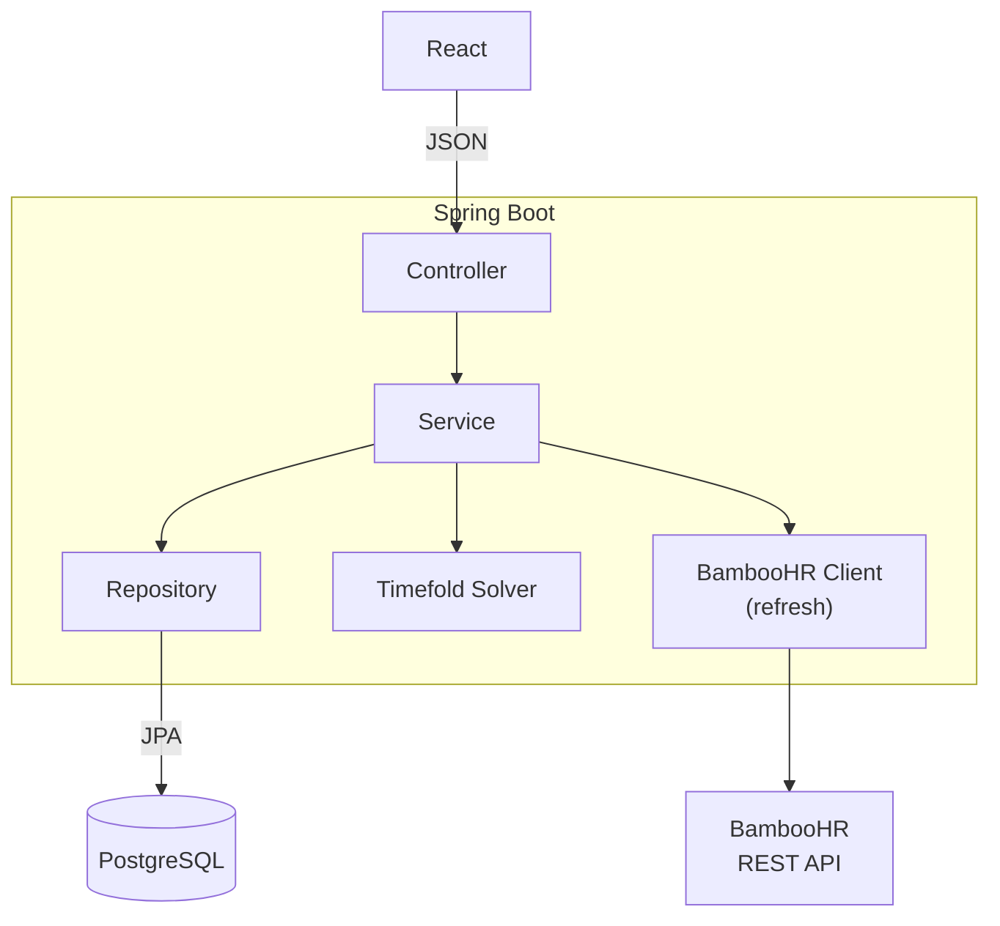
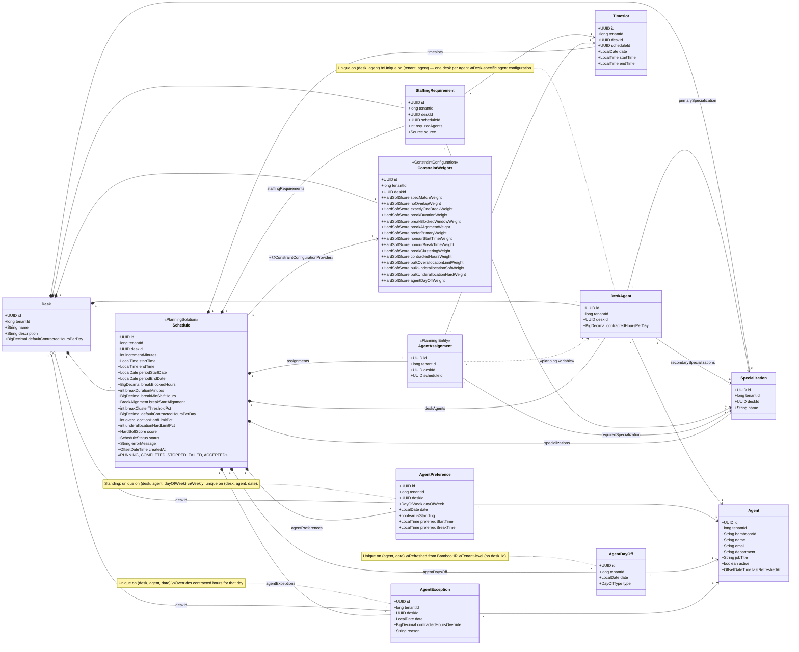

# WFM Service — System Specification

## 1. Overview

WFM Service is a workforce management system that allocates **agents** to **timeslots** using constraint-based optimisation. The solver is powered by [Timefold](https://timefold.ai/) (Java). The application exposes a REST API via Spring Boot and persists state in PostgreSQL. Agent data is sourced from **BambooHR** via its REST API and refreshed into the local database on demand.

The service is **multi-tenant** and **multi-desk**. Tenant identity and authentication are managed by an external **AI service platform** (a separate project, out of scope for this document). Every API request includes a `tenant_id` (`BIGINT`) provided by the platform. Within a tenant, work is partitioned by **desk** — a desk represents a distinct contact-centre capability (e.g. "Inbound Sales", "Technical Support", "Billing Enquiries") with its own staffing data, solver runs, and schedules. All data is isolated per tenant and per desk at the database level — see sections 3.1 and 3.2.

### Assumptions

1. Agents work a contiguous block of hours each day (their "shift"), which may include a break (agents whose contracted hours do not exceed `breakMinShiftHours` work without a break — see section 4.6.2).
2. Each agent has exactly one primary specialization and one or more secondary specializations.
3. The time period to be scheduled is made up of a contiguous sequence of timeslots.
4. The solver will be configured to solve for a maximum of five minutes per run.
5. All times are in a single tenant-local time zone. No time zone conversion or storage is performed. Multi-zone tenants are out of scope.

## 2. Tech Stack

| Layer | Technology |
|---|---|
| Build | Gradle (Groovy DSL) |
| UI | React |
| API / Controllers | Spring Boot (Java 21+) |
| Business Logic / Services | Spring Boot |
| ORM | Hibernate (via Spring Data JPA) |
| Database | PostgreSQL |
| Solver | Timefold Solver (Java) |
| Spreadsheet Export | Apache POI |
| Agent Data Source | BambooHR REST API |

## 3. Architecture



The backend is organised into the following packages:

- **`model`** — JPA entities, Timefold planning model annotations, and enums.
- **`repository`** — Spring Data JPA repositories (one per entity).
- **`service`** — Business logic, solver lifecycle management, and transaction orchestration.
- **`controller`** — REST endpoints that accept and return JSON.
- **`dto`** — Request and response DTOs for all API endpoints.
- **`integration`** — BambooHR client interface, implementations (mock and HTTP), and refresh service.
- **`solver`** — Timefold `ConstraintProvider` implementation.
- **`config`** — Cross-cutting concerns: tenant filter, tenant context holder, CORS configuration.

### 3.1 Multi-Tenancy

All data is scoped to a tenant via a `tenant_id` column (`BIGINT`) present on every tenant-owned table. The value is assigned and supplied by the external AI service platform — WFM Service never generates tenant ids itself.

- **Inbound requests** — The platform authenticates each request and forwards the resolved `tenant_id` to WFM Service via the HTTP header `X-Tenant-ID`. A Spring `OncePerRequestFilter` (`TenantFilter`) reads this header, parses it as a `Long`, and stores the value in a `ThreadLocal` holder (`TenantContext`). All service and repository code retrieves the current tenant id from `TenantContext.getTenantId()`. If the header is missing or not a valid long, the filter returns `400 Bad Request`. The filter is registered in the package layout under `config/TenantFilter.java` and the thread-local holder under `config/TenantContext.java`.
- **Thread-local lifecycle** — `TenantFilter` must clear the `ThreadLocal` in a `finally` block after the filter chain completes (i.e. after `filterChain.doFilter` returns or throws). Servlet containers reuse threads from a pool — failing to clear the `ThreadLocal` can leak a tenant context into an unrelated subsequent request (a classic Spring security/data-isolation bug).
- **Async thread propagation** — The solver runs on a separate thread (section 7.11). Since `ThreadLocal` values do not propagate to child threads, the `SolverService` must capture the `tenant_id` from `TenantContext` on the request thread and explicitly set it on the solver thread before execution (e.g. in a `Runnable` wrapper that sets the value in a `try` block and clears it in `finally`). The same applies to any other async operations (e.g. `@Async` methods).
- **Data isolation** — Every query filters by `tenant_id`. An entity created by one tenant is never visible to another.
- **Database strategy** — Shared schema, shared tables, discriminated by `tenant_id`. No per-tenant schemas or databases.

### 3.2 Desk Isolation

Within a tenant, all scheduling work is organised into **desks**. A desk represents a specific contact-centre capability — for example, "Inbound Sales", "Technical Support", or "Billing Enquiries". Each desk operates independently: it has its own specializations, staffing requirements, agent configuration, constraint weights, and schedules. There is no cross-desk scheduling.

- **Desk scoping** — Most data is scoped to both `tenant_id` and `desk_id`. The `desk_id` (`UUID`) acts as a second-level partition key on every desk-scoped table, exactly like `tenant_id` acts at the tenant level.
- **Tenant-level data** — Two categories of data remain at the tenant level (scoped by `tenant_id` only, no `desk_id`):
  1. **Agent records** — imported from BambooHR via `POST /desks/{deskId}/agents/refresh`. An agent is a person who exists at the tenant level.
  2. **Agent days off** — also sourced from BambooHR. A day off reflects the person's absence and applies regardless of desk.
- **Agent-desk assignment** — An agent must be explicitly assigned to a desk before they can participate in that desk's schedules. Assignment is managed via the Desk Agents API (section 7.2). When assigned, the agent receives desk-specific configuration: contracted hours per day, primary specialization, and secondary specializations. An agent may be assigned to **at most one desk** at a time. Desk assignment is driven by the BambooHR `project` custom field, matched to `Desk.name` during refresh (section 9.4). Manual assignment via the API remains available.
- **Desk context in the API** — All desk-scoped endpoints require a `deskId` path parameter or are nested under a desk resource. Desk management endpoints (`/desks`) require only tenant context. See section 7 for details.
- **Single-desk constraint** — Because each agent is assigned to exactly one desk, cross-desk scheduling conflicts cannot occur.
- **Desk selection in the UI** — Before navigating to any scheduling page, the user selects a desk from a desk picker (section 12.1). All subsequent pages operate within that desk's context.

### 3.3 CORS

The React frontend is served from a different origin to the Spring Boot API. A global CORS configuration is registered via a `WebMvcConfigurer` bean to allow cross-origin requests.

| Setting | Value | Notes |
|---|---|---|
| Allowed origins | Configurable via `cors.allowed-origins` | Comma-separated list. Defaults to `http://localhost:3000` for local development. |
| Allowed methods | `GET, POST, PUT, DELETE, OPTIONS` | All methods used by the API. |
| Allowed headers | `*` | Permits any request header (including `Authorization` and custom tenant headers). |
| Exposed headers | `Content-Disposition` | Required for the spreadsheet export download (section 8.5). |
| Allow credentials | `true` | Enables cookies and authorization headers. |
| Max age | `3600` (seconds) | Browsers cache preflight responses for 1 hour. |

In production the allowed origins must be restricted to the actual frontend domain(s). The wildcard `*` must **not** be used when `allowCredentials` is `true`.

## 4. Solver Inputs

Each solve run is configured by a set of inputs that define the problem space. These inputs are provided by the user before the solver is invoked.

### 4.1 Timeslot Increment

All timeslots in a given solution share a uniform duration. Supported values:

| Increment | Example slots (8 am–9 am) |
|---|---|
| 15 minutes | 08:00–08:15, 08:15–08:30, 08:30–08:45, 08:45–09:00 |
| 30 minutes | 08:00–08:30, 08:30–09:00 |
| 60 minutes | 08:00–09:00 |

### 4.2 Time Range

The contiguous window of time to be covered, expressed as a start time and end time (e.g. 08:00–18:00). Timeslots are **generated and persisted** by subdividing this range into intervals of the configured increment for each day in the date range. For example, 08:00–18:00 at 15-minute increments produces 40 timeslots per day. Timeslots must exist in the database **before** staffing requirements can be entered — they are a prerequisite for the demand grid. See section 7.9 for the generation endpoint.

### 4.3 Specializations

Each agent has one primary and one or more secondary specialization assignments:

- **Primary specialization** — the agent's main area of expertise (exactly one).
- **Secondary specializations** — additional areas the agent can cover (one or more).

The set of available specializations is an input (e.g. "Billing", "Technical Support", "Sales"). Each timeslot may require coverage from multiple specializations simultaneously; the solver prefers assigning agents whose primary specialization matches the need, but may fall back to any of their secondary specializations.

### 4.4 Staffing Demand

The number of agents required **per timeslot, per specialization**. Because call volumes vary throughout the day, staffing demand is expressed at timeslot granularity — not as a flat daily total. This allows peak periods to be staffed more heavily than quiet periods.

| Field | Example |
|---|---|
| Timeslot | Monday 09:00–09:15 |
| Specialization | Billing |
| Required agents | 8 |

Demand can be:

1. **Directly input** — the customer provides agent counts per timeslot per specialization.
2. **Calculated via Erlang X** — Erlang X extends Erlang C by accounting for caller abandonment and redials, producing more accurate staffing numbers. The calculation is performed per timeslot per specialization before the solver is invoked.

   **Algorithm:** The implementation uses the iterative approach described in the Erlang X model (sometimes called "Extended Erlang C" or "Erlang A with retrials"). The algorithm:
   1. Starts with the Erlang C staffing estimate for the given call volume, AHT, and service level.
   2. Calculates the probability of abandonment given caller patience (exponential patience distribution).
   3. Adjusts the offered load upward by `retryRate` × the number of abandoned calls (retrials re-enter the queue).
   4. Iterates steps 2–3 until the retrial-adjusted staffing count converges (change < 1 agent between iterations).
   5. Returns the smallest integer number of agents that meets the `serviceLevelTarget` within `serviceLevelThreshold`.

   A reference implementation is available in the open-source Python library [erlang](https://pypi.org/project/erlang/) (function `erlang_x`). The Java implementation should produce equivalent results. If no suitable Java library is available, the algorithm should be implemented directly using the formulas above, with Erlang C probability computed via the Jagerman formula to avoid factorial overflow.

   The minimal input parameters are:

   | Parameter | Type | Unit | Description |
   |---|---|---|---|
   | `callVolume` | `int` | calls | Forecasted number of incoming calls for this timeslot |
   | `aht` | `double` | seconds | Average Handle Time — mean duration of a call including talk time and after-call work |
   | `patience` | `double` | seconds | Average caller patience — mean time a caller will wait in queue before abandoning |
   | `retryRate` | `double` | % (0–100) | Percentage of abandoned callers who will call back |
   | `serviceLevelTarget` | `double` | % (0–100) | Target percentage of calls answered within `serviceLevelThreshold` |
   | `serviceLevelThreshold` | `int` | seconds | Maximum acceptable wait time for the service level target (e.g. 20 seconds for "80% of calls answered within 20 seconds") |

   Each row in the Erlang X request applies to a single timeslot and specialization. The output is the calculated `requiredAgents` count for that combination.

### 4.5 Agent Preferences

Agents may submit scheduling preferences. These are **soft inputs** — the solver tries to honour them but will override them when staffing demands require it. Two preferences are supported:

- **Preferred start time** — the time the agent would like their first assignment to begin (e.g. 09:00). The solver attempts to avoid assigning the agent to timeslots before this time.
- **Preferred break time** — the time the agent would like a break (e.g. 12:00). The solver attempts to leave the agent unassigned during timeslots that overlap this time.

Preferences are optional. An agent with no submitted preferences is scheduled purely based on staffing demand and hard constraints.

#### Standing vs weekly preferences

Every preference record has a `dayOfWeek` (e.g. MONDAY) and a boolean `isStanding` flag:

- **Standing preference** (`isStanding = true`) — a recurring default for a specific **day of week**. An agent may have up to one standing preference per day of week (e.g. a standing Monday preference and a separate standing Thursday preference). When a new standing preference is saved for a day of week, the previous standing preference for that same day of week is **deleted**.
- **Weekly preference** (`isStanding = false`) — applies only to a specific **date** and **overrides** the standing preference for that day of week during the scheduling period. A weekly preference and a standing preference may coexist for the same day of week — the weekly preference takes priority for its specific date while the standing preference continues to serve as the default for that day of week in other weeks.

When the solver resolves preferences for a given agent-day: if a weekly (non-standing) preference exists for that specific date **and at least one preference field is non-null**, use it; otherwise fall back to the standing preference for that day of week (if one exists); otherwise the agent has no preference for that day. Resolution is **per-record** — a weekly override replaces the standing preference entirely for that date (individual fields are not merged). A weekly preference where all preference fields (`preferredStartTime`, `preferredBreakTime`) are null is ignored during resolution — the standing preference (if any) applies as though the weekly record did not exist.

| Field | Example (standing) | Example (weekly override) |
|---|---|---|
| Agent | Jane Smith | Jane Smith |
| Day of week | MONDAY | TUESDAY |
| Date | *(null — standing)* | 2026-02-25 |
| Is standing | `true` | `false` |
| Preferred start | 09:00 | 10:00 |
| Preferred break | 12:30 | *(null — no break preference this day)* |

### 4.6 Break Rules

Configurable rules that govern when an agent may take a break. Each agent receives **exactly one break** per shift — a contiguous block of unassigned timeslots. An agent's **shift** on a given day is defined as the span from the start time of their earliest assignment to the end time of their latest assignment.

#### 4.6.1 Blocked window (hard)

By default, the first **1 hour** and last **1 hour** of an agent's shift are blocked — no part of a break may fall within these periods. The blocked duration is configurable per schedule and supports fractional hours (e.g. 0.5 for 30 minutes, 1.5 for 90 minutes).

Example: an agent's shift runs 08:00–17:00. Breaks are forbidden before 09:00 and after 16:00; the eligible break window is 09:00–16:00.

#### 4.6.2 Minimum shift duration (hard)

Breaks are only permitted if an agent's contracted hours **exceed** the threshold (strictly greater than). The default threshold is **4 hours**, configurable per schedule. An agent with exactly 4 hours (or fewer) of contracted work does **not** receive a break.

#### 4.6.3 Break duration (hard)

The break duration is configurable per schedule, expressed in minutes. It must be a **multiple of the schedule's timeslot increment** (section 4.1). Typical values are 30, 45, or 60 minutes. The solver assigns exactly this many contiguous unassigned timeslots as the agent's break.

| Schedule increment | Valid break durations (examples) |
|---|---|
| 15 minutes | 15, 30, 45, 60, 75, … |
| 30 minutes | 30, 60, 90, … |
| 60 minutes | 60, 120, … |

The default break duration is **60 minutes**. Pre-solve validation rejects a break duration that is not a multiple of the increment.

#### 4.6.4 Break start alignment (hard)

The break start time must align to a configured boundary:

| Setting | Allowed break starts (examples) |
|---|---|
| `ON_HOUR` | 10:00, 11:00, 12:00 |
| `ON_HALF_HOUR` | 10:00, 10:30, 11:00, 11:30 |
| `ON_QUARTER_HOUR` | 10:00, 10:15, 10:30, 10:45 |

The default is `ON_HOUR`. Preferred break times (section 4.5) are stored **without** alignment validation — an agent may submit any valid time. Alignment is checked at **solve time**: if an agent's effective preferred break time does not conform to the schedule's active alignment, the pre-solve validation (section 7.11) flags the offending preferences and the solve is blocked until they are corrected. In practice, the alignment setting rarely changes for a given tenant.

#### 4.6.5 Break clustering penalty (soft)

When too many agents take their break during the same timeslot, coverage suffers. A soft penalty is applied when the number of agents on break in a single timeslot exceeds a configurable threshold (expressed as a percentage of agents **assigned during that same timeslot**, default **20%**). The penalty scales linearly with the number of agents over the threshold — e.g. if the threshold allows 8 agents on break and 10 are on break, the penalty is 2 × the constraint weight.

### 4.7 Constraint Weights

Each constraint (section 6) has an associated **weight** that controls how much a violation affects the solver score. Weights are stored per desk and loaded as part of the planning solution via Timefold's `@ConstraintConfiguration` mechanism.

Weights allow per-desk customisation without changing constraint code:

- **Disable a constraint** — set its weight to zero.
- **Prioritise constraints** — give one soft constraint a weight of 10 and another a weight of 1.
- **Promote soft to hard (or vice versa)** — change a weight from `HardSoftScore.ofSoft(n)` to `HardSoftScore.ofHard(n)`.

The constraint table in section 6 documents the **default** level and weight for each constraint. A tenant's saved weights override these defaults at solve time.

### 4.8 Agent Days Off

Agents have designated days off that are refreshed from BambooHR as explicit dates. The solver must not assign an agent to any timeslot on a day off. Two types are supported:

- **Mandatory day off** — the agent's regular non-working days (the equivalent of weekends; typically two per week). These recur weekly but are stored as explicit dates per scheduling period.
- **PTO (Paid Time Off)** — approved leave days. Only pre-approved PTO is considered; sick days are out of scope and not modelled.

Both types have the same effect on the solver: the agent is **completely unavailable** for the day. The distinction is informational — it appears in the UI and agent schedule output so managers can see *why* an agent is absent.

Days off are **read-only** within WFM Service — they originate from BambooHR and are refreshed alongside agent data (see section 9).

### 4.9 Agent Exceptions

Some agents may need to work different hours on specific days due to personal circumstances. Rather than changing the agent's contracted hours permanently, a scheduler can create an **exception** for a specific agent on a specific date. This overrides the agent's normal contracted hours for that day only.

Common reasons for exceptions:

- **Childcare** — agent must leave early for school pickup.
- **Part-time study** — agent attends classes on certain days.
- **Training** — agent is only available for a shortened shift.
- **Phased return** — agent returning from leave on reduced hours.

Exceptions are created before the solver runs and are treated as hard inputs — the solver schedules the agent for exactly the overridden number of hours on that day. Each exception includes a free-text reason so that schedule reviewers can see why an agent has non-standard hours.

An exception must not conflict with a day off on the same date — an agent cannot be both unavailable and working reduced hours on the same day.

## 5. Domain Model



### 5.1 Desk

A desk represents a distinct contact-centre capability (e.g. "Inbound Sales", "Technical Support", "Billing Enquiries"). Each desk operates as an independent scheduling unit with its own data and solver runs. A tenant must have at least one desk before any scheduling work can begin.

| Field | Type | Notes |
|---|---|---|
| `id` | `UUID` | Primary key |
| `tenantId` | `long` | Tenant identifier (from platform) |
| `name` | `String` | Display name (unique per tenant) |
| `description` | `String` | Free-text description of this desk's purpose or capability (optional) |
| `defaultContractedHoursPerDay` | `BigDecimal` | Desk-level default contracted daily hours excluding break time (default 8.0). Used as the fallback for any desk-agent whose `contractedHoursPerDay` is not explicitly set. Can be overridden per solve run via the schedule configuration. |

**`BigDecimal` convention.** All `BigDecimal` hour fields across the domain model (`contractedHoursPerDay`, `defaultContractedHoursPerDay`, `breakBlockedHours`, `breakMinShiftHours`, `contractedHoursOverride`) use a standard scale of **2 decimal places** and are stored as `NUMERIC(5,2)` in PostgreSQL (max 999.99, sufficient for any hours value). Arithmetic and comparison operations in Java must use `compareTo()` — never `equals()` — because `BigDecimal.equals` is scale-sensitive (`new BigDecimal("8.0").equals(new BigDecimal("8.00"))` returns `false`). Service code should normalise values to scale 2 with `HALF_UP` rounding on input.

### 5.2 Specialization

A reference entity representing a named area of expertise (e.g. "Billing", "Technical Support", "Sales"). Specializations are **desk-scoped** — each desk defines its own set of specializations independently.

| Field | Type | Notes |
|---|---|---|
| `id` | `UUID` | Primary key |
| `tenantId` | `long` | Tenant identifier (from platform) |
| `deskId` | `UUID` | Desk this specialization belongs to |
| `name` | `String` | Unique specialization name (unique per desk) |

### 5.3 Agent

An agent is a person who can be assigned to work during one or more timeslots. Agent records are imported from BambooHR and are **tenant-level** — they exist independently of any desk. An agent must be assigned to a desk (via a `DeskAgent` record, section 5.4) before participating in that desk's schedules.

The `Agent` entity holds only BambooHR-sourced data. Desk-specific configuration — specializations and contracted hours — is managed on the `DeskAgent` entity.

| Field | Type | Notes |
|---|---|---|
| `id` | `UUID` | Primary key (internal) |
| `tenantId` | `long` | Tenant identifier (from platform) |
| `bamboohrId` | `String` | BambooHR employee id (unique per tenant, external key) |
| `name` | `String` | Display name (from BambooHR) |
| `email` | `String` | Work email (from BambooHR) |
| `department` | `String` | Department (from BambooHR) |
| `jobTitle` | `String` | Job title (from BambooHR) |
| `active` | `boolean` | Whether the employee is active in BambooHR |
| `lastRefreshedAt` | `OffsetDateTime` | Timestamp of last successful refresh from BambooHR |

### 5.4 DeskAgent

Represents an agent's assignment to a desk, together with that desk's configuration for the agent. An agent must have a `DeskAgent` record for a desk before they can participate in that desk's schedules. An agent may be assigned to **at most one desk** at a time. Desk assignment is driven by the BambooHR `project` custom field, matched to `Desk.name` during refresh (section 9.4). Manual assignment via the API remains available.

**Specialization requirement:** Every desk-agent must have a primary specialization and at least one secondary specialization assigned before they can participate in a solve run. During a BambooHR refresh, newly created desk-agents are automatically assigned a default "Basic" specialization (as both primary and secondary) — the specialization is auto-created on the desk if it does not already exist (see section 9.4). Administrators can reassign specializations at any time via the UI or API. The solver will refuse to start if any active desk-agent lacks specializations (see section 7.11).

| Field | Type | Notes |
|---|---|---|
| `id` | `UUID` | Primary key |
| `tenantId` | `long` | Tenant identifier (from platform) |
| `deskId` | `UUID` | Desk this assignment belongs to |
| `agent` | `Agent` | The assigned agent |
| `primarySpecialization` | `Specialization` | Main area of expertise for this desk (managed locally) |
| `secondarySpecializations` | `List<Specialization>` | Additional areas the agent can cover for this desk (managed locally, one or more) |
| `contractedHoursPerDay` | `BigDecimal` | The agent's contracted daily working hours for this desk, **excluding break time** (e.g. 8.0 for full-time, 4.0 for part-time). A full-time agent with 8.0 contracted hours and a 60-minute break works a 9-hour shift. Nullable — if not set, the desk's `Desk.defaultContractedHoursPerDay` (section 5.1) is used. |

**Uniqueness constraints:**
- Unique on (`desk`, `agent`) — an agent may be assigned to a given desk at most once.
- Unique on (`tenant`, `agent`) — an agent may be assigned to **at most one desk** across the entire tenant. This enforces the single-desk rule: each desk has a unique set of agents with no overlap.

### 5.5 Timeslot

A timeslot is a single time interval within the coverage window. Timeslots are **generated and persisted to the database** before staffing requirements or the solver can reference them (see section 7.9). They are not created manually — the user specifies a date range, time range, and increment, and the system generates all timeslots automatically. A timeslot is specialization-agnostic; multiple agents with different specializations may be needed in the same timeslot. Timeslots are desk-scoped.

| Field | Type | Notes |
|---|---|---|
| `id` | `UUID` | Primary key |
| `tenantId` | `long` | Tenant identifier (from platform) |
| `deskId` | `UUID` | Desk this timeslot belongs to |
| `scheduleId` | `UUID` | Nullable. `NULL` = live input data (user-editable). Non-null = snapshot belonging to an accepted schedule. |
| `date` | `LocalDate` | The day this slot belongs to |
| `startTime` | `LocalTime` | Start of the interval |
| `endTime` | `LocalTime` | End of the interval |

### 5.6 StaffingRequirement

Represents the demand for a given specialization in a given timeslot. There is one StaffingRequirement per timeslot/specialization combination. Each row directly states how many concurrent agents are needed, enabling non-uniform staffing across the day. Staffing requirements are desk-scoped.

| Field | Type | Notes |
|---|---|---|
| `id` | `UUID` | Primary key |
| `tenantId` | `long` | Tenant identifier (from platform) |
| `deskId` | `UUID` | Desk this requirement belongs to |
| `scheduleId` | `UUID` | Nullable. `NULL` = live input data (user-editable). Non-null = snapshot belonging to an accepted schedule. |
| `timeslot` | `Timeslot` | The specific interval |
| `specialization` | `Specialization` | Which specialization is needed |
| `requiredAgents` | `int` | Number of concurrent agents needed |
| `source` | `enum(DIRECT, ERLANG_X)` | How the value was determined |

**Generating seats:** For each StaffingRequirement, the system creates `requiredAgents` AgentAssignment instances for that timeslot and specialization. This is a direct 1-to-N expansion — no averaging or division needed.

Example: Monday 09:00–09:15 needs 8 Billing agents and 3 Tech Support agents → the system generates **8 + 3 = 11 AgentAssignment** instances for that single timeslot. Across 40 timeslots in a day, the total seat count varies per slot based on the individual StaffingRequirement values.

### 5.7 AgentAssignment (Planning Entity)

The central Timefold planning entity. Each instance represents one **seat** — a need for one agent with a particular specialization in a particular timeslot. The solver decides which desk-agent fills each seat. Agent assignments are desk-scoped.

Multiple AgentAssignment instances may reference the same timeslot, each for a different (or the same) specialization. This is how a single timeslot is staffed by several agents across multiple specializations.

| Field | Type | Notes |
|---|---|---|
| `id` | `UUID` | Primary key |
| `tenantId` | `long` | Tenant identifier (from platform) |
| `deskId` | `UUID` | Desk this assignment belongs to |
| `scheduleId` | `UUID` | The accepted schedule this assignment belongs to (NOT NULL — assignments only exist as part of a persisted schedule) |
| `timeslot` | `Timeslot` | The time interval to fill |
| `requiredSpecialization` | `Specialization` | The specialization this seat demands |
| `deskAgent` | `DeskAgent` | **Planning variable** (`@PlanningVariable`, not nullable) — assigned by the solver. Every seat must be filled; the solver will never leave a seat unassigned. The `@ValueRangeProvider` is `Schedule.deskAgents` (section 5.12). Using `DeskAgent` (rather than `Agent`) gives constraints direct access to desk-specific configuration: specializations, contracted hours, and the underlying `Agent` record. When an accepted schedule is persisted to the database, the `agent_assignment` row stores FKs to both `desk_agent` and `agent` for query convenience. |

### 5.8 AgentPreference

An agent's scheduling preferences for a specific desk. Standing preferences define recurring defaults per day of week; weekly preferences override the standing default for a specific date. These are loaded as problem facts and referenced by soft constraints during solving. Preferences are **desk-scoped** — they belong to the agent's assigned desk.

| Field | Type | Notes |
|---|---|---|
| `id` | `UUID` | Primary key |
| `tenantId` | `long` | Tenant identifier (from platform) |
| `deskId` | `UUID` | Desk this preference belongs to |
| `agent` | `Agent` | The agent expressing the preference |
| `dayOfWeek` | `DayOfWeek` | The day of week this preference applies to (MONDAY–SUNDAY). Always set. For weekly preferences (`isStanding = false`), the server **derives** `dayOfWeek` from `date` and ignores any client-supplied value — the client may omit it for weekly preferences. For standing preferences (`isStanding = true`), `dayOfWeek` is required and `date` must be null. |
| `date` | `LocalDate` | The specific date this preference applies to. **Null** for standing preferences (which apply to every occurrence of `dayOfWeek`). Set for weekly preferences. |
| `isStanding` | `boolean` | `true` = this is the recurring default for the given `dayOfWeek`. `false` = this applies only to the specific `date`. Default `false`. |
| `preferredStartTime` | `LocalTime` | Desired start of first assignment (nullable) |
| `preferredBreakTime` | `LocalTime` | Desired break time (nullable) |

**Keys and uniqueness constraints:**

- **Primary key:** `id` (UUID) — surrogate key. All references to a preference record use this key.
- **Standing uniqueness:** Unique on (`desk`, `agent`, `dayOfWeek`) where `isStanding = true` — at most one standing preference per desk-agent per day of week. An agent may have up to 7 standing preferences per desk (one for each day of the week). When a new standing preference is saved for a day of week, the previous standing preference for that same desk-agent-day is deleted.
- **Weekly uniqueness:** Unique on (`desk`, `agent`, `date`) where `isStanding = false` — at most one weekly preference per desk-agent per specific date.

**Solver resolution:** When building the problem facts for a solve run, the service resolves each agent-day to a single **effective** preference: if a weekly (non-standing) preference exists for that specific date **and at least one preference field is non-null**, use it; otherwise fall back to the standing preference for that day of week (if one exists); otherwise the agent has no preference for that day. Resolution is per-record — the entire standing record is replaced, not merged field-by-field. A weekly preference where all preference fields are null is ignored during resolution — the standing preference (if any) applies. The solver receives only the resolved effective preferences.

### 5.9 AgentDayOff

A day on which an agent is unavailable for scheduling. Days off are refreshed from BambooHR (see section 9) and treated as read-only within WFM Service. Days off are **tenant-level** (no `deskId`) — a day off reflects the person's absence and applies to all desks the agent is assigned to.

| Field | Type | Notes |
|---|---|---|
| `id` | `UUID` | Primary key |
| `tenantId` | `long` | Tenant identifier (from platform) |
| `agent` | `Agent` | The unavailable agent |
| `date` | `LocalDate` | The day the agent is off |
| `type` | `enum(MANDATORY, PTO)` | Reason for the day off — `MANDATORY` for regular non-working days (e.g. weekends), `PTO` for approved leave |

**Uniqueness constraint:** Unique on (`agent`, `date`) — an agent has at most one day-off record per date.

**Solver usage:** When building the planning solution for a desk, the service loads all `AgentDayOff` records that fall within the schedule's period for agents assigned to that desk. These are included as problem facts and referenced by the "Agent day off" hard constraint (section 6).

### 5.10 AgentException

A per-agent, per-desk, per-day override that allows an agent to work different contracted hours than their standard `contractedHoursPerDay` on a specific date. Exceptions are used to accommodate individual circumstances — for example, an agent who is a part-time student and can only work 4 hours on certain days, or an agent with childcare responsibilities requiring a shorter shift. Exceptions are **desk-scoped** — they belong to the agent's assigned desk.

Exceptions are **pre-solve inputs** — they must be configured before the solver is run. The solver uses the exception's `contractedHoursOverride` in place of the desk-agent's normal contracted hours for that day when evaluating the "Contracted hours" constraint (section 6).

| Field | Type | Notes |
|---|---|---|
| `id` | `UUID` | Primary key |
| `tenantId` | `long` | Tenant identifier (from platform) |
| `deskId` | `UUID` | Desk this exception belongs to |
| `agent` | `Agent` | The agent the exception applies to |
| `date` | `LocalDate` | The day the override applies to |
| `contractedHoursOverride` | `BigDecimal` | The number of working hours (excluding break time) for this agent on this day. Replaces the desk-agent's `contractedHoursPerDay` for this date only. Must be positive. |
| `reason` | `String` | A free-text explanation of why the exception exists (e.g. "Childcare — school pickup", "Part-time student", "Training day — short shift"). Required. |

**Uniqueness constraint:** Unique on (`desk`, `agent`, `date`) — an agent has at most one exception per desk per date.

**Interaction with days off:** An exception and a day off must not coexist for the same agent on the same date — pre-solve validation (section 7.11) rejects this as contradictory.

**Solver resolution:** When building the planning solution for a desk, the service loads all `AgentException` records for that desk that fall within the schedule's period. For each agent-day, if an exception exists the solver uses `contractedHoursOverride`; otherwise it uses the desk-agent's `contractedHoursPerDay` (or the schedule's `defaultContractedHoursPerDay` if not set). The pre-solve coverage window check (section 7.11) also accounts for exceptions — an agent with a 4-hour exception does not require a 9-hour window.

### 5.11 ConstraintWeights

A Timefold `@ConstraintConfiguration` class that holds a `@ConstraintWeight` field for every constraint defined in section 6. One row per desk (identified by `tenantId` + `deskId`) so each desk can tune solver behaviour independently.

**Lifecycle:** A `constraint_weights` row is **auto-created with defaults** when a desk is created (`POST /desks`). `GET /desks/{deskId}/constraint-weights` always returns a row (never 404). `PUT` updates individual fields; omitted fields retain their current values.

| Field | Type | Default | Notes |
|---|---|---|---|
| `id` | `UUID` | — | Primary key |
| `tenantId` | `long` | — | Tenant identifier (from platform) |
| `deskId` | `UUID` | — | Desk identifier; unique together with `tenantId` — one row per desk |
| `agentDayOffWeight` | `HardSoftScore` | `hard(1)` | Agent day off |
| `specMatchWeight` | `HardSoftScore` | `hard(1)` | Specialization match |
| `noOverlapWeight` | `HardSoftScore` | `hard(1)` | One assignment per timeslot |
| `exactlyOneBreakWeight` | `HardSoftScore` | `hard(1)` | Exactly one break per shift |
| `breakDurationWeight` | `HardSoftScore` | `hard(1)` | Break duration |
| `breakBlockedWindowWeight` | `HardSoftScore` | `hard(1)` | Break blocked window |
| `breakAlignmentWeight` | `HardSoftScore` | `hard(1)` | Break start alignment |
| `preferPrimaryWeight` | `HardSoftScore` | `soft(1)` | Prefer primary specialization |
| `honourStartTimeWeight` | `HardSoftScore` | `soft(1)` | Honour preferred start time |
| `honourBreakTimeWeight` | `HardSoftScore` | `soft(1)` | Honour preferred break time |
| `breakClusteringWeight` | `HardSoftScore` | `soft(2)` | Break clustering |
| `contractedHoursWeight` | `HardSoftScore` | `hard(1)` | Contracted hours (hard — every agent must work exactly their contracted hours) |
| `bulkOverallocationLimitWeight` | `HardSoftScore` | `hard(1)` | Bulk over-allocation limit (hard — total staffing hours must not exceed predicted demand by more than `overallocationHardLimitPct`, default 130%) |
| `bulkUnderallocationSoftWeight` | `HardSoftScore` | `soft(1)` | Bulk under-allocation soft penalty (scales linearly with the shortfall between demand and contracted hours) |
| `bulkUnderallocationHardWeight` | `HardSoftScore` | `hard(1)` | Bulk under-allocation hard limit (violated when demand falls below `underallocationHardLimitPct` of contracted hours, default 70%) |


The "One agent per seat" constraint is structural (enforced by the planning variable) and has no configurable weight.

**JPA mapping of `HardSoftScore` fields.** Each `HardSoftScore` field is stored as a **single VARCHAR column** using Timefold's `HardSoftScoreConverter` (`@Convert(converter = HardSoftScoreConverter.class)` from the `timefold-solver-jpa` dependency). The converter serialises scores to the format `"<hard>hard/<soft>soft"` (e.g. `"1hard/0soft"`). Each weight field also carries an explicit `@Column(name = "...")` annotation. The `constraint_weights` table therefore has 15 VARCHAR columns (one per weight). The `schedule` table stores its solver score the same way (a single `score VARCHAR` column).

### 5.12 Schedule (Planning Solution)

The top-level Timefold `@PlanningSolution` that aggregates all facts and planning entities for a single solve run. Each schedule belongs to a specific desk.

| Field | Type | Notes |
|---|---|---|
| `id` | `UUID` | Primary key |
| `tenantId` | `long` | Tenant identifier (from platform) |
| `deskId` | `UUID` | Desk this schedule belongs to |
| `incrementMinutes` | `int` | 15, 30, or 60 |
| `startTime` | `LocalTime` | Coverage window start |
| `endTime` | `LocalTime` | Coverage window end |
| `periodStartDate` | `LocalDate` | First day of the schedule period |
| `periodEndDate` | `LocalDate` | Last day of the schedule period (inclusive). The period must be contiguous, at least 1 day, and at most **31 days** (i.e. `periodEndDate − periodStartDate + 1 ≤ 31`). It can span any range of days (e.g. Mon–Fri, Mon–Thu, Sat–Sun, or a full Mon–Sun week). Timeslots are generated for every day from `periodStartDate` to `periodEndDate`. |
| `breakBlockedHours` | `BigDecimal` | Hours blocked at the start and end of an agent's shift where breaks are forbidden (default 1.0). Fractional values are supported (e.g. 0.5 for 30 minutes). Uses `BigDecimal` for consistency with other hour-based fields. |
| `breakDurationMinutes` | `int` | Length of each agent's break in minutes (default 60). Must be a multiple of `incrementMinutes`. |
| `breakMinShiftHours` | `BigDecimal` | Contracted hours must strictly exceed this threshold for a break to be assigned (default 4.0). An agent with exactly this many hours or fewer gets no break. Uses `BigDecimal` for consistency with other hour-based fields (e.g. a threshold of 4.5 is valid). |
| `breakStartAlignment` | `enum(ON_HOUR, ON_HALF_HOUR, ON_QUARTER_HOUR)` | Required alignment for break start times (default `ON_HOUR`) |
| `breakClusterThresholdPct` | `int` | Max percentage of on-shift agents on break per timeslot before soft penalty applies (default 20) |
| `defaultContractedHoursPerDay` | `BigDecimal` | Default contracted daily hours excluding break time for this solve run. If omitted in the solve request, inherits from `Desk.defaultContractedHoursPerDay` (section 5.1). Applied to any desk-agent whose `contractedHoursPerDay` is not explicitly set. |
| `overallocationHardLimitPct` | `int` | Maximum percentage by which total assigned staffing hours across all agents may exceed total predicted demand hours before triggering a hard constraint violation (default 130) |
| `underallocationHardLimitPct` | `int` | Minimum percentage of total contracted agent hours that total predicted demand hours must reach before triggering a hard constraint violation (default 70). Below this floor the schedule is considered infeasible. Between this floor and 100% a soft penalty applies proportional to the shortfall. |
| `constraintWeights` | `ConstraintWeights` | `@ConstraintConfigurationProvider` — per-desk weights applied at solve time |
| `specializations` | `List<Specialization>` | Problem facts — desk's specializations |
| `deskAgents` | `List<DeskAgent>` | Problem facts and **`@ValueRangeProvider`** for the `AgentAssignment.deskAgent` planning variable. **Only desk-agents whose underlying `Agent.active` is `true` and who have specializations assigned** are loaded. "Active" is determined solely by the `Agent.active` flag (set by BambooHR refresh). Inactive agents and desk-agents without specializations are excluded at input time, not by constraint. |
| `staffingRequirements` | `List<StaffingRequirement>` | Problem facts |
| `agentPreferences` | `List<AgentPreference>` | Problem facts |
| `agentDaysOff` | `List<AgentDayOff>` | Problem facts — days off within the schedule period |
| `agentExceptions` | `List<AgentException>` | Problem facts — contracted hours overrides within the schedule period (section 5.10) |
| `timeslots` | `List<Timeslot>` | Generated problem facts |
| `assignments` | `List<AgentAssignment>` | Planning entities |
| `score` | `HardSoftScore` | Populated by solver. `null` while `RUNNING` if no solution found yet, and `null` if `FAILED`. |
| `status` | `enum(RUNNING, COMPLETED, STOPPED, FAILED, ACCEPTED)` | Current solver/lifecycle status (see lifecycle rules below). Persisted as a database column for accepted schedules. |
| `errorMessage` | `String` | `null` unless status is `FAILED`. Contains the exception message from the solver failure. |
| `createdAt` | `OffsetDateTime` | Timestamp when the solve was initiated. Set once during the pre-solve phase and never modified. Persisted to the database when the schedule is accepted. |

**Schedule lifecycle.** A schedule progresses through the following states:

1. **`RUNNING`** — the solver is actively working. The schedule can be stopped (`PUT /desks/{deskId}/schedules/{id}/stop`) but not accepted or rejected.
2. **`COMPLETED`** — the solver has finished. The scheduler reviews the results. The schedule can be **accepted** or **rejected**.
3. **`STOPPED`** — the solver was terminated early. Treated the same as `COMPLETED` for accept/reject purposes.
4. **`FAILED`** — the solver threw an unrecoverable exception during execution. The schedule retains whatever partial data was available (score may be `null`, assignments may be empty). A failed schedule can only be **rejected** (not accepted). The user must fix any underlying issue and re-run the solver.
5. **`ACCEPTED`** — the scheduler has accepted this schedule as the active schedule for its period on this desk. At most **one** accepted schedule may exist per desk for any given date — if two schedules share even a single day, they overlap. Accepting a new schedule that overlaps with an existing accepted schedule on the same desk **deletes the old schedule entirely** (including all its snapshot data). For example, if schedule A covers Mon–Fri and schedule B covers Thu–Sun, accepting B deletes A in full (Mon–Wed data is lost). The user should re-run a solve for Mon–Wed if separate coverage is needed.

**JPA and Timefold dual-annotation model.** `Schedule` carries both `@Entity` and `@PlanningSolution`; `AgentAssignment` carries both `@Entity` and `@PlanningEntity`. During solving, Timefold mutates the `deskAgent` planning variable on `AgentAssignment` thousands of times per second. If these entities were attached to a Hibernate persistence context, dirty checking would destroy solver performance. Therefore, the entire planning solution — `Schedule`, all `AgentAssignment` instances, and all problem-fact collections — must be **detached from (or never attached to) the JPA persistence context** while the solver is running. In practice the pre-solve phase loads all required data via Spring Data repositories (which close the persistence context at the end of the `@Transactional` read), assembles a detached `Schedule` object, and hands it to the solver. The entities become JPA-managed again only during the accept transaction, when a **new** persistence context merges/persists them. Timefold's best-solution cloning also requires that collection fields (e.g. `DeskAgent.secondarySpecializations`) are plain `java.util` collections, not Hibernate proxy wrappers — the pre-solve assembly step should copy Hibernate collections into `ArrayList`/`HashSet` to avoid `LazyInitializationException` during cloning.

**In-memory persistence model.** This model applies to **schedule output only** — the `Schedule` record and its solver-generated data (agent assignments, solver score). All **solver input data** (agent specializations, preferences, exceptions, staffing requirements, timeslots, constraint weights) is persisted to the database immediately via its respective API endpoint as the user enters it. This allows users to build up their input data incrementally over time without risk of data loss.

**Implementation:** The in-memory store is held as a Spring-managed singleton bean (`InMemoryScheduleStore`) containing a `ConcurrentHashMap<UUID, Schedule>` keyed by **schedule ID** and a secondary index `ConcurrentHashMap<UUID, UUID>` mapping **desk ID → schedule ID** to enforce the one-non-accepted-schedule-per-desk invariant. Because operations that modify both maps must be atomic (e.g. creating a schedule must check the desk index *and* insert into both maps without a race), `InMemoryScheduleStore` guards all mutating methods with a single `ReentrantLock`. Read-only lookups by schedule ID may use the `ConcurrentHashMap` directly without the lock. The lock is held only for the in-memory map operations (nanoseconds), never across database calls or solver invocations.

Schedules in `RUNNING`, `COMPLETED`, `STOPPED`, and `FAILED` status are held **entirely in memory** — they are not written to the database. The database only contains `ACCEPTED` schedules. This means:

- The `Schedule` object and its solver-generated data exist only in the JVM heap until the schedule is accepted.
- API endpoints that query non-accepted schedules (`GET /schedules/{id}`, `GET /schedules`, `GET /schedules/{id}/export`) serve data from the in-memory store.
- If the server restarts or crashes, any non-accepted schedules are **lost** — the user must re-run the solver. This is acceptable because non-accepted schedules are transient working data, not committed decisions. All input data remains safely in the database.
- Only one non-accepted schedule may exist per desk at a time (enforced by the concurrent-solve restriction). Different desks may have concurrent solves running independently.

**Live data vs accepted schedule snapshots.** Timeslots and staffing requirements exist in two forms in the database:

1. **Live data** (`schedule_id IS NULL`) — the working data that users create and edit via the API. These are the current inputs for future solve runs.
2. **Accepted schedule snapshots** (`schedule_id IS NOT NULL`) — read-only copies created when a schedule is accepted. These ensure the accepted schedule is self-contained and its output views (staffing summary, etc.) remain accurate even if the user later changes live timeslots or staffing requirements.

Agent assignments only ever exist as part of an accepted schedule — they always have a `schedule_id`.

When a schedule is accepted (section 7.11), the accept transaction:
1. Persists the `Schedule` record.
2. Copies the live timeslots for the schedule's date range into snapshot rows (new UUIDs) with `schedule_id` set. Builds a **remapping table** (`Map<UUID, UUID>`) from live timeslot ID → snapshot timeslot ID.
3. Copies the live staffing requirements for those timeslots into snapshot rows with `schedule_id` set, using the remapping table to point each snapshot requirement at its corresponding **snapshot** timeslot (not the live timeslot).
4. Writes the solver's agent assignments with `schedule_id` set, using the same remapping table to point each assignment at its corresponding **snapshot** timeslot. The in-memory `AgentAssignment` objects reference the live `Timeslot` instances that were loaded during the pre-solve phase; the accept logic must remap these references.
5. All four steps execute in a single transaction.

**Acceptance and persistence:** When a schedule is accepted (`PUT /desks/{deskId}/schedules/{id}/accept`), the complete schedule — including the `Schedule` record, all generated timeslots, all agent assignments, staffing requirement snapshots, and the final score — is written to the database in a single transaction. This is the **only point** at which schedule data touches the database. Once persisted, the schedule is removed from the in-memory store.

**Rejection:** Rejecting a schedule simply discards it from the in-memory store. No database operation is required since the schedule was never persisted.

**Replacement:** If the solver is re-run for a desk and the new schedule is accepted, any previously accepted schedule on the same desk whose date range overlaps even a single day is deleted from the database. There is no archive of superseded schedules.

## 6. Constraints

Constraints are defined in a `ConstraintProvider` implementation. The **Level** column shows the default; per-desk `ConstraintWeights` (section 5.11) can override levels and magnitudes at solve time.

| Constraint | Default Level | Description |
|---|---|---|
| Agent day off | Hard | An agent must not be assigned to any timeslot on a day they have a day off (mandatory or PTO). |
| Specialization match | Hard | An agent's primary specialization or one of their secondary specializations must match the assignment's required specialization. |
| One assignment per timeslot | Hard | An agent cannot be assigned to more than one seat in the same timeslot. Since timeslots are non-overlapping by construction (section 4.2), this reduces to: at most one seat per agent per timeslot. |
| One agent per seat | Hard | Each AgentAssignment (seat) is filled by exactly one agent (enforced by the planning variable). |
| Exactly one break | Hard | An agent whose contracted hours **strictly exceed** the minimum shift threshold (`breakMinShiftHours`, default 4.0) must have exactly one contiguous break of the configured duration. An agent whose contracted hours are equal to or less than the threshold must have **no break** — their shift consists entirely of assigned work. **Break detection:** a "break" is a contiguous sequence of one or more timeslots within the agent's shift window (from their earliest assignment start to their latest assignment end) where the agent has **no assignment**. Multiple gaps or zero gaps (when one is required) each constitute a violation. |
| Break duration | Hard | An agent's break (the single contiguous gap, as detected above) must span exactly `breakDurationMinutes / incrementMinutes` timeslots. A gap that is shorter or longer than the configured duration is a violation. |
| Break blocked window | Hard | No part of an agent's break may fall within the first or last N hours of their shift (configurable, default 1.0 hour, fractional values supported). The entire break must be contained within the eligible window between the blocked periods. |
| Break start alignment | Hard | A break must start on a timeslot boundary that matches the configured alignment (hour, half-hour, or quarter-hour). |
| Prefer primary specialization | Soft | Prefer assigning agents to seats matching their primary specialization over any of their secondary specializations. |
| Honour preferred start time | Soft | Penalise assigning an agent to a timeslot that starts before their preferred start time on that day. |
| Honour preferred break time | Soft | Penalise assigning an agent to a timeslot that overlaps their preferred break time on that day. |
| Break clustering | Soft | Penalise when the number of agents on break in a single timeslot exceeds the configured threshold percentage of agents **assigned during that same timeslot** (not the whole day). Penalty scales linearly with the number of agents over the threshold. |
| Contracted hours | Hard | Every desk-agent must be assigned exactly their contracted hours per day (from `DeskAgent.contractedHoursPerDay`, or the schedule's `defaultContractedHoursPerDay` if not set). Contracted hours count **assigned (non-break) time only** — break time is additional. For example, an agent with 8.0 contracted hours and a 60-minute break has a 9-hour shift (8 hours working + 1 hour break). Since assignments are quantised to the timeslot increment, `contractedHoursPerDay` **must be a multiple of `incrementMinutes / 60`** — e.g. with 15-minute increments, valid values are 4.0, 4.25, 4.5, … 8.0, etc. Pre-solve validation (section 7.11) rejects any desk-agent whose contracted hours are not a multiple of the increment. |
| Bulk over-allocation limit | Hard | **Total contracted agent hours** (supply) must not exceed **total predicted demand hours** (from staffing requirements) by more than `overallocationHardLimitPct` (default 130%). "Total contracted agent hours" = `Σ (effective contracted hours per day for each desk-agent for each day in the period)`, accounting for exceptions and excluding agents on day-off. "Total predicted demand hours" = `Σ (requiredAgents × incrementMinutes / 60)` across all timeslots and specializations. Example: demand = 200 hours, limit = 130% → contracted supply must not exceed 260 hours. This is evaluated as a **pre-solve check** in addition to being a solver constraint, because the values are determined entirely by inputs. |
| Bulk under-allocation limit | Soft / Hard | When **total predicted demand hours** are less than **total contracted agent hours** for the schedule period, a **soft penalty** scales linearly with the gap. If demand falls below `underallocationHardLimitPct` (default 70%) of contracted hours, a **hard** violation is triggered. Same definitions of "total contracted agent hours" and "total predicted demand hours" as the over-allocation constraint above. Example: contracted hours = 200, limit = 70% → demand below 140 hours is a hard violation; demand between 140–200 hours incurs a soft penalty proportional to the shortfall. This is also evaluated as a **pre-solve check**. |


## 7. API

All endpoints are served under the base path `/api/v1`. Every request is scoped to a single tenant — the `tenant_id` is extracted from the `X-Tenant-ID` request header by `TenantFilter` (see section 3.1). Responses only include data belonging to the requesting tenant.

**Desk-scoped endpoints** are nested under `/desks/{deskId}` and operate on data belonging to that specific desk. **Tenant-level endpoints** (desk management, agent records, agent days off, and BambooHR refresh) do not require a desk context.

**Pagination.** List endpoints that can return unbounded or large result sets support cursor-based pagination via the following query parameters and response envelope:

| Query parameter | Type | Default | Description |
|---|---|---|---|
| `limit` | `int` | `50` | Maximum number of items to return (1–200). |
| `cursor` | `String` | *(none)* | Opaque cursor returned by a previous response. When omitted the server returns the first page. |

**Ordering.** Each paginated endpoint uses a deterministic sort order. The cursor encodes the position within that order. Since primary keys are random UUIDs (v4) and do not provide meaningful ordering, each endpoint defines its own sort key:

| Endpoint | Sort order | Cursor key |
|---|---|---|
| `GET /desks/{deskId}/agents` | Agent name (asc), then `desk_agent.id` | `(name, id)` |
| `GET /agents` | Agent name (asc), then `agent.id` | `(name, id)` |
| `GET /days-off` | Date (asc), then `agent_day_off.id` | `(date, id)` |
| `GET /desks/{deskId}/staffing-requirements` | Timeslot date (asc), timeslot start time (asc), specialization name (asc), then `staffing_requirement.id` | `(date, startTime, specName, id)` |
| `GET /desks/{deskId}/schedules` | `created_at` (desc), then `schedule.id` | `(createdAt, id)` |

The `id` tiebreaker ensures a total order even when the primary sort fields have duplicates. The cursor is a Base64-encoded JSON object containing the sort key values of the last item on the current page. The server decodes the cursor and applies a `WHERE` clause to seek past it (keyset pagination), avoiding `OFFSET`-based skipping.

Paginated responses use a standard envelope:

```json
{
  "data": [ ... ],
  "nextCursor": "eyJpZCI6MTAwfQ",
  "hasMore": true
}
```

- `data` — array of items for the current page.
- `nextCursor` — opaque cursor to pass as the `cursor` query parameter to fetch the next page. `null` when there are no more results.
- `hasMore` — `true` if additional pages exist beyond this one.

Endpoints with small, bounded result sets (e.g. per-agent filtered by date range) return a plain JSON array and do not use the pagination envelope.

**Error responses.** All endpoints use a standard error envelope for non-2xx responses:

```json
{
  "error": {
    "code": "VALIDATION_FAILED",
    "message": "Human-readable summary of what went wrong.",
    "details": [
      {
        "field": "breakDurationMinutes",
        "message": "Must be a positive multiple of incrementMinutes (15).",
        "value": "25"
      }
    ]
  }
}
```

| Field | Type | Required | Description |
|---|---|---|---|
| `error.code` | `String` | Yes | A stable, machine-readable error code. Clients should switch on this value rather than parsing `message`. See table below for defined codes. |
| `error.message` | `String` | Yes | A human-readable description of the error. Not guaranteed to be stable across versions. |
| `error.details` | `Array` | No | Optional list of field-level or item-level errors. Primarily used for validation failures. |
| `error.details[].field` | `String` | No | The request field or entity that caused the error (e.g. `"breakDurationMinutes"`, `"agent.primarySpecialization"`). |
| `error.details[].message` | `String` | Yes | Human-readable explanation of the specific issue. |
| `error.details[].value` | `String` | No | The rejected value, if applicable. |

**Standard error codes and HTTP status mappings:**

| HTTP Status | Error Code | When Used |
|---|---|---|
| `400` | `VALIDATION_FAILED` | Request body or query parameters fail validation (e.g. missing required fields, invalid values, pre-solve validation failures). The `details` array lists each failing check. |
| `404` | `NOT_FOUND` | The requested entity does not exist or does not belong to the requesting tenant. |
| `409` | `CONFLICT` | The request conflicts with current state (e.g. a solve is already running for the desk, or an entity cannot be deleted because it is in use). |
| `409` | `REFRESH_IN_PROGRESS` | A BambooHR refresh is already in progress for this desk (section 9.4). |
| `422` | `UNPROCESSABLE_ENTITY` | The request is syntactically valid but semantically invalid (e.g. a staffing requirement references a non-existent specialization). |
| `500` | `INTERNAL_ERROR` | An unexpected server error occurred. The `message` field contains a generic description; details are logged server-side. |

**Health and readiness.** The following operational endpoints are served outside the `/api/v1` path, are **not** tenant-scoped, and do not require authentication. They are provided by Spring Boot Actuator.

| Method | Path | Description |
|---|---|---|
| `GET` | `/actuator/health` | Returns the overall application health status. Includes checks for database connectivity (PostgreSQL) and disk space. Returns `200` with `{"status": "UP"}` when healthy, `503` with `{"status": "DOWN"}` when any component is unhealthy. |
| `GET` | `/actuator/health/readiness` | Kubernetes-style readiness probe. Returns `200` when the application is ready to accept traffic (database connection pool is available, Timefold solver factory is initialised). Returns `503` when not ready. Used by container orchestrators to decide whether to route traffic to this instance. |
| `GET` | `/actuator/health/liveness` | Kubernetes-style liveness probe. Returns `200` when the JVM is running and not deadlocked. Returns `503` if the application is in an unrecoverable state. Used by container orchestrators to decide whether to restart the instance. |

All other Actuator endpoints are disabled by default. Additional endpoints (e.g. `/actuator/info`, `/actuator/metrics`) may be enabled via configuration for operational use but are not part of the application API.

### 7.1 Desks

Desk management is **tenant-level** — these endpoints do not require a desk context.

| Method | Path | Description |
|---|---|---|
| `GET` | `/desks` | List all desks for the tenant. Returns a flat JSON array (not paginated — bounded by business constraints; a tenant typically has fewer than 20 desks). Each object: `{ "id": "uuid", "name": "Inbound Sales", "description": "...", "defaultContractedHoursPerDay": 8.0 }`. |
| `POST` | `/desks` | Create a new desk. Request body: `{ "name": "...", "description": "...", "defaultContractedHoursPerDay": 8.0 }`. `name` is required; `description` and `defaultContractedHoursPerDay` are optional (default 8.0). Name must be unique per tenant — returns `409 Conflict` (error code `CONFLICT`) if a desk with the same name already exists. Returns `201` with the created desk. Also auto-creates a `constraint_weights` row with defaults for this desk (section 5.11). |
| `GET` | `/desks/{deskId}` | Get desk by id. Returns `200` with the same object format as `GET /desks` list items. |
| `PUT` | `/desks/{deskId}` | Update desk. Request body: `{ "name": "...", "description": "...", "defaultContractedHoursPerDay": 8.0 }`. All fields are optional — omitted fields keep their current values. Name must remain unique per tenant — returns `409 Conflict` (error code `CONFLICT`) if the new name is already taken. |
| `DELETE` | `/desks/{deskId}` | Delete a desk. Returns `204 No Content` on success. Returns `409 Conflict` (error code `CONFLICT`) if the desk has any accepted schedules. If the desk has no accepted schedules, deletion **cascade-deletes** all desk-scoped data: desk-agents (and their preferences, exceptions), specializations, timeslots, staffing requirements, constraint weights, and any non-accepted in-memory schedule. |

### 7.2 Desk Agents

Manages which agents are assigned to a desk and their desk-specific configuration (specializations, contracted hours). These endpoints are **desk-scoped**.

**Path parameter convention:** All `{agentId}` path parameters in this section refer to the **`Agent.id`** (the tenant-level agent UUID), not the `DeskAgent.id`. The server resolves the desk-agent record internally using the combination of `deskId` + `agentId`.

| Method | Path | Description |
|---|---|---|
| `GET` | `/desks/{deskId}/agents` | List agents assigned to this desk with their desk-specific configuration (specializations, contracted hours). Paginated. Optional query parameter `search` filters by name (case-insensitive substring match). |
| `POST` | `/desks/{deskId}/agents` | Assign one or more agents to this desk. Request body: `{ "agentIds": ["uuid1", "uuid2"] }`. Agents must exist and be active. An agent may only belong to **one desk** — if any agent in the list is already assigned to **any** desk (including this one), the entire request fails with `409 Conflict` (error code `CONFLICT`) and no agents are assigned. If any agent is inactive, the request also fails with `409 Conflict`. If any agent does not exist, the request fails with `404 Not Found`. The operation is **all-or-nothing**: if any agent in the list is invalid, the entire request fails and no agents are assigned. Returns `201` with an array of created desk-agent records using the DeskAgentResponse format below. |
| `DELETE` | `/desks/{deskId}/agents/{agentId}` | Remove an agent from this desk. Deletes the desk-agent record and all associated desk-scoped data for this agent (preferences, exceptions). Returns `204 No Content` on success. **Deferred:** the in-progress schedule check (`409 Conflict` if the desk has a non-accepted schedule) is not yet implemented and is planned for Phase 4. |
| `PUT` | `/desks/{deskId}/agents/{agentId}/specializations` | Set primary and secondary specializations for an agent on this desk. Specializations must belong to this desk. Request body: `{ "primarySpecializationId": "uuid", "secondarySpecializationIds": ["uuid1", "uuid2"] }`. Returns `200` with the updated DeskAgentResponse. Returns `404 Not Found` if any specialization does not belong to this desk. **Deferred:** the validation that primary must not appear in the secondary list is not yet implemented. |
| `PUT` | `/desks/{deskId}/agents/{agentId}/contracted-hours` | Set the agent's contracted hours per day for this desk. Accepts `{ "contractedHoursPerDay": 8.0 }`. Returns `200` with the updated DeskAgentResponse. If not set, the desk's `defaultContractedHoursPerDay` is used. |
| `POST` | `/desks/{deskId}/agents/refresh` | Trigger a desk-scoped refresh of agent data from BambooHR (section 9.4). Uses the desk's `name` as the BambooHR `project` filter to pull only employees assigned to this desk. Returns `200` with the full list of desk-agents after the refresh completes (same shape as `GET /desks/{deskId}/agents` items but **not paginated** — returns all desk-agents in a flat array so the UI can replace its local state in one shot). Returns `409 Conflict` if a refresh is already in progress for this desk. |

**Desk-agent response format** (used by `GET /desks/{deskId}/agents` list items and `POST /desks/{deskId}/agents` response):

```json
{
  "id": "desk-agent-uuid",
  "deskId": "uuid",
  "agent": {
    "id": "agent-uuid",
    "name": "Jane Smith",
    "email": "jane@example.com",
    "department": "Support",
    "jobTitle": "Senior Agent",
    "active": true,
    "lastRefreshedAt": "2026-02-24T10:00:00Z"
  },
  "primarySpecialization": { "id": "uuid", "name": "Billing" },
  "secondarySpecializations": [
    { "id": "uuid", "name": "Technical Support" }
  ],
  "contractedHoursPerDay": 8.0,
  "effectiveContractedHoursPerDay": 8.0
}
```

`effectiveContractedHoursPerDay` is the resolved value: the desk-agent's `contractedHoursPerDay` if set, otherwise the desk's `defaultContractedHoursPerDay`. `primarySpecialization` and `secondarySpecializations` are `null`/empty if not yet assigned.

### 7.3 Agents (Tenant-Level)

Agent records originate from BambooHR. These endpoints are **tenant-level** — they do not require a desk context and operate on the agent pool shared across all desks.

| Method | Path | Description |
|---|---|---|
| `GET` | `/agents` | List all agents for the tenant. Paginated. Optional query parameters: `search` filters by name (case-insensitive substring match); `unassigned=true` returns only agents **not currently assigned to any desk** (useful for the assign-agents modal). Each item uses the agent response format below. |
| `GET` | `/agents/{agentId}` | Get agent by id. Returns `200` with the agent response format below. |

**Agent response format** (used by all tenant-level agent endpoints):

```json
{
  "id": "uuid",
  "name": "Jane Smith",
  "email": "jane@example.com",
  "department": "Support",
  "jobTitle": "Senior Agent",
  "active": true,
  "lastRefreshedAt": "2026-02-24T10:00:00Z"
}
```

The `bamboohrId` is not exposed in the API — it is an internal mapping key used only during BambooHR refresh.

### 7.4 Agent Days Off

Days off are refreshed from BambooHR (section 9) and are read-only. These endpoints are **tenant-level** — days off apply across all desks.

| Method | Path | Description |
|---|---|---|
| `GET` | `/agents/{agentId}/days-off` | List days off for an agent. Optionally filtered by date range via query parameters (`from`, `to`). Returns a flat JSON array. Each object: `{ "id": "uuid", "date": "2026-03-01", "type": "PTO" }`. |
| `GET` | `/days-off` | List all agent days off, optionally filtered by date range (`from`, `to`). Paginated. Useful for the schedule setup page to show availability across all agents for a given period. Each item: `{ "id": "uuid", "agent": { "id": "uuid", "name": "Jane Smith" }, "date": "2026-03-01", "type": "MANDATORY" }`. |

### 7.5 Specializations

Desk-scoped. Each desk defines its own set of specializations.

| Method | Path | Description |
|---|---|---|
| `GET` | `/desks/{deskId}/specializations` | List all specializations for this desk. Returns a flat JSON array (not paginated — bounded by business constraints; a desk typically has fewer than 20 specializations). Each object: `{ "id": "uuid", "name": "Billing" }`. |
| `POST` | `/desks/{deskId}/specializations` | Create specialization for this desk. Request body: `{ "name": "..." }`. Name must be unique per desk — returns `409 Conflict` (error code `CONFLICT`) if the name is already taken. Returns `201` with the created specialization. |
| `PUT` | `/desks/{deskId}/specializations/{id}` | Rename a specialization. Request body: `{ "name": "..." }`. Name must be unique per desk — returns `409 Conflict` (error code `CONFLICT`) if the new name is already taken. Returns `200` with the updated specialization. |
| `DELETE` | `/desks/{deskId}/specializations/{id}` | Delete specialization. Returns `204 No Content` on success. Returns `409 Conflict` (error code `CONFLICT`) if the specialization is referenced by any desk-agent (as primary or secondary) or by any staffing requirement. The references must be removed before the specialization can be deleted — no cascade. |

### 7.6 Agent Preferences

Desk-scoped. Preferences are specific to an agent within a desk. Handled by `DeskAgentController` (same controller as section 7.2, since endpoints share the `/desks/{deskId}/agents/{agentId}` prefix).

| Method | Path | Description |
|---|---|---|
| `GET` | `/desks/{deskId}/agents/{agentId}/preferences` | List **raw** preference records for an agent on this desk. Optionally filtered by date range via query parameters. Always includes all standing preferences for the desk-agent alongside any date-specific (weekly) preferences in the range. Returns a flat JSON array. Each object: `{ "id": "uuid", "dayOfWeek": "MONDAY", "date": null, "isStanding": true, "preferredStartTime": "09:00", "preferredBreakTime": "12:30" }`. The client is responsible for computing the effective preference per day (standing-vs-weekly resolution described in section 5.8). |
| `PUT` | `/desks/{deskId}/agents/{agentId}/preferences` | Create or update preferences for an agent on this desk (batch). Each entry includes `dayOfWeek`, `date` (null for standing), `preferredStartTime`, `preferredBreakTime`, and `isStanding`. If `isStanding` is set to `true` on a record, the server deletes any previous standing preference for that same desk-agent-day before saving the new one. Returns `200` with the full updated list of preferences for this desk-agent (same format as `GET .../preferences`). |
| `DELETE` | `/desks/{deskId}/agents/{agentId}/preferences/{id}` | Delete a preference by its id. Returns `204 No Content` on success. If the deleted preference was standing, the desk-agent will have no standing default for that day of week until a new one is set. |

### 7.7 Agent Exceptions

Desk-scoped. Exceptions allow a desk-agent's contracted hours to be overridden on specific dates, with a mandatory reason (section 5.10). Handled by `DeskAgentController` (same controller as sections 7.2 and 7.6).

| Method | Path | Description |
|---|---|---|
| `GET` | `/desks/{deskId}/agents/{agentId}/exceptions` | List exception records for an agent on this desk. Optionally filtered by date range via query parameters (`from`, `to`). Returns a flat JSON array. Each object: `{ "id": "uuid", "date": "2026-03-01", "contractedHoursOverride": 4.0, "reason": "Part-time study" }`. |
| `PUT` | `/desks/{deskId}/agents/{agentId}/exceptions` | Create or update exceptions for an agent on this desk (batch). Each entry includes `date`, `contractedHoursOverride`, and `reason`. Existing exceptions for the same desk-agent and date are replaced. Returns `200` with the full updated list of exceptions for this desk-agent (same format as `GET .../exceptions`). Returns `409 Conflict` (error code `CONFLICT`) if an exception conflicts with a day off on the same date. |
| `DELETE` | `/desks/{deskId}/agents/{agentId}/exceptions/{date}` | Delete the exception for the specified date. Returns `204 No Content` on success. The desk-agent reverts to their standard contracted hours for that day. |

### 7.8 Constraint Weights

Desk-scoped. Each desk has its own constraint weight configuration.

| Method | Path | Description |
|---|---|---|
| `GET` | `/desks/{deskId}/constraint-weights` | Get constraint weights for this desk. Returns `200` with the current weights (see format below). If no weights have been explicitly saved for this desk, returns the defaults from section 5.11. |
| `PUT` | `/desks/{deskId}/constraint-weights` | Update constraint weights for this desk (partial updates allowed; omitted fields keep their current values). Returns `200` with the full updated weights. |

**Constraint weights JSON format** (used by both GET response and PUT request):

```json
{
  "agentDayOffWeight": { "hardScore": 1, "softScore": 0 },
  "specMatchWeight": { "hardScore": 1, "softScore": 0 },
  "noOverlapWeight": { "hardScore": 1, "softScore": 0 },
  "exactlyOneBreakWeight": { "hardScore": 1, "softScore": 0 },
  "breakDurationWeight": { "hardScore": 1, "softScore": 0 },
  "breakBlockedWindowWeight": { "hardScore": 1, "softScore": 0 },
  "breakAlignmentWeight": { "hardScore": 1, "softScore": 0 },
  "preferPrimaryWeight": { "hardScore": 0, "softScore": 1 },
  "honourStartTimeWeight": { "hardScore": 0, "softScore": 1 },
  "honourBreakTimeWeight": { "hardScore": 0, "softScore": 1 },
  "breakClusteringWeight": { "hardScore": 0, "softScore": 2 },
  "contractedHoursWeight": { "hardScore": 1, "softScore": 0 },
  "bulkOverallocationLimitWeight": { "hardScore": 1, "softScore": 0 },
  "bulkUnderallocationSoftWeight": { "hardScore": 0, "softScore": 1 },
  "bulkUnderallocationHardWeight": { "hardScore": 1, "softScore": 0 }
}
```

Each weight is a `HardSoftScore` object. To promote a constraint from soft to hard (or vice versa), change the score component — e.g. `{ "hardScore": 0, "softScore": 0 }` disables a constraint entirely.

### 7.9 Timeslots

Desk-scoped. Timeslots define the time grid against which demand is specified. They are generated **on-demand** — the frontend calls the generate endpoint automatically when the user configures the period, time range, and increment on the Staffing Requirements page. No explicit "Generate" button is needed; the grid appears as soon as valid parameters are set. The generate endpoint is idempotent in the sense that it deletes any existing timeslots for the date range before creating new ones.

| Method | Path | Description |
|---|---|---|
| `GET` | `/desks/{deskId}/timeslots` | List timeslots for this desk. Returns **live data only** (`schedule_id IS NULL`); accepted schedule snapshots are accessed via the schedule endpoints. Query parameters `from` and `to` filter by date range (both required — open-ended listing is not supported since the result set could be very large). Returns a **flat JSON array** (not paginated) of timeslot objects ordered by date then start time. The maximum result size is bounded by the 31-day period limit × slots per day (e.g. 31 × 40 = 1,240 rows at 15-min increments). Each object: `{ "id": "uuid", "date": "2026-02-23", "startTime": "08:00", "endTime": "08:15" }`. |
| `POST` | `/desks/{deskId}/timeslots/generate` | Generate timeslots for the given parameters and persist them. Request body: `{ "periodStartDate": "2026-02-23", "periodEndDate": "2026-02-27", "startTime": "08:00", "endTime": "18:00", "incrementMinutes": 15 }`. Creates one timeslot per increment per day in the date range. If timeslots already exist for any date in the range on this desk, they are **deleted and regenerated** — any staffing requirements referencing the old timeslots for those dates are also deleted. Returns `201` with the generated timeslots as a flat JSON array (same format as `GET .../timeslots`). Returns `400` (error code `VALIDATION_FAILED`) if `incrementMinutes` is not 15, 30, or 60, or if the time range is not evenly divisible by the increment. |
| `DELETE` | `/desks/{deskId}/timeslots` | Delete all timeslots (and their associated staffing requirements) for the given date range. Query parameters `from` and `to` are required. Returns `204 No Content` on success. Returns `409 Conflict` if any of the affected timeslots are referenced by an accepted schedule. |

### 7.10 Staffing Requirements

Desk-scoped. Timeslots must exist before staffing requirements can be created (see section 7.9).

| Method | Path | Description |
|---|---|---|
| `GET` | `/desks/{deskId}/staffing-requirements` | List staffing requirements for this desk. Paginated (uses the standard pagination envelope from section 7). Optional query parameters `from` and `to` filter by date range. Returns live data only (`schedule_id IS NULL`). Each item in the `data` array uses the same **individual item format** as the `requirements` array in the POST response body below (i.e. `{ "id", "timeslotId", "specializationId", "date", "startTime", "endTime", "specializationName", "requiredAgents", "source" }`). |
| `POST` | `/desks/{deskId}/staffing-requirements` | Create or replace requirements for a schedule period on this desk. Full replace for the specified date range — any existing live requirements for dates in the range not present in the payload are **deleted**. Executes the delete-and-insert in a **single transaction**. Returns `200` with the response body below. Returns `400` (error code `VALIDATION_FAILED`) if any referenced timeslot or specialization does not exist. |
| `POST` | `/desks/{deskId}/staffing-requirements/erlang-x` | Calculate per-timeslot requirements from Erlang X inputs and persist the results. Timeslots for the target date range must already exist. The calculation and persistence is executed in a **single transaction**. Returns `200` with the response body below. |

**Request body for `POST /desks/{deskId}/staffing-requirements`:**

```json
{
  "requirements": [
    {
      "timeslotId": "uuid-of-timeslot",
      "specializationId": "uuid-of-specialization",
      "requiredAgents": 8
    },
    {
      "timeslotId": "uuid-of-another-timeslot",
      "specializationId": "uuid-of-specialization",
      "requiredAgents": 12
    }
  ]
}
```

Each entry references a timeslot by its `id` (timeslots must already exist in the database) and a specialization by its `id` (must belong to this desk). The combination of `timeslotId` + `specializationId` must be unique within the payload. The **replacement date range** is derived from the timeslots referenced in the payload: `min(timeslot.date)` to `max(timeslot.date)`. All existing live staffing requirements whose timeslot date falls within this range are deleted before the new requirements are inserted — this is a full replace for that date range, not a merge. To update a single day, include only timeslots for that day.

**Request body for `POST /desks/{deskId}/staffing-requirements/erlang-x`:**

```json
{
  "from": "2026-02-23",
  "to": "2026-02-27",
  "parameters": [
    {
      "timeslotId": "uuid-of-timeslot",
      "specializationId": "uuid-of-specialization",
      "callVolume": 500,
      "aht": 180.0,
      "patience": 60.0,
      "retryRate": 20.0,
      "serviceLevelTarget": 80.0,
      "serviceLevelThreshold": 20
    }
  ]
}
```

Each entry provides Erlang X input parameters (section 4.4) for a single timeslot/specialization combination. The endpoint calculates the `requiredAgents` count for each entry and persists the results as staffing requirements with `source = ERLANG_X`. If the calculation produces `requiredAgents = 0` for a given entry (e.g. very low call volume), the row is **still persisted** with `requiredAgents = 0` — this means no agents are needed for that specialization in that timeslot, which is different from having no staffing requirement at all. The `from`/`to` dates define the replacement range — existing live requirements within this range are deleted before the calculated results are inserted. The response returns the calculated requirements so the UI can display them for review.

**Response body (both endpoints):**

```json
{
  "requirements": [
    {
      "id": "uuid",
      "timeslotId": "uuid",
      "specializationId": "uuid",
      "date": "2026-02-23",
      "startTime": "08:00",
      "endTime": "08:15",
      "specializationName": "Billing",
      "requiredAgents": 8,
      "source": "DIRECT"
    }
  ]
}
```

### 7.11 Solver

Desk-scoped. Each desk runs its own independent solver.

| Method | Path | Description |
|---|---|---|
| `POST` | `/desks/{deskId}/schedules/solve` | Start a solve run for this desk (async). Request body contains schedule configuration (see below). Returns `202 Accepted` with a schedule summary (see summary format below). The solver begins asynchronously; the client should poll `GET /desks/{deskId}/schedules/{id}` for progress. |
| `GET` | `/desks/{deskId}/schedules` | List schedules for this desk. Paginated. Returns summary records (see summary format below) without the full output views. Includes both accepted schedules (from the database) and the current non-accepted schedule (from memory, if one exists). Used by the "Past schedules list" in the Schedule Setup page. |
| `GET` | `/desks/{deskId}/schedules/{id}` | Get schedule with output views: staffing summary, agent schedule, preference report, and constraint violations (section 8). Serves from the in-memory store for non-accepted schedules and from the database for accepted schedules. Supports an optional `date` query parameter (e.g. `?date=2026-02-24`) that filters the staffing summary, agent schedule, and preference report to a single day — reducing the response payload by up to 31×. When omitted, all days in the schedule period are returned. Constraint violations are always returned in full regardless of the date filter. |
| `PUT` | `/desks/{deskId}/schedules/{id}/stop` | Terminate a running solve early. Returns `200` with the updated schedule summary (status will be `STOPPED`). Returns `409 Conflict` if the schedule is not in `RUNNING` status. |
| `PUT` | `/desks/{deskId}/schedules/{id}/accept` | Accept this schedule as the active schedule for its period on this desk. Only allowed when status is `COMPLETED` or `STOPPED` — returns `409 Conflict` (error code `CONFLICT`) otherwise. Persists the complete schedule (including all timeslots, assignments, and score) to the database in a single transaction and removes it from the in-memory store. If another accepted schedule exists for an overlapping date range on this desk, it is deleted and replaced by this one. Sets status to `ACCEPTED`. Returns `200` with the updated schedule. |
| `PUT` | `/desks/{deskId}/schedules/{id}/reject` | Reject and discard this schedule. Only allowed when status is `COMPLETED`, `STOPPED`, or `FAILED` — returns `409 Conflict` (error code `CONFLICT`) otherwise. The schedule is removed from the in-memory store. No database operation is performed since non-accepted schedules are never persisted. Returns `204 No Content`. |
| `GET` | `/desks/{deskId}/schedules/{id}/export` | Download schedule as a multi-tab `.xlsx` spreadsheet (section 8.5). |

**Request body for `POST /desks/{deskId}/schedules/solve`:**

```json
{
  "periodStartDate": "2026-02-23",
  "periodEndDate": "2026-02-27",
  "startTime": "08:00",
  "endTime": "18:00",
  "incrementMinutes": 15,
  "breakBlockedHours": 1.0,
  "breakDurationMinutes": 60,
  "breakMinShiftHours": 4.0,
  "breakStartAlignment": "ON_HOUR",
  "breakClusterThresholdPct": 20,
  "defaultContractedHoursPerDay": 8.0,
  "overallocationHardLimitPct": 130,
  "underallocationHardLimitPct": 70
}
```

All fields with defaults (section 5.12) are optional in the request — omitted fields use their default values. The five scheduling parameters — `periodStartDate`, `periodEndDate`, `startTime`, `endTime`, and `incrementMinutes` — are **required**. The server assembles the `Schedule` by loading desk-agents, specializations, staffing requirements, preferences, days off, and exceptions from the database for the specified desk and date range.

**Schedule summary format** (used by `POST /schedules/solve` response, `GET /schedules` list items, and `PUT /schedules/{id}/stop` response):

```json
{
  "id": "uuid",
  "deskId": "uuid",
  "status": "RUNNING",
  "periodStartDate": "2026-02-23",
  "periodEndDate": "2026-02-27",
  "startTime": "08:00",
  "endTime": "18:00",
  "incrementMinutes": 15,
  "score": null,
  "feasible": null,
  "createdAt": "2026-02-24T10:30:00Z"
}
```

`score` and `feasible` are `null` while status is `RUNNING` (if no feasible solution has been found yet) or `FAILED`. Once the solver finds a solution, `score` contains `{ "hardScore": 0, "softScore": -42 }` and `feasible` is derived from the hard score.

**Concurrent solves:** Only one non-accepted schedule may exist per desk at a time (tracked in the in-memory store). Different desks may have concurrent solves running independently. If a desk attempts to start a solve while another is already running or awaiting accept/reject for that desk, the endpoint returns `409 Conflict` using the standard error envelope (error code `CONFLICT`). To start a new solve the existing one must first be stopped (if running) and then accepted or rejected.

**Transaction scopes.** Since non-accepted schedules are held entirely in memory (section 5.12), the solve lifecycle does not involve database transactions until acceptance:

1. **Pre-solve phase** — covers everything from receiving the `POST /desks/{deskId}/schedules/solve` request through to the point where the solver is ready to start. This includes: validating the request, loading existing timeslots and staffing requirements from the database, loading desk-agents/specializations/preferences/days off/exceptions from the database (all read-only), expanding staffing requirements into `AgentAssignment` entities, and creating the in-memory `Schedule` object with status `RUNNING`. Timeslots must already exist in the database (generated via `POST /desks/{deskId}/timeslots/generate`, section 7.9). If any step fails (validation error, no timeslots found, unexpected exception), the in-memory schedule is discarded and the client receives an error response. No database writes occur during this phase.

2. **Solve phase** — once the pre-solve phase completes successfully, the solver is started asynchronously on a separate thread. The solver operates on the in-memory planning solution and periodically updates the best score. When the solver terminates (either by completing, reaching the time limit, or being stopped via the API), the in-memory schedule status is updated to `COMPLETED` or `STOPPED` and the final assignments and score are retained in memory for the user to review. If the solver throws an uncaught exception, the schedule status is set to `FAILED`, an error message is captured on the schedule object, and the schedule remains in the in-memory store so the user can see the failure and reject it (freeing the desk for a new solve).

3. **Accept transaction** — when the user accepts the schedule via `PUT /desks/{deskId}/schedules/{id}/accept`, the complete schedule and all its associated data are written to the database in a **single transaction**. If this transaction fails, the schedule remains in memory with its `COMPLETED` or `STOPPED` status and the user can retry acceptance. This is the only phase that performs database writes for schedule data.

**Failure recovery.** Since non-accepted schedules exist only in memory, a server crash or restart simply loses any in-progress or completed-but-not-accepted schedules. No database cleanup is needed — there are no orphaned records to recover. The concurrent-solve check is also held in memory (per desk), so a restart naturally clears it. The user must re-run the solver after a restart.

**Solver configuration.** The solver is configured via `solverConfig.xml` (or Timefold's programmatic API) placed on the classpath. The configuration should define at minimum:

1. **Construction heuristic** — `FIRST_FIT_DECREASING` (or `FIRST_FIT`) to build an initial solution quickly. Ordering planning entities by day + timeslot start time helps the construction heuristic produce a reasonable starting point.
2. **Local search phase** — `LATE_ACCEPTANCE` or `TABU_SEARCH` (Timefold defaults). For this problem size (up to 31 days × 40 timeslots × ~10 seats per slot = ~12,400 planning entities with ~50 planning values each), the default move selector (swap + change) is appropriate.
3. **Termination** — time-based (see below).

The `solverConfig.xml` is a required project artifact. Solver tuning (phase order, move filters, entity/value sorters) is expected to evolve as the team benchmarks with realistic data.

**Solver time limit.** Each solve run is subject to a configurable time limit (default: 5 minutes, set via `solver.time-limit` application property). When the limit is reached, Timefold terminates gracefully and the best solution found so far is retained in memory. This is functionally equivalent to the user calling `PUT /desks/{deskId}/schedules/{id}/stop` — the schedule transitions to `COMPLETED` with the best-effort result.

**Pre-solve validation:** `POST /desks/{deskId}/schedules/solve` performs the following validation before starting the solver. If any check fails, the endpoint returns `400 Bad Request` using the standard error envelope (error code `VALIDATION_FAILED`). Each failing check is represented as an entry in the `details` array so that the client can display all issues at once:

- The schedule period must be between 1 and 31 days (`periodEndDate − periodStartDate + 1 ≤ 31`). *(`details[].field`: `"periodEndDate"`.)*
- Timeslots must exist for this desk covering every day of the schedule period. (Timeslots are normally generated on-demand from the Staffing Requirements page; see section 7.9.) *(`details[].field`: `"timeslots"`.)*
- The schedule's `incrementMinutes`, `startTime`, and `endTime` must match the existing timeslot structure. If the timeslots were generated with a 15-minute increment from 08:00–18:00, the schedule must use the same values. *(`details[].field`: `"incrementMinutes"` / `"startTime"` / `"endTime"`.)*
- Every active desk-agent must have a primary specialization and at least one secondary specialization assigned. *(`details[].field`: `"deskAgent.specializations"`, with the affected agent identified.)*
- Every desk-agent's effective contracted hours (accounting for exceptions) must be a multiple of `incrementMinutes / 60`. For example, with 15-minute increments, 7.5 hours is valid (30 slots) but 7.6 is not. *(`details[].field`: `"deskAgent.contractedHoursPerDay"`, with the affected agent identified.)*
- At least one staffing requirement must exist for this desk for the target period.
- At least one active desk-agent must be available (i.e. not on a day off for every day of the period).
- `breakDurationMinutes` must be a positive multiple of `incrementMinutes`. *(`details[].field`: `"breakDurationMinutes"`.)*
- Every desk-agent with an effective preferred break time for a day in the schedule period must have that time conform to the schedule's `breakStartAlignment`. Non-conforming preferences are listed in the `details` array (one entry per agent-day) so they can be corrected.
- The coverage window (`timeRangeEnd − timeRangeStart`) must be at least as long as each desk-agent's **effective** contracted hours (accounting for exceptions) plus the configured break duration where applicable (since contracted hours exclude break time). Specifically, for every active agent-day whose shift would include a break (effective contracted hours **strictly greater than** `breakMinShiftHours`), the check verifies that `coverageWindowHours ≥ effectiveContractedHours + (breakDurationMinutes / 60)`. For agents at or below the threshold (no break), the check verifies `coverageWindowHours ≥ effectiveContractedHours`. For example, an agent with 8.0 contracted hours and a 60-minute break requires a coverage window of at least 9 hours; an agent with a 4-hour exception requires only a 4-hour window (no break). Agents failing this check are listed in the `details` array.
- No agent may have both an exception (on this desk) and a day off on the same date within the schedule period. *(`details[].field`: `"agentException.date"`, with the conflicting agent and date identified.)*
- Every specialization referenced by a staffing requirement in the schedule period must have at least one eligible desk-agent (active, with that specialization as primary or secondary, and not on day-off for every day of the period). If a specialization has demand but no agent can fill it, the solver will inevitably violate constraints. *(`details[].field`: `"staffingRequirement.specialization"`, with the unmatched specialization identified.)*

## 8. Schedule Output

When a solve completes (or while in progress), `GET /desks/{deskId}/schedules/{id}` returns the full schedule along with derived output views. These views are also available as a multi-tab spreadsheet export.

**Computation model.** Output views (staffing summary, agent schedule, preference report, constraint violations) are **computed on-the-fly** from the raw `AgentAssignment` data by `ScheduleOutputService` — they are not pre-computed or stored. For non-accepted schedules this uses the in-memory `Schedule` object directly. For accepted schedules, the service loads the `Schedule`, its snapshot timeslots, snapshot staffing requirements, and agent assignments from the database, then derives the views. Agent names and specialization names are resolved from the **current** agent and specialization records (not snapshotted) — if an agent is renamed after acceptance, the output views reflect the new name. This is acceptable because agent identity doesn't change, only the display label.

**Nested entity representations in output views.** When entities appear in output views (sections 8.1–8.4), they are serialized as compact objects, not full entity records:
- **Agent** → `{ "id": "uuid", "name": "Jane Smith" }` — only `id` and `name`, since this is sufficient for display. Full agent details are available via `GET /agents/{id}`.
- **Timeslot** → `{ "id": "uuid", "date": "2026-02-23", "startTime": "08:00", "endTime": "08:15" }` — all fields except `tenantId`, `deskId`, `scheduleId`.
- **Specialization** → `{ "id": "uuid", "name": "Billing" }` — only `id` and `name`.

**Response structure for `GET /desks/{deskId}/schedules/{id}`:**

```json
{
  "id": "uuid",
  "deskId": "uuid",
  "status": "COMPLETED",
  "periodStartDate": "2026-02-23",
  "periodEndDate": "2026-02-27",
  "startTime": "08:00",
  "endTime": "18:00",
  "incrementMinutes": 15,
  "breakDurationMinutes": 60,
  "breakBlockedHours": 1.0,
  "breakMinShiftHours": 4.0,
  "breakStartAlignment": "ON_HOUR",
  "breakClusterThresholdPct": 20,
  "defaultContractedHoursPerDay": 8.0,
  "overallocationHardLimitPct": 130,
  "underallocationHardLimitPct": 70,
  "score": { "hardScore": 0, "softScore": -42 },
  "feasible": true,
  "violatedHardConstraints": [],
  "errorMessage": null,
  "createdAt": "2026-02-24T10:30:00Z",

  "staffingSummary": [ ... ],
  "agentSchedule": [ ... ],
  "preferenceReport": { "entries": [ ... ], "summary": { ... } },
  "constraintViolations": [ ... ]
}
```

The top-level fields are the schedule configuration and solver result. The four output view arrays are defined in sections 8.1–8.4 below. While the solver is `RUNNING`, the output views reflect the current best solution and may change on subsequent polls — the `score` field always reflects the most recent best score. When `status` is `RUNNING`, the `score` may be `null` if the solver has not yet found any feasible solution.

### 8.1 Staffing Summary

A per-day comparison of **predicted** staffing hours (derived from staffing requirements) versus **actual** staffing hours (derived from agent assignments).

| Field | Type | Description |
|---|---|---|
| `date` | `LocalDate` | Day |
| `specialization` | `String` | Specialization name |
| `predictedHours` | `BigDecimal` | Sum of `requiredAgents × incrementMinutes / 60` across all timeslots for that day and specialization |
| `actualHours` | `BigDecimal` | Sum of `(assigned agents) × incrementMinutes / 60` across all timeslots for that day and specialization |
| `deltaHours` | `BigDecimal` | `actualHours − predictedHours` (positive = overstaffed, negative = understaffed) |
| `coveragePct` | `BigDecimal` | `actualHours / predictedHours × 100`. If `predictedHours` is zero, `coveragePct` is `null` (not applicable — there was no demand for that specialization/day). |

A `totals` row per day aggregates across all specializations. A grand-total row aggregates across all days.

### 8.2 Agent Schedule

A per-agent, per-day view of every assignment, the specialization used, and break periods.

Each entry in the list represents one agent-day:

| Field | Type | Description |
|---|---|---|
| `agent` | `Agent` | The assigned agent |
| `date` | `LocalDate` | Day |
| `shiftStart` | `LocalTime` | Start time of earliest assignment |
| `shiftEnd` | `LocalTime` | End time of latest assignment |
| `totalHours` | `BigDecimal` | Total assigned hours (excluding breaks) |
| `assignments` | `List<SlotDetail>` | Ordered list of timeslot assignments |
| `breaks` | `List<BreakDetail>` | Gaps within the shift where the agent is unassigned |

**SlotDetail:**

| Field | Type | Description |
|---|---|---|
| `timeslot` | `Timeslot` | The assigned timeslot |
| `requiredSpecialization` | `String` | Specialization the seat demanded |
| `matchType` | `enum(PRIMARY, SECONDARY)` | Whether the agent's primary or secondary specialization was used |

**BreakDetail:**

| Field | Type | Description |
|---|---|---|
| `startTime` | `LocalTime` | Break start |
| `endTime` | `LocalTime` | Break end |
| `durationMinutes` | `int` | Break length |

### 8.3 Preference Report

A per-agent, per-day report showing which preferences were honoured and which were overridden. Preference values shown are the **effective (resolved)** values after standing-vs-weekly resolution (see section 5.8), not the raw stored records.

| Field | Type | Description |
|---|---|---|
| `agent` | `Agent` | The agent |
| `date` | `LocalDate` | Day |
| `preferenceSource` | `enum(WEEKLY, STANDING, NONE)` | Whether the effective preference came from a date-specific record, the standing default, or no preference existed |
| `preferredStartTime` | `LocalTime` | Effective preferred start time (null if none) |
| `actualStartTime` | `LocalTime` | Earliest assignment start time |
| `startTimeHonoured` | `boolean` | `true` if `actualStartTime >= preferredStartTime` (or no preference was set) |
| `preferredBreakTime` | `LocalTime` | Effective preferred break time (null if none) |
| `actualBreakTime` | `LocalTime` | Start of actual break closest to the preferred time (null if no break) |
| `breakTimeHonoured` | `boolean` | `true` if the agent's break overlaps the preferred break timeslot (or no preference was set) |

Summary counters are included at the schedule level:

| Field | Type | Description |
|---|---|---|
| `totalPreferences` | `int` | Total agent-day preferences submitted |
| `startTimeHonouredCount` | `int` | Number where start time was respected |
| `breakTimeHonouredCount` | `int` | Number where break time was respected |
| `overallHonouredPct` | `BigDecimal` | Percentage of all preference fields honoured |

### 8.4 Constraint Violations

A breakdown of every constraint violation in the current best solution, grouped by constraint and score level.

| Field | Type | Description |
|---|---|---|
| `constraint` | `String` | Constraint name (matches section 6 names) |
| `level` | `enum(HARD, SOFT)` | Score level of the violation |
| `weight` | `HardSoftScore` | Active weight from ConstraintWeights |
| `violationCount` | `int` | Number of times this constraint was violated |
| `totalPenalty` | `HardSoftScore` | Sum of individual match scores across all violations of this constraint. For fixed-penalty constraints this equals `weight × violationCount`; for variable-penalty constraints (e.g. break clustering) each match contributes a different score. |
| `violations` | `List<ViolationDetail>` | Individual violation instances |

**ViolationDetail:**

| Field | Type | Description |
|---|---|---|
| `agent` | `Agent` | Affected agent (if applicable) |
| `timeslot` | `Timeslot` | Affected timeslot (if applicable) |
| `description` | `String` | Human-readable explanation (e.g. "Agent Jane Smith assigned to Billing but has no matching specialization") |

The following score totals are included at the **schedule detail top level** (alongside `score` and `feasible` in the response JSON shown in section 8, not inside the `constraintViolations` array):

| Field | Type | Description |
|---|---|---|
| `violatedHardConstraints` | `List<String>` | Names of hard constraints with at least one violation (empty when `feasible == true`). Derived from the `constraintViolations` list, included at top level for convenience. |

The `score` (`{ "hardScore": ..., "softScore": ... }`) and `feasible` fields are already defined at the schedule detail top level (see section 8 response structure).

### 8.5 Spreadsheet Export

The schedule can be exported as a multi-tab spreadsheet (`.xlsx`). Each tab corresponds to one of the output views above.

| Tab | Contents | Source |
|---|---|---|
| **Staffing Summary** | Predicted vs actual hours per day per specialization, with totals | Section 8.1 |
| **Agent Schedule** | One row per agent per timeslot: agent name, date, timeslot start/end, specialization, match type (primary/secondary), and a "Break" flag for gap slots | Section 8.2 |
| **Preference Report** | One row per agent per day: preferences submitted, actual values, honoured flags | Section 8.3 |

Constraint violations (section 8.4) are not included in the spreadsheet — they are diagnostic data consumed via the API and displayed in the UI.

Export is triggered via a dedicated endpoint (see section 7.11). The `.xlsx` file is generated using **Apache POI** (the `XSSFWorkbook` API for `.xlsx` format). The response streams the file with `Content-Type: application/vnd.openxmlformats-officedocument.spreadsheetml.sheet`.

## 9. BambooHR Integration

### 9.1 Overview

Agent data is sourced from BambooHR via its REST API. The integration keeps the local `agent` table up to date with the BambooHR employee directory via **desk-scoped, user-initiated refreshes**. Each refresh targets a single desk, using the desk's name to filter BambooHR employees by their `project` custom field.

The service is operated by a single **BPO (Business Process Outsourcer)** that manages agents on behalf of multiple clients. Each client is represented by a `tenant_id` in WFM Service. All agents are stored in **one shared BambooHR instance** managed by the BPO — there is not a separate BambooHR account per tenant.

**Tenant-to-employee mapping:** Each BambooHR employee record contains two custom fields maintained by the BPO as part of their onboarding process:

- **`wfmTenantId`** — identifies which tenant the employee belongs to. The `BambooRefreshService` filters the employee list by this field, importing only employees whose `wfmTenantId` matches the requesting tenant's `tenant_id`. If the field is missing or unrecognised, the employee is skipped during refresh.
- **`project`** — identifies which desk the employee is assigned to, matched (case-insensitive) to `Desk.name` within the tenant. If the field is blank or does not match any desk, the agent is imported without a desk assignment. See section 9.4 for desk assignment behaviour during refresh.

### 9.2 Data Source

Initially the BambooHR client will operate against an **in-memory mock** that returns static employee data. This allows development and testing to proceed without a live BambooHR account. The mock will be swapped for a real HTTP client behind a common interface when credentials are available.

### 9.3 Client Interface

```java
public interface BambooHRClient {
    List<BambooEmployee> listEmployees(String wfmTenantId, String project);
    BambooEmployee getEmployee(String bamboohrId);
    List<BambooTimeOff> listTimeOff(String wfmTenantId, LocalDate from, LocalDate to);
}
```

`listEmployees` returns only employees whose `wfmTenantId` matches the tenant **and** whose `project` matches the desk name. `getEmployee` remains unfiltered (direct lookup by BambooHR ID). `listTimeOff` is tenant-scoped — days off apply across all desks (section 5.9).

**`BambooEmployee` fields:**

| Field | Type | Mapped to |
|---|---|---|
| `id` | `String` | `Agent.bamboohrId` |
| `displayName` | `String` | `Agent.name` |
| `workEmail` | `String` | `Agent.email` |
| `department` | `String` | `Agent.department` |
| `jobTitle` | `String` | `Agent.jobTitle` |
| `status` | `String` | `Agent.active` (`"Active"` → `true`, all other values → `false`) |
| `wfmTenantId` | `String` | Used for tenant filtering during refresh; not persisted on Agent |
| `project` | `String` | BambooHR custom field identifying the agent's desk. Matched (case-insensitive) to `Desk.name` for automatic desk assignment during refresh. If blank or no matching desk exists, the agent is imported without a desk assignment. Not persisted on Agent. |

**`BambooTimeOff`** represents a single day-off record:

| Field | Type | Mapped to |
|---|---|---|
| `employeeId` | `String` | Matched to `Agent.bamboohrId` |
| `date` | `LocalDate` | `AgentDayOff.date` |
| `type` | `String` | `AgentDayOff.type` (`"holiday"` / `"mandatory"` → `MANDATORY`, all other types → `PTO`) |

Two implementations:

| Implementation | Purpose |
|---|---|
| `MockBambooHRClient` | Returns hard-coded employee data from memory. Active by default via a Spring profile (`bamboohr.mock=true`). |
| `HttpBambooHRClient` | Calls the live BambooHR REST API. Activated when `bamboohr.mock=false` and credentials are configured. |

### 9.4 Refresh Behaviour

All refreshes are **desk-scoped** and **user-initiated** — there is no automatic or scheduled background refresh. A refresh is triggered explicitly via `POST /api/v1/desks/{deskId}/agents/refresh` (typically by clicking the Refresh button on the Desk Agents page). The service uses the desk's `name` as the BambooHR `project` filter, pulling only employees assigned to that desk. This ensures the user is always in control of when external data is pulled into the system.

- **Concurrency guard** — Only one refresh may run at a time per desk. The service holds an in-memory `ConcurrentHashMap<UUID, Boolean>` keyed by `desk_id`. When a refresh is requested, the service attempts `putIfAbsent(deskId, true)`. If a refresh is already in progress for this desk, the endpoint returns `409 Conflict` (error code `REFRESH_IN_PROGRESS`, message: *"A BambooHR refresh is already in progress for this desk."*). The flag is removed in a `finally` block after the refresh completes (success or failure). This prevents duplicate API calls and data races from concurrent button clicks.
- **Employee retrieval** — The service calls `listEmployees(wfmTenantId, desk.name)` to fetch only employees matching the tenant and the desk's BambooHR project. This means each desk refresh pulls a targeted subset of the BPO's workforce rather than all employees.
- **Upsert logic** — Employees are matched by `bamboohrId`. New employees are inserted into the tenant-level `agent` table; existing employees have their name, email, department, and job title updated. Employees present in the previous refresh for this desk but no longer returned by BambooHR are marked `active = false` (soft-delete).
- **Desk assignment** — Every employee returned by `listEmployees` for this desk is automatically assigned to the desk: a `DeskAgent` record is created if one does not already exist. Newly created desk-agents are assigned a default **"Basic"** specialization as both primary and secondary specialization — the "Basic" specialization is auto-created on the desk if it does not already exist. The agent's `contractedHoursPerDay` is set to the desk's `defaultContractedHoursPerDay`. If the agent is already assigned to a different desk, the refresh logs a warning and skips the desk assignment for that agent — the administrator must resolve the conflict manually.
- **Specializations are preserved** — Locally assigned specializations are never overwritten by a refresh. The default "Basic" assignment only applies to newly created desk-agent records.
- **Days off refresh** — The refresh also calls `listTimeOff(wfmTenantId, from, to)` for a configurable lookahead window (default: 8 weeks from today, configurable via `bamboohr.time-off.lookahead-weeks`). Days off are **tenant-level** (not desk-scoped) so this call uses `wfmTenantId` only. Returned day-off records are upserted into the `agent_day_off` table for the agents returned by this refresh, matched by (`agent`, `date`). For **only those agents**, days off within the refreshed date range that are no longer present in BambooHR are deleted. Days off for agents not included in this desk's refresh are never touched.
- **Transaction scope** — The entire refresh (agent upserts + desk assignment upserts + days off upserts) executes in a **single database transaction** (`@Transactional`). If any part fails (e.g. database error mid-import), all changes are rolled back. The BambooHR API calls (which are external and read-only) happen before the transaction begins — the service first fetches all data from BambooHR, then applies the changes to the database atomically.

### 9.5 Configuration

The following table lists **all** application configuration properties (not just BambooHR). They are grouped here for a single reference.

| Property | Description | Default |
|---|---|---|
| **CORS** | | |
| `cors.allowed-origins` | Comma-separated list of allowed CORS origins (section 3.3) | `http://localhost:3000` |
| **BambooHR** | | |
| `bamboohr.mock` | Use in-memory mock client | `true` |
| `bamboohr.api-key` | BambooHR API key (required when mock=false) | — |
| `bamboohr.subdomain` | BambooHR company subdomain | — |
| `bamboohr.time-off.lookahead-weeks` | Number of weeks ahead to fetch day-off records during a refresh | `8` |
| **Solver** | | |
| `solver.time-limit` | Maximum duration for a single solve run (ISO-8601 duration) | `PT5M` (5 minutes) |
| `solver.polling-interval-ms` | Recommended polling interval for the UI when checking solve progress (milliseconds). Not enforced server-side — the client may poll at any rate. | `2000` (2 seconds) |

## 10. Package Layout

```
src/main/java/com/wfm/
├── model/
│   ├── Desk.java
│   ├── Specialization.java
│   ├── Agent.java
│   ├── DeskAgent.java
│   ├── Timeslot.java
│   ├── StaffingRequirement.java
│   ├── AgentPreference.java
│   ├── AgentDayOff.java
│   ├── AgentException.java
│   ├── AgentAssignment.java
│   ├── ConstraintWeights.java
│   ├── Schedule.java
│   ├── DayOffType.java              (enum: MANDATORY, PTO)
│   ├── ScheduleStatus.java          (enum: RUNNING, COMPLETED, STOPPED, FAILED, ACCEPTED)
│   ├── BreakAlignment.java          (enum: ON_HOUR, ON_HALF_HOUR, ON_QUARTER_HOUR)
│   ├── StaffingSource.java          (enum: DIRECT, ERLANG_X)
│   └── MatchType.java               (enum: PRIMARY, SECONDARY)
├── repository/
│   ├── DeskRepository.java
│   ├── SpecializationRepository.java
│   ├── AgentRepository.java
│   ├── DeskAgentRepository.java
│   ├── AgentPreferenceRepository.java
│   ├── AgentDayOffRepository.java
│   ├── AgentExceptionRepository.java
│   ├── TimeslotRepository.java
│   ├── StaffingRequirementRepository.java
│   ├── ConstraintWeightsRepository.java
│   ├── AgentAssignmentRepository.java
│   └── ScheduleRepository.java
├── service/
│   ├── DeskService.java
│   ├── AgentService.java
│   ├── DeskAgentService.java
│   ├── AgentPreferenceService.java
│   ├── AgentDayOffService.java
│   ├── AgentExceptionService.java
│   ├── SpecializationService.java
│   ├── ConstraintWeightsService.java
│   ├── StaffingRequirementService.java
│   ├── TimeslotGeneratorService.java
│   ├── ErlangXService.java
│   ├── ScheduleService.java          (schedule CRUD: list, accept, reject, get detail; coordinates InMemoryScheduleStore + ScheduleRepository)
│   ├── ScheduleOutputService.java
│   ├── ScheduleExportService.java
│   ├── InMemoryScheduleStore.java
│   └── SolverService.java            (solver lifecycle: start, stop, pre-solve validation)
├── controller/
│   ├── DeskController.java
│   ├── AgentController.java
│   ├── DeskAgentController.java
│   ├── AgentDayOffController.java
│   ├── SpecializationController.java
│   ├── TimeslotController.java
│   ├── StaffingRequirementController.java
│   ├── ConstraintWeightsController.java
│   └── ScheduleController.java
├── integration/
│   ├── BambooHRClient.java
│   ├── BambooEmployee.java
│   ├── BambooTimeOff.java
│   ├── MockBambooHRClient.java
│   ├── HttpBambooHRClient.java
│   └── BambooRefreshService.java
├── dto/                               (request/response DTOs for all API endpoints)
│   ├── SolveRequest.java
│   ├── ScheduleSummary.java
│   ├── ScheduleDetailResponse.java
│   ├── StaffingRequirementRequest.java
│   ├── ErlangXRequest.java
│   ├── StaffingRequirementResponse.java
│   ├── DeskAgentResponse.java
│   ├── ConstraintWeightsDto.java
│   └── ErrorResponse.java
├── config/
│   ├── TenantFilter.java
│   ├── TenantContext.java
│   └── CorsConfig.java
├── solver/
│   └── ScheduleConstraintProvider.java
└── WfmApplication.java
```

## 11. Database

PostgreSQL is the sole data store. Schema management uses **Flyway** (or Liquibase) from day one — not Hibernate DDL auto-generation — because several data integrity constraints cannot be expressed through JPA annotations alone:

- **Partial unique indexes** — `agent_preference` requires two partial unique indexes (`WHERE is_standing = true` and `WHERE is_standing = false`); `timeslot` and `staffing_requirement` require partial unique indexes (`WHERE schedule_id IS NULL`). Hibernate's DDL generator cannot create partial indexes.
- **`BigDecimal` column precision** — All `BigDecimal` hour fields use `NUMERIC(5,2)` (see below). Flyway migrations ensure consistent column definitions.

During local development, Hibernate's `ddl-auto=validate` may be used to verify that entity mappings are compatible with the Flyway-managed schema.

Every tenant-owned table carries a `tenant_id BIGINT NOT NULL` column. Desk-scoped tables additionally carry a `desk_id UUID NOT NULL` column. All queries filter on `tenant_id` (and `desk_id` where applicable) to enforce data isolation (see sections 3.1 and 3.2).

### Key tables

**Tenant-level tables** (no `desk_id`):

- `desk` (`tenant_id`, `name`, `description`, `default_contracted_hours_per_day`, unique on `tenant_id` + `name`)
- `agent` (`tenant_id`, unique on `tenant_id` + `bamboohr_id`)
- `agent_day_off` (`tenant_id`, FK → `agent`, `date`, `type`, unique on `agent` + `date`). The `tenant_id` column is present for query filtering but not needed in the uniqueness constraint since `agent` already implies tenant.

**Desk-scoped tables** (`tenant_id` + `desk_id`):

- `desk_agent` (`tenant_id`, `desk_id`, FK → `desk`, FK → `agent`, FK → `specialization` for primary, `contracted_hours_per_day`, unique on `tenant_id` + `desk_id` + `agent`, unique on `tenant_id` + `agent` — enforces one desk per agent)
- `desk_agent_secondary_specialization` (join table: FK → `desk_agent`, FK → `specialization`)
- `specialization` (`tenant_id`, `desk_id`, FK → `desk`, unique on `tenant_id` + `desk_id` + `name`)
- `agent_preference` (`tenant_id`, `desk_id`, FK → `desk`, FK → `agent`, `day_of_week`, `date`, `is_standing`; partial unique on `tenant_id` + `desk_id` + `agent` + `day_of_week` where `is_standing = true`; partial unique on `tenant_id` + `desk_id` + `agent` + `date` where `is_standing = false`)
- `agent_exception` (`tenant_id`, `desk_id`, FK → `desk`, FK → `agent`, `date`, `contracted_hours_override`, `reason`, unique on `tenant_id` + `desk_id` + `agent` + `date`)
- `timeslot` (`tenant_id`, `desk_id`, FK → `desk`, nullable FK → `schedule` (`schedule_id`), unique on `tenant_id` + `desk_id` + `date` + `start_time` + `end_time` where `schedule_id IS NULL`). Rows with `schedule_id IS NULL` are live input data; rows with a `schedule_id` are accepted schedule snapshots.
- `staffing_requirement` (`tenant_id`, `desk_id`, FK → `desk`, FK → `timeslot`, FK → `specialization`, nullable FK → `schedule` (`schedule_id`), unique on `tenant_id` + `desk_id` + `timeslot` + `specialization` where `schedule_id IS NULL`). Same live-vs-snapshot distinction as `timeslot`.
- `agent_assignment` (`tenant_id`, `desk_id`, FK → `desk`, FK → `schedule` (`schedule_id`, NOT NULL), FK → `timeslot`, FK → `specialization`, FK → `desk_agent`, FK → `agent`). Assignments only exist as part of an accepted schedule. Stores FKs to both `desk_agent` (the planning variable) and `agent` (denormalised for query convenience).
- `constraint_weights` (`tenant_id`, `desk_id`, FK → `desk`, unique on `tenant_id` + `desk_id` — one row per desk)
- `schedule` (`tenant_id`, `desk_id`, FK → `desk`, FK → `constraint_weights`, `status`, `increment_minutes`, `start_time`, `end_time`, `period_start_date`, `period_end_date`, `break_blocked_hours`, `break_duration_minutes`, `break_min_shift_hours`, `break_start_alignment`, `break_cluster_threshold_pct`, `default_contracted_hours_per_day`, `overallocation_hard_limit_pct`, `underallocation_hard_limit_pct`, `score`, `error_message`, `created_at`). Only `ACCEPTED` schedules are written to this table.

## 12. React UI

The React front end communicates exclusively through the REST API described in section 7. A persistent sidebar or top-level navigation provides access to each page. All pages operate within the authenticated tenant context. Before accessing any desk-scoped page, the user must select a desk (section 12.1).

### 12.1 Desk Selector

The entry point of the application. Shown when the user first navigates to the app or when they want to switch desks. All subsequent pages operate within the selected desk's context.

| Control | Type | Description |
|---|---|---|
| Desk list | Card grid or list | Displays all desks for the tenant, fetched via `GET /desks`. Each card shows the desk name and description. Clicking a card selects that desk and navigates to the desk's landing page (Schedule Setup). |
| Active desk indicator | Header badge | Once a desk is selected, the desk name is displayed in the global header/navigation bar so the user always knows which desk they are working in. Clicking the indicator returns to the desk selector. |
| Manage desks button | Button | Navigates to the Desk Management page (section 12.2). |

### 12.2 Desk Management Page

Manages desks for the tenant. Accessible from the desk selector or via the sidebar. This page does **not** require a desk to be selected.

| Control | Type | Description |
|---|---|---|
| Desk table | Table | Columns: name, description, number of assigned agents. One row per desk. |
| Add desk | Form (inline or modal) | Fields: **Name** (required, unique per tenant), **Description** (optional). Creates a desk via `POST /desks`. |
| Edit desk | Inline or modal form (per row) | Edit the desk's name and description. Saves via `PUT /desks/{deskId}`. |
| Delete button | Icon button (per row) | Deletes the desk via `DELETE /desks/{deskId}`. Disabled if the desk has accepted schedules. Shows a confirmation dialog warning that all desk-scoped data (agents, specializations, timeslots, staffing requirements, etc.) will be permanently deleted. |

### 12.3 Specializations Page

Manages the set of available specializations for the selected desk (section 4.3). Desk-scoped.

| Control | Type | Description |
|---|---|---|
| Specializations table | Table | Lists all specializations for this desk by name. One row per specialization. |
| Add specialization | Text input + button | Text field for the specialization name and an "Add" button. Creates a new specialization via `POST /desks/{deskId}/specializations`. |
| Delete button | Icon button (per row) | Deletes the specialization via `DELETE /desks/{deskId}/specializations/{id}`. Disabled or shows a warning if the specialization is in use by desk-agents or staffing requirements. |

### 12.4 Desk Agents Page

Manages agents assigned to the selected desk — their assignment, specializations, and contracted hours (sections 5.3, 5.4, 7.2). Desk-scoped.

| Control | Type | Description |
|---|---|---|
| Desk agent table | Table | Columns: name, email, department, job title, primary specialization, secondary specializations, contracted hours/day, active status, last refreshed timestamp. Shows only agents assigned to the selected desk, fetched via `GET /desks/{deskId}/agents`. Sortable and filterable. |
| Assign agents button | Button | Opens a modal listing unassigned tenant agents (fetched via `GET /agents?unassigned=true`). The user selects one or more agents and confirms. Assigns via `POST /desks/{deskId}/agents`. |
| Remove agent button | Icon button (per row) | Removes the agent from this desk via `DELETE /desks/{deskId}/agents/{agentId}`. Shows a confirmation dialog since this also deletes the agent's desk-scoped preferences and exceptions. Disabled if a non-accepted schedule exists for this desk. |
| Refresh from BambooHR button | Button | Triggers `POST /desks/{deskId}/agents/refresh` (desk-scoped). Displays a loading indicator while the refresh runs and reloads the table on completion. Imported agents are automatically assigned to this desk (section 9.4). |
| Active/inactive filter | Toggle or dropdown | Filters the table to show active agents, inactive agents, or all. Defaults to active only. |
| Edit specializations (per agent) | Inline or modal form | **Primary specialization:** single-select dropdown populated from this desk's specializations list. **Secondary specializations:** multi-select control populated from this desk's specializations list (excluding the selected primary). Saves via `PUT /desks/{deskId}/agents/{agentId}/specializations`. |
| Edit contracted hours (per agent) | Inline edit or modal | Numeric input for the agent's contracted hours per day on this desk. Displays the desk default if no override is set. Saves via `PUT /desks/{deskId}/agents/{agentId}/contracted-hours`. |
| Days off (per agent) | Expandable row or modal | Shows upcoming days off for the agent (read-only, tenant-level), fetched via `GET /agents/{agentId}/days-off`. Each entry displays the date and type (Mandatory / PTO). |

### 12.5 Agent Preferences Page

Allows administrators to submit shift preferences for an agent on the selected desk (sections 4.5, 7.6). Accessible as a sub-view of the Desk Agents page or as a standalone page. Desk-scoped.

| Control | Type | Description |
|---|---|---|
| Agent selector | Dropdown or search | Selects the desk-agent whose preferences are being viewed or edited. Only shows agents assigned to this desk. |
| Period picker | Date range picker | Selects the target date range. Loads existing preferences via `GET /desks/{deskId}/agents/{agentId}/preferences?from={date}&to={date}`. The response includes all standing preferences for the desk-agent plus any weekly preferences within the date range. |
| Preferences grid | Editable table | One row per day within the selected period (e.g. Monday–Friday for a Mon–Fri schedule). Columns: **Day** (day of week + date), **Preferred start time** (time picker), **Preferred break time** (time picker), **Standing** (checkbox — each day of week may independently have its standing checkbox checked; checking it sets this row's values as the recurring default for that day of week on this desk), **Source** (read-only label: "Standing default" if the row's values are inherited from the standing preference for that day of week, "Weekly override" if a date-specific preference exists, "None" if no preference). Preferred break time pickers accept **any valid time** — alignment is not enforced at input time. Non-conforming break times are flagged during pre-solve validation (section 7.11), not at preference entry time (see section 4.6.4). The UI may show a warning icon if the entered time does not conform to the desk's most recent break alignment setting. |
| Save button | Button | Persists all rows via `PUT /desks/{deskId}/agents/{agentId}/preferences`. Disabled until a change is made. Sends the `isStanding` flag with each record; the server ensures at most one standing preference per desk-agent per day of week. |
| Delete button | Button (per row) | Deletes the preference for the selected row via `DELETE /desks/{deskId}/agents/{agentId}/preferences/{id}`. If the deleted preference was standing, that day of week falls back to no preference until a new standing default is set. If a weekly override is deleted, the day falls back to the standing preference for that day of week (if one exists). |

### 12.6 Agent Exceptions Page

Manages per-agent, per-day contracted hours overrides for the selected desk (sections 4.9, 5.10, 7.7). Accessible as a sub-view of the Desk Agents page or as a standalone page. Desk-scoped.

| Control | Type | Description |
|---|---|---|
| Agent selector | Dropdown or search | Selects the desk-agent whose exceptions are being viewed or edited. Only shows agents assigned to this desk. |
| Period picker | Date range picker | Selects the target date range. Loads existing exceptions via `GET /desks/{deskId}/agents/{agentId}/exceptions?from={date}&to={date}`. |
| Exceptions grid | Editable table | One row per day within the selected range. Columns: **Day**, **Standard hours** (read-only — the desk-agent's normal `contractedHoursPerDay`), **Override hours** (numeric input — the `contractedHoursOverride` for this day; blank if no exception), **Reason** (text input — required when override hours is set). Days that coincide with a day off are greyed out and cannot have an exception. |
| Save button | Button | Persists all rows with an override via `PUT /desks/{deskId}/agents/{agentId}/exceptions`. Disabled until a change is made. Validates that reason is provided for every override. |
| Delete button | Button (per row) | Deletes the exception for the selected day via `DELETE /desks/{deskId}/agents/{agentId}/exceptions/{date}`. The desk-agent reverts to standard contracted hours for that day. |

### 12.7 Staffing Requirements Page

Defines how many agents are needed per timeslot per specialization for the selected desk (sections 4.4, 7.9, 7.10). Desk-scoped. The user configures the period, time range, and increment; timeslots are generated **on-demand** (automatically via `POST /desks/{deskId}/timeslots/generate`) as soon as all parameters are set, and the demand grid appears immediately.

| Control | Type | Description |
|---|---|---|
| **Timeslot configuration** | | |
| Period picker | Date range picker | Selects the target date range. |
| Time range start | Time picker | Coverage window start (e.g. 08:00). |
| Time range end | Time picker | Coverage window end (e.g. 18:00). Must be after start. |
| Timeslot increment | Dropdown | Options: 15 minutes, 30 minutes, 60 minutes. |
| *(On-demand generation)* | Automatic | When all five parameters above are set, timeslots are generated automatically via `POST /desks/{deskId}/timeslots/generate` (debounced). If timeslots already exist for this date range, they are regenerated (which deletes any existing staffing requirements for those dates). The demand grid below is populated with the generated timeslots. No explicit "Generate" button is needed. |
| **Demand entry** | | |
| Input mode toggle | Tab or radio group | Switches between **Direct input** and **Erlang X calculation**. |
| **Direct input mode** | | |
| Demand grid | Editable table | Rows: timeslots (loaded from the database via `GET /desks/{deskId}/timeslots?from={date}&to={date}`). Columns: one per specialization (for this desk). Cells contain the required agent count (integer input). Pre-populated with existing requirements if any, via `GET /desks/{deskId}/staffing-requirements?from={date}&to={date}`. |
| Copy day | Button + day selector | Copies one day's demand profile to other selected days to speed up entry. |
| Save button | Button | Persists via `POST /desks/{deskId}/staffing-requirements`. |
| **Erlang X mode** | | |
| Erlang X parameters form | Form fields | Per specialization per timeslot (or per day with a distribution pattern): **Call volume** (integer), **AHT** (seconds), **Patience** (seconds), **Retry rate** (%), **Service level target** (%), **Service level threshold** (seconds). See section 4.4 for parameter definitions. |
| Calculate & save button | Button | Submits parameters via `POST /desks/{deskId}/staffing-requirements/erlang-x`. The endpoint calculates **and persists** the results in a single transaction (section 7.10). The response returns the calculated requirements, which are displayed in the demand grid so the user can review them. If the results are unsatisfactory, the user can adjust parameters and re-submit — the new results will replace the previous ones for the same date range. |

### 12.8 Constraint Weights Page

Displays and adjusts per-desk constraint weights (sections 4.7, 5.11, 7.8). Desk-scoped.

| Control | Type | Description |
|---|---|---|
| Weights table | Editable table | One row per constraint (matching the constraints in section 6). Columns: **Constraint name**, **Description**, **Level** (Hard/Soft dropdown), **Weight** (numeric input). Pre-populated from `GET /desks/{deskId}/constraint-weights`. |
| Reset to defaults button | Button | Restores all weights to the defaults defined in section 5.11. |
| Save button | Button | Persists changes via `PUT /desks/{deskId}/constraint-weights`. |

### 12.9 Schedule Setup Page

Configures solver inputs and triggers a solve run for the selected desk (sections 4.1, 4.2, 4.6, 7.11). Desk-scoped. The five timeslot parameters (period start/end, time range start/end, increment) are **pre-populated** from the values last used on the Staffing Requirements page for this desk (persisted in the browser's local storage). The user can still override them before solving.

| Control | Type | Description |
|---|---|---|
| Schedule period start | Date picker | Selects the first day of the schedule period (`periodStartDate`). Pre-populated from Staffing Requirements if previously set. |
| Schedule period end | Date picker | Selects the last day of the schedule period (`periodEndDate`). Must be on or after the start date and at most 31 days from the start date. The period must be contiguous (e.g. Mon–Fri, Thu–Sun, Mon–Sun). Pre-populated from Staffing Requirements if previously set. |
| Timeslot increment | Dropdown | Options: 15 minutes, 30 minutes, 60 minutes. Pre-populated from Staffing Requirements if previously set. |
| Time range start | Time picker | Coverage window start (e.g. 08:00). Pre-populated from Staffing Requirements if previously set. |
| Time range end | Time picker | Coverage window end (e.g. 18:00). Must be after start. Pre-populated from Staffing Requirements if previously set. |
| Break blocked hours | Numeric input | Hours at the start and end of a shift where breaks are forbidden (default 1.0). Accepts fractional values (e.g. 0.5 for 30 minutes). |
| Break duration | Dropdown or numeric input | Break length in minutes (default 60). Options are filtered to multiples of the selected timeslot increment (e.g. 30, 45, 60 for a 15-min increment). |
| Minimum shift for break | Numeric input | Contracted hours must strictly exceed this value for a break to be assigned (default 4). Agents with exactly this many hours or fewer get no break. |
| Break start alignment | Dropdown | Options: On the hour, On the half hour, On the quarter hour. |
| Break cluster threshold | Numeric input (%) | Maximum percentage of on-shift agents on break per timeslot before penalty applies (default 20). |
| Default contracted hours/day | Numeric input | Desk-level default contracted daily hours for agents without an explicit override (default 8.0). |
| Over-allocation hard limit | Numeric input (%) | Maximum percentage by which total assigned staffing hours may exceed total predicted demand hours before triggering a hard constraint violation (default 130%). |
| Under-allocation hard limit | Numeric input (%) | Minimum percentage of total contracted agent hours that total predicted demand must reach. Below this floor the schedule is infeasible; between the floor and 100% a soft penalty applies (default 70%). |
| Validation summary | Read-only panel | Before solving, displays a summary: number of desk-agents, specializations configured, staffing requirements loaded, days off affecting this period, exceptions configured, and any missing data warnings (e.g. desk-agents without specializations, conflicting exceptions and days off). |
| Solve button | Button | Submits `POST /desks/{deskId}/schedules/solve`. Disabled if validation errors exist. Navigates to the Schedule Results page on success. |
| Past schedules list | Paginated table | Lists previously completed and accepted schedules for this desk with date, score, and status, fetched via `GET /desks/{deskId}/schedules`. Accepted schedules are visually distinguished (e.g. bold or with an "Accepted" badge). Each row links to its Schedule Results page. |

### 12.10 Schedule Results Page

Displays solver output for a given schedule on the selected desk (section 8). Shown after a solve completes or when viewing a past schedule. Desk-scoped.

| Control | Type | Description |
|---|---|---|
| Schedule header | Read-only panel | Displays: desk name, schedule period, time range, increment, solver score (hard/soft), feasibility indicator, and solve status (running/completed/stopped/failed/accepted). Shows an **"Accepted"** badge when accepted or an **error banner** when failed (displaying `errorMessage`). |
| Non-optimal banner | Alert banner | Displayed prominently at the top of the page when `feasible == false`. Shows the text **"NON-OPTIMAL SOLUTION"** followed by a bulleted list of every violated hard constraint name (from `violatedHardConstraints`). Styled as a warning/error banner (e.g. red or amber background) so it is immediately visible. Hidden when the solution is feasible. |
| Stop button | Button | Visible while the solver is running. Calls `PUT /desks/{deskId}/schedules/{id}/stop`. |
| Progress indicator | Progress bar or spinner | Shown while the solver is running. Polls `GET /desks/{deskId}/schedules/{id}` for status and intermediate scores. |
| Accept button | Primary button | Visible when the schedule status is `COMPLETED` or `STOPPED` (hidden for `FAILED`). Accepts this schedule as the active schedule for its period on this desk via `PUT /desks/{deskId}/schedules/{id}/accept`. If the solution is **not feasible** (`feasible == false`), clicking the button opens a confirmation dialog (see below) before proceeding. On success, the schedule status changes to `ACCEPTED`, the button is replaced by the accepted badge, and the reject button is hidden. |
| Reject button | Destructive/secondary button | Visible when the schedule status is `COMPLETED`, `STOPPED`, or `FAILED`. Opens a confirmation dialog: *"Are you sure you want to reject this schedule? It will be permanently deleted."* On confirmation, calls `PUT /desks/{deskId}/schedules/{id}/reject` and navigates back to the Schedule Setup page. For `FAILED` schedules, rejecting is the only way to clear the failed solve and allow a new one. |
| Non-optimal accept confirmation | Modal dialog | Shown only when the user clicks **Accept** on a non-feasible schedule. Displays: **"This schedule has hard constraint violations and is not optimal. Are you sure you want to accept it?"** with a summary of violated hard constraints. Two buttons: **"Accept anyway"** (proceeds with accept) and **"Cancel"** (returns to the results page). |
| Export to Excel button | Button | Downloads the `.xlsx` export via `GET /desks/{deskId}/schedules/{id}/export`. |
| Results tabs | Tab bar | Four tabs as described below. |

#### 12.10.1 Staffing Summary Tab

Corresponds to section 8.1.

| Control | Type | Description |
|---|---|---|
| Summary table | Table | Columns: **Day**, **Specialization**, **Predicted hours**, **Actual hours**, **Delta hours**, **Coverage %**. Colour-coded: green for fully staffed or overstaffed, amber for slightly understaffed, red for significantly understaffed. Includes per-day totals and a weekly grand-total row. |
| Day filter | Dropdown or button group | Filters the table to a single day or shows all days. |

#### 12.10.2 Agent Schedule Tab

Corresponds to section 8.2.

| Control | Type | Description |
|---|---|---|
| Schedule grid | Grid / heatmap | Rows: agents. Columns: timeslots for the selected day. Cells are colour-coded by specialization match type (primary vs secondary). Break timeslots are visually distinct (e.g. hatched or grey). Hovering a cell shows a tooltip with timeslot times, required specialization, and match type. |
| Day selector | Dropdown or tab strip | Switches the grid to a different day of the schedule period. |
| Agent search / filter | Text input | Filters the grid to agents whose name matches the search text. |
| Legend | Inline legend | Explains cell colours: primary match, secondary match, break, unassigned. |

#### 12.10.3 Preference Report Tab

Corresponds to section 8.3.

| Control | Type | Description |
|---|---|---|
| Preference table | Table | Columns: **Agent**, **Day**, **Preferred start**, **Actual start**, **Start honoured** (check/cross icon), **Preferred break**, **Actual break**, **Break honoured** (check/cross icon). Sortable by any column. |
| Summary counters | Read-only panel | Displays `totalPreferences`, `startTimeHonouredCount`, `breakTimeHonouredCount`, and `overallHonouredPct`. |
| Filter: overridden only | Toggle | Filters the table to show only rows where at least one preference was overridden. |

#### 12.10.4 Constraint Violations Tab

Corresponds to section 8.4.

| Control | Type | Description |
|---|---|---|
| Score summary | Read-only panel | Displays **Hard score**, **Soft score**, and **Feasible** (yes/no badge). Hard score highlighted in red if non-zero. |
| Violations table | Expandable table | One row per constraint. Columns: **Constraint name**, **Level** (Hard/Soft badge), **Weight**, **Violation count**, **Total penalty**. Expandable to show individual `ViolationDetail` rows with agent, timeslot, and human-readable description. |
| Filter by level | Dropdown or toggle | Filters to Hard only, Soft only, or All. |

## 13. Open Issues (SME Review Required)

- ~~**Contracted hours: does the value include or exclude break time?**~~ **Resolved.** Contracted hours **exclude** break time. An agent's contracted hours represent assigned (non-break) working time only. Break time is additional — e.g. a full-time agent with 8.0 contracted hours and a 60-minute break works a 9-hour shift. This is now stated explicitly in sections 5.4, 5.12, and 6.

- ~~**Coverage window vs. contracted hours + break pre-solve validation.**~~ **Resolved.** Since contracted hours exclude break time, the coverage window must be ≥ `contractedHoursPerDay + (breakDurationMinutes / 60)` for agents whose shift includes a break. The formula in section 7.11 has been updated accordingly.

- ~~**"Every seat must be filled" vs contracted hours — over-allocation and under-allocation.**~~ **Resolved.** (a) No dummy agent — every seat must be filled. (b) Contracted hours remains a hard constraint — every agent must work exactly their contracted hours. (c) Under-allocation is handled by a new "Bulk under-allocation limit" constraint: a **soft penalty** that scales linearly with the shortfall between total predicted demand hours and total contracted agent hours, plus a configurable **hard floor** (`underallocationHardLimitPct`, default 70%) below which the schedule is infeasible. (d) Both over-allocation (`overallocationHardLimitPct`) and under-allocation (`underallocationHardLimitPct`) limits are configurable per schedule. See sections 5.12 and 6.

- ~~**Desk-to-BambooHR mapping.**~~ **Resolved.** A WFM "desk" maps to the BambooHR custom field `project`. During refresh, the employee's `project` value is matched (case-insensitive) to `Desk.name` within the tenant. See sections 9.1, 9.3, and 9.4.

- **PTO type classification.** BambooHR time-off records include a `type` string (section 9.3). The current mapping treats `"holiday"` / `"mandatory"` as `MANDATORY` and everything else as `PTO`. What are the actual PTO type values returned by BambooHR, and does the type affect scheduling beyond the current binary classification? For example, should half-day PTO reduce contracted hours rather than block the entire day? Resolve with SME.

- ~~**Per-agent time-off retrieval by desk.**~~ **Resolved.** `BambooHRClient.listTimeOff` now accepts a `wfmTenantId` parameter to filter time-off records by tenant (section 9.3). Desk assignment is determined by the `project` custom field on each employee record, matched to `Desk.name` (section 9.4). Days off remain tenant-level (not desk-scoped).

- ~~**Agent-to-desk assignment from BambooHR.**~~ **Resolved.** The BambooHR custom field `project` identifies the agent's desk. During refresh, it is matched (case-insensitive) to `Desk.name` within the tenant. If matched, a `DeskAgent` record is auto-created. Manual assignment via the API remains available. See sections 3.2, 5.4, and 9.4.

## 14. API Versioning

All endpoints are served under `/api/v1`. The following versioning strategy applies:

**What constitutes a breaking change (requires a new major version):**

- Removing or renaming an endpoint, field, or enum value.
- Changing the type of an existing field (e.g. `int` → `String`).
- Adding a new **required** field to a request body.
- Changing the semantics of an existing field or error code in a way that would break existing clients.

**What is non-breaking (does not require a new version):**

- Adding a new optional field to a request or response body (clients must ignore unknown fields).
- Adding a new endpoint.
- Adding a new enum value (clients should handle unknown values gracefully).
- Adding a new error code.

**Coexistence:** When a `v2` is introduced, both `/api/v1` and `/api/v2` will be served simultaneously for a deprecation period. The React UI is always built against the latest API version and does not need to support older versions. External consumers (if any) will receive a deprecation notice with a sunset date.

**Current status:** Only `v1` exists. No breaking changes are anticipated before the first production release.

## 15. Open Questions

- Deployment topology (single JAR, containers, cloud provider). Initially the application will run on a laptop for development and demonstration purposes.
- ~~Erlang X input parameters to expose.~~ **Resolved.** The minimal parameter set is defined in section 4.4: call volume, AHT, patience, retry rate, service level target, and service level threshold.

## 16. Future Enhancements

The following items are out of scope for the initial release but are anticipated as future work:

- **Audit trail and timestamps.** Add `createdAt`, `updatedAt`, and `createdBy` fields to key entities (schedules, constraint weights, exceptions, preferences). Record who accepted/rejected each schedule and when.
- **Optimistic locking.** Add `@Version` fields to entities with concurrent write risk (constraint weights, staffing requirements, preferences, exceptions). Return ETags on responses and require `If-Match` on updates to prevent lost updates.
- **Solve progress via SSE/WebSocket.** Replace polling-based solve progress with a server-sent events or WebSocket stream for real-time score updates and status changes.
- **Schedule comparison.** Allow side-by-side comparison of two completed schedules for the same period before accepting one.
- **Structured logging and observability.** Add structured JSON logging, solve-duration metrics, constraint violation counters, and integration with an observability platform (e.g. OpenTelemetry).
- **Database indexing strategy.** Define composite indexes for high-frequency query patterns (`tenant_id` + date-range filters on preferences, days off, exceptions, timeslots, and staffing requirements).
- **Multi-zone tenant support.** Extend the time model to support tenants operating across multiple time zones.

---

## Appendix I — Future Clients: Customizing the Code

> **Status:** This appendix describes a **future enhancement** — a plugin architecture that allows clients to extend WFM Service with custom constraints, handlers, and business logic without modifying the core codebase. None of the mechanisms described here are part of the initial release. They are documented now to ensure the core architecture does not preclude extensibility.

### I.1 Overview

Different BPO clients have different scheduling rules. One client may require that no agent works more than 3 consecutive days without a rest day. Another may need a "mentor pairing" rule that co-schedules junior and senior agents. Rather than adding every client-specific rule to the core constraint set (section 6), the system should support a **plugin model** where custom constraints, pre-solve validators, and post-solve handlers can be developed, packaged, and loaded independently.

The plugin architecture has three tiers, in order of increasing capability:

| Tier | Mechanism | Restart required | Use case |
|---|---|---|---|
| **Configuration-only** | Existing `ConstraintWeights` (section 5.11) | No | Adjust weight, disable, or promote/demote built-in constraints |
| **Compiled plugin** | JAR on the classpath, discovered via `ServiceLoader` | Yes (redeploy) | Add new constraints, validators, or handlers that ship with the deployment |
| **Hot-loaded plugin** | JAR uploaded at runtime, loaded via a custom `ClassLoader` | No | Add or update constraints without restarting the server |

### I.2 Custom Constraint SPI

#### I.2.1 The `CustomConstraint` interface

A custom constraint is a class that implements a single-method service provider interface. The interface exposes enough metadata for the system to register the constraint with the solver, create a corresponding `ConstraintWeights` entry, and display it in the UI.

```java
package com.wfm.solver.plugin;

import ai.timefold.solver.core.api.score.stream.ConstraintFactory;
import ai.timefold.solver.core.api.score.stream.Constraint;
import ai.timefold.solver.core.api.score.buildin.hardsoft.HardSoftScore;

/**
 * Service provider interface for client-supplied scheduling constraints.
 * Implementations are discovered via {@link java.util.ServiceLoader}.
 */
public interface CustomConstraint {

    /**
     * A unique, stable identifier for this constraint (e.g. "acme.max-consecutive-days").
     * Used as the constraint name in Timefold and as the key in ConstraintWeights.
     * Must not collide with built-in constraint names (section 6).
     */
    String name();

    /** Human-readable description shown in the Constraint Weights UI. */
    String description();

    /** The default score level and weight for this constraint. */
    HardSoftScore defaultWeight();

    /**
     * Define the constraint using Timefold's Constraint Streams API.
     * The implementation has access to all planning facts on the Schedule
     * (agents, timeslots, assignments, preferences, days off, exceptions).
     *
     * @param factory the Timefold constraint factory
     * @return a fully defined Constraint
     */
    Constraint define(ConstraintFactory factory);
}
```

#### I.2.2 Composing built-in and custom constraints

The core `ScheduleConstraintProvider` composes the built-in constraint set with any discovered `CustomConstraint` implementations:

```java
package com.wfm.solver;

import ai.timefold.solver.core.api.score.stream.ConstraintProvider;
import ai.timefold.solver.core.api.score.stream.ConstraintFactory;
import ai.timefold.solver.core.api.score.stream.Constraint;
import com.wfm.solver.plugin.CustomConstraint;

import java.util.ArrayList;
import java.util.List;
import java.util.ServiceLoader;

public class ScheduleConstraintProvider implements ConstraintProvider {

    @Override
    public Constraint[] defineConstraints(ConstraintFactory factory) {
        List<Constraint> all = new ArrayList<>();

        // Built-in constraints (section 6)
        all.add(agentDayOff(factory));
        all.add(specializationMatch(factory));
        all.add(oneAssignmentPerTimeslot(factory));
        all.add(exactlyOneBreak(factory));
        // ... remaining built-in constraints ...

        // Discover and add custom constraints via ServiceLoader
        ServiceLoader<CustomConstraint> plugins = ServiceLoader.load(
            CustomConstraint.class,
            Thread.currentThread().getContextClassLoader()
        );
        for (CustomConstraint plugin : plugins) {
            all.add(plugin.define(factory));
        }

        return all.toArray(new Constraint[0]);
    }

    // Built-in constraint methods ...
    private Constraint agentDayOff(ConstraintFactory factory) { /* ... */ }
    private Constraint specializationMatch(ConstraintFactory factory) { /* ... */ }
    // ...
}
```

By using `Thread.currentThread().getContextClassLoader()` rather than the default classloader, the `ServiceLoader` will discover providers on both the application classpath **and** any dynamically loaded plugin classloaders (see section I.4).

#### I.2.3 Example: "Maximum consecutive working days" constraint

A client requires that no agent works more than 5 consecutive days without a day off. This is a hard constraint.

**File:** `acme-wfm-plugins/src/main/java/com/acme/wfm/MaxConsecutiveDaysConstraint.java`

```java
package com.acme.wfm;

import ai.timefold.solver.core.api.score.buildin.hardsoft.HardSoftScore;
import ai.timefold.solver.core.api.score.stream.Constraint;
import ai.timefold.solver.core.api.score.stream.ConstraintFactory;
import com.wfm.model.AgentAssignment;
import com.wfm.solver.plugin.CustomConstraint;

import java.time.LocalDate;

import static ai.timefold.solver.core.api.score.stream.ConstraintCollectors.*;
import static ai.timefold.solver.core.api.score.stream.Joiners.*;

public class MaxConsecutiveDaysConstraint implements CustomConstraint {

    private static final int MAX_CONSECUTIVE_DAYS = 5;

    @Override
    public String name() {
        return "acme.max-consecutive-days";
    }

    @Override
    public String description() {
        return "An agent must not be assigned to work more than "
             + MAX_CONSECUTIVE_DAYS + " consecutive days without a day off.";
    }

    @Override
    public HardSoftScore defaultWeight() {
        return HardSoftScore.ofHard(1);
    }

    @Override
    public Constraint define(ConstraintFactory factory) {
        // Group assignments by desk-agent, collect distinct working dates,
        // then penalise any sequence of > MAX_CONSECUTIVE_DAYS consecutive dates.
        return factory.forEach(AgentAssignment.class)
            .groupBy(
                AgentAssignment::getDeskAgent,
                toSet(a -> a.getTimeslot().getDate())
            )
            .filter((deskAgent, workingDates) ->
                hasConsecutiveRun(workingDates, MAX_CONSECUTIVE_DAYS))
            .penalize(HardSoftScore.ONE_HARD)
            .asConstraint(name());
    }

    private boolean hasConsecutiveRun(java.util.Set<LocalDate> dates, int max) {
        // Sort dates, scan for runs longer than max
        var sorted = dates.stream().sorted().toList();
        int run = 1;
        for (int i = 1; i < sorted.size(); i++) {
            if (sorted.get(i).equals(sorted.get(i - 1).plusDays(1))) {
                run++;
                if (run > max) return true;
            } else {
                run = 1;
            }
        }
        return false;
    }
}
```

**ServiceLoader registration:** `META-INF/services/com.wfm.solver.plugin.CustomConstraint`

```
com.acme.wfm.MaxConsecutiveDaysConstraint
```

#### I.2.4 Example: "Mentor pairing" soft constraint

A client wants to co-schedule a junior agent alongside a senior agent during the junior's first month. This is a soft constraint — the solver tries but may override when demand requires it.

```java
package com.acme.wfm;

import ai.timefold.solver.core.api.score.buildin.hardsoft.HardSoftScore;
import ai.timefold.solver.core.api.score.stream.Constraint;
import ai.timefold.solver.core.api.score.stream.ConstraintFactory;
import com.wfm.model.AgentAssignment;
import com.wfm.solver.plugin.CustomConstraint;

import static ai.timefold.solver.core.api.score.stream.Joiners.*;

public class MentorPairingConstraint implements CustomConstraint {

    @Override
    public String name() {
        return "acme.mentor-pairing";
    }

    @Override
    public String description() {
        return "Junior agents (job title contains 'Junior') should be "
             + "co-scheduled with a senior agent in the same timeslot.";
    }

    @Override
    public HardSoftScore defaultWeight() {
        return HardSoftScore.ofSoft(3);
    }

    @Override
    public Constraint define(ConstraintFactory factory) {
        // For every junior agent assignment, check that at least one
        // senior agent is assigned to the same timeslot.
        return factory.forEach(AgentAssignment.class)
            .filter(a -> a.getDeskAgent().getAgent().getJobTitle()
                          .contains("Junior"))
            .ifNotExists(
                AgentAssignment.class,
                equal(a -> a.getTimeslot(), a -> a.getTimeslot()),
                filtering((junior, other) ->
                    other.getDeskAgent().getAgent().getJobTitle()
                         .contains("Senior"))
            )
            .penalize(HardSoftScore.ONE_SOFT)
            .asConstraint(name());
    }
}
```

### I.3 Custom Handlers SPI

Beyond constraints, clients may need to hook into the schedule lifecycle — for example, to run a custom validation before solving, post-process assignments after solving, or trigger an external notification when a schedule is accepted. A second SPI covers these extension points.

#### I.3.1 The `ScheduleLifecycleHandler` interface

```java
package com.wfm.solver.plugin;

import com.wfm.model.Schedule;
import java.util.List;

/**
 * Lifecycle hooks for the solve pipeline.
 * Implementations are discovered via ServiceLoader.
 * Multiple handlers may be active; they execute in ServiceLoader discovery order.
 */
public interface ScheduleLifecycleHandler {

    /** Unique identifier for this handler (e.g. "acme.slack-notifier"). */
    String name();

    /** Human-readable description shown in the Plugin Management UI. */
    String description();

    /**
     * Called after standard pre-solve validation passes but before the solver starts.
     * The handler may inspect the assembled Schedule and return validation errors.
     * If any handler returns a non-empty list, the solve is blocked and the errors
     * are included in the 400 response alongside the standard validation details.
     *
     * @param schedule the fully assembled (but not yet solving) Schedule
     * @return list of validation error messages (empty = OK)
     */
    default List<String> onPreSolve(Schedule schedule) {
        return List.of();
    }

    /**
     * Called after the solver finishes (status COMPLETED or STOPPED) but before
     * the schedule is made available for accept/reject. The handler may mutate
     * the schedule (e.g. annotate assignments with custom metadata) or perform
     * side effects (e.g. log analytics).
     *
     * @param schedule the completed Schedule with final assignments and score
     */
    default void onPostSolve(Schedule schedule) { }

    /**
     * Called after a schedule is accepted and persisted to the database.
     * Runs outside the accept transaction (after commit) so database state is
     * guaranteed consistent. Use for notifications, exports, or integrations.
     *
     * @param schedule the accepted Schedule
     */
    default void onAccepted(Schedule schedule) { }

    /**
     * Called after a schedule is rejected and removed from the in-memory store.
     *
     * @param scheduleId the ID of the rejected schedule
     */
    default void onRejected(java.util.UUID scheduleId) { }
}
```

#### I.3.2 Handler discovery and execution in `SolverService`

```java
package com.wfm.service;

import com.wfm.solver.plugin.ScheduleLifecycleHandler;
import java.util.ServiceLoader;
import java.util.List;
import java.util.ArrayList;

public class SolverService {

    private final List<ScheduleLifecycleHandler> handlers;

    public SolverService(/* ... other dependencies ... */) {
        // Discover all registered handlers at startup (or on plugin reload)
        this.handlers = new ArrayList<>();
        ServiceLoader.load(
            ScheduleLifecycleHandler.class,
            Thread.currentThread().getContextClassLoader()
        ).forEach(handlers::add);
    }

    private List<String> runPreSolveHandlers(Schedule schedule) {
        List<String> errors = new ArrayList<>();
        for (ScheduleLifecycleHandler handler : handlers) {
            try {
                errors.addAll(handler.onPreSolve(schedule));
            } catch (Exception e) {
                errors.add("Plugin '" + handler.name() + "' failed: " + e.getMessage());
            }
        }
        return errors;
    }

    private void runPostSolveHandlers(Schedule schedule) {
        for (ScheduleLifecycleHandler handler : handlers) {
            try {
                handler.onPostSolve(schedule);
            } catch (Exception e) {
                // Log but do not fail — post-solve handlers are best-effort
                log.warn("Post-solve handler '{}' failed: {}", handler.name(), e.getMessage());
            }
        }
    }

    // onAccepted and onRejected follow the same pattern
}
```

#### I.3.3 Example: Slack notification on schedule acceptance

```java
package com.acme.wfm;

import com.wfm.model.Schedule;
import com.wfm.solver.plugin.ScheduleLifecycleHandler;

public class SlackNotificationHandler implements ScheduleLifecycleHandler {

    @Override
    public String name() {
        return "acme.slack-notifier";
    }

    @Override
    public String description() {
        return "Posts a summary to the #scheduling Slack channel "
             + "when a schedule is accepted.";
    }

    @Override
    public void onAccepted(Schedule schedule) {
        String message = String.format(
            "Schedule accepted for desk %s (%s to %s). Score: %s. Feasible: %s.",
            schedule.getDeskId(),
            schedule.getPeriodStartDate(),
            schedule.getPeriodEndDate(),
            schedule.getScore(),
            schedule.getScore() != null && schedule.getScore().isFeasible()
        );
        // SlackClient is packaged in the plugin JAR or resolved via SPI
        SlackClient.postMessage("#scheduling", message);
    }
}
```

### I.4 Dynamic Plugin Loading (Hot-Load)

For environments where server restarts are costly (e.g. production with active solves on other desks), plugins can be loaded at runtime without restarting the JVM.

#### I.4.1 Architecture

```
┌─────────────────────────────────────────────────────────────┐
│                      Spring Boot JVM                        │
│                                                             │
│  ┌──────────────┐    ┌──────────────────────────────┐       │
│  │ Application  │    │      PluginManager            │       │
│  │ ClassLoader  │    │  ┌─────────────────────────┐  │       │
│  │              │    │  │ PluginClassLoader (A)    │  │       │
│  │ Core WFM     │    │  │  acme-constraints.jar   │  │       │
│  │ classes      │    │  └─────────────────────────┘  │       │
│  │              │    │  ┌─────────────────────────┐  │       │
│  │              │    │  │ PluginClassLoader (B)    │  │       │
│  │              │    │  │  beta-handlers.jar       │  │       │
│  │              │    │  └─────────────────────────┘  │       │
│  └──────────────┘    └──────────────────────────────┘       │
│         ▲                        ▲                          │
│         │ parent                 │ parent                   │
│         └────────────────────────┘                          │
│                                                             │
│  plugins/                                                   │
│  ├── acme-constraints-1.2.jar                               │
│  └── beta-handlers-0.3.jar                                  │
└─────────────────────────────────────────────────────────────┘
```

Each plugin JAR gets its own `URLClassLoader` with the application classloader as its parent. This ensures the plugin can see core WFM classes (`CustomConstraint`, `ScheduleLifecycleHandler`, domain model) but is isolated from other plugins.

#### I.4.2 `PluginManager` implementation sketch

```java
package com.wfm.plugin;

import com.wfm.solver.plugin.CustomConstraint;
import com.wfm.solver.plugin.ScheduleLifecycleHandler;

import java.io.IOException;
import java.net.URL;
import java.net.URLClassLoader;
import java.nio.file.Path;
import java.util.*;
import java.util.concurrent.ConcurrentHashMap;

public class PluginManager {

    private final Path pluginDir;
    private final Map<String, LoadedPlugin> plugins = new ConcurrentHashMap<>();

    public PluginManager(Path pluginDir) {
        this.pluginDir = pluginDir;
    }

    /**
     * Load (or reload) a plugin JAR. The JAR must contain
     * META-INF/services entries for CustomConstraint and/or
     * ScheduleLifecycleHandler.
     */
    public PluginDescriptor loadPlugin(Path jarPath) throws IOException {
        // Unload previous version if present
        String jarName = jarPath.getFileName().toString();
        unloadPlugin(jarName);

        // Create an isolated classloader for this plugin
        URLClassLoader pluginClassLoader = new URLClassLoader(
            new URL[]{ jarPath.toUri().toURL() },
            getClass().getClassLoader()  // parent = application classloader
        );

        // Discover SPIs within the plugin JAR
        List<CustomConstraint> constraints = new ArrayList<>();
        ServiceLoader.load(CustomConstraint.class, pluginClassLoader)
            .forEach(constraints::add);

        List<ScheduleLifecycleHandler> handlers = new ArrayList<>();
        ServiceLoader.load(ScheduleLifecycleHandler.class, pluginClassLoader)
            .forEach(handlers::add);

        LoadedPlugin loaded = new LoadedPlugin(
            jarName, pluginClassLoader, constraints, handlers
        );
        plugins.put(jarName, loaded);

        // Rebuild the solver's constraint and handler registries
        refreshRegistries();

        return loaded.describe();
    }

    /** Unload a plugin, closing its classloader. */
    public void unloadPlugin(String jarName) throws IOException {
        LoadedPlugin existing = plugins.remove(jarName);
        if (existing != null) {
            existing.classLoader().close();
            refreshRegistries();
        }
    }

    /** Return all custom constraints across all loaded plugins. */
    public List<CustomConstraint> allConstraints() {
        return plugins.values().stream()
            .flatMap(p -> p.constraints().stream())
            .toList();
    }

    /** Return all lifecycle handlers across all loaded plugins. */
    public List<ScheduleLifecycleHandler> allHandlers() {
        return plugins.values().stream()
            .flatMap(p -> p.handlers().stream())
            .toList();
    }

    private void refreshRegistries() {
        // Notify SolverService and ScheduleService to pick up the new
        // constraint/handler lists. Uses Spring's ApplicationEventPublisher
        // so components can react without tight coupling.
    }

    record LoadedPlugin(
        String jarName,
        URLClassLoader classLoader,
        List<CustomConstraint> constraints,
        List<ScheduleLifecycleHandler> handlers
    ) {
        PluginDescriptor describe() {
            return new PluginDescriptor(
                jarName,
                constraints.stream().map(c -> new PluginDescriptor.Item(
                    c.name(), c.description(), "CONSTRAINT",
                    c.defaultWeight().toString()
                )).toList(),
                handlers.stream().map(h -> new PluginDescriptor.Item(
                    h.name(), h.description(), "HANDLER", null
                )).toList()
            );
        }
    }
}
```

#### I.4.3 Safety constraints for hot-loaded plugins

| Concern | Mitigation |
|---|---|
| **Plugin references stale domain model** | The plugin's parent classloader is the application classloader — plugin code always resolves core WFM classes from the running application. A plugin compiled against an older version of the SPI will fail fast at `ServiceLoader.load()` if method signatures changed. |
| **Plugin crashes the solver** | Each `CustomConstraint.define()` call is wrapped in a try-catch during constraint composition. A failing plugin constraint is logged, skipped, and reported in the plugin health status. Solver continues with remaining constraints. |
| **Plugin leaks resources** | `URLClassLoader.close()` on unload releases JAR file handles. Plugins must not start threads or hold references outside their scope. The `PluginManager` enforces this contract. |
| **Hot-load during active solve** | Plugins are loaded into the registry but take effect only on the **next** solve run — a running solver's constraint set is immutable once started. The plugin management API returns a warning if a solve is in progress: *"Plugin will take effect on the next solve run."* |
| **Name collision** | `PluginManager.loadPlugin()` validates that no custom constraint `name()` collides with a built-in constraint name (section 6) or another loaded plugin's constraint. Collisions are rejected with a descriptive error. |

#### I.4.4 Plugin REST API

| Method | Path | Description |
|---|---|---|
| `GET` | `/plugins` | List all loaded plugins with their constraints and handlers. Returns a flat JSON array. Each item includes the JAR filename, load timestamp, and the constraints/handlers it provides. |
| `POST` | `/plugins` | Upload and load a plugin JAR. Accepts `multipart/form-data` with a single `.jar` file. Validates the JAR contains at least one `CustomConstraint` or `ScheduleLifecycleHandler` SPI entry. Returns `201` with the plugin descriptor. Returns `400` if the JAR is invalid or contains name collisions. Returns `409` if a plugin with the same filename is already loaded (use `PUT` to replace). |
| `PUT` | `/plugins/{jarName}` | Replace an existing plugin with a new version. Unloads the old version and loads the new one. Same validation as `POST`. Returns `200` with the updated plugin descriptor. |
| `DELETE` | `/plugins/{jarName}` | Unload a plugin and remove it from the plugin directory. Returns `204 No Content`. Returns `409` if a solve is currently running that uses constraints from this plugin (the solve must finish first). |
| `GET` | `/plugins/{jarName}` | Get details for a specific loaded plugin. Returns `200` with the plugin descriptor. |

**Plugin descriptor response format:**

```json
{
  "jarName": "acme-constraints-1.2.jar",
  "loadedAt": "2026-02-24T14:30:00Z",
  "constraints": [
    {
      "name": "acme.max-consecutive-days",
      "description": "An agent must not work more than 5 consecutive days.",
      "type": "CONSTRAINT",
      "defaultWeight": "0hard/1soft"
    }
  ],
  "handlers": [
    {
      "name": "acme.slack-notifier",
      "description": "Posts to Slack when a schedule is accepted.",
      "type": "HANDLER"
    }
  ],
  "status": "ACTIVE"
}
```

#### I.4.5 Integration with `ConstraintWeights`

When a plugin providing custom constraints is loaded, the system must make those constraints configurable per desk — just like built-in constraints.

**Automatic weight registration:** When `PluginManager.loadPlugin()` discovers a `CustomConstraint`, it checks whether a corresponding weight entry exists in the `constraint_weights` table for each desk. If not, it inserts one using the constraint's `defaultWeight()`. This happens lazily — weights are created for a desk the first time it runs a solve after the plugin is loaded, not eagerly for all desks.

**`ConstraintWeights` extension:** Custom constraint weights are stored in a separate table (`custom_constraint_weight`) rather than adding columns to the existing `constraint_weights` table:

| Field | Type | Notes |
|---|---|---|
| `id` | `UUID` | Primary key |
| `tenantId` | `long` | Tenant identifier |
| `deskId` | `UUID` | Desk identifier |
| `constraintName` | `String` | The custom constraint's `name()` value |
| `hardScore` | `int` | Hard score component |
| `softScore` | `int` | Soft score component |
| `enabled` | `boolean` | Whether this constraint is active for this desk (default `true`) |

This row-per-constraint design avoids schema changes when plugins are added or removed.

**API extension:** The existing `GET/PUT /desks/{deskId}/constraint-weights` endpoints are extended to include a `customWeights` section in the response and accept updates to custom weights:

```json
{
  "specMatchWeight": { "hardScore": 1, "softScore": 0 },
  "... built-in weights ...": "...",

  "customWeights": [
    {
      "constraintName": "acme.max-consecutive-days",
      "description": "An agent must not work more than 5 consecutive days.",
      "hardScore": 1,
      "softScore": 0,
      "enabled": true,
      "source": "acme-constraints-1.2.jar"
    }
  ]
}
```

### I.5 Plugin Management UI

A new top-level page (tenant-scoped, not desk-scoped) for managing plugins. Accessible from the sidebar.

#### I.5.1 Plugin List Page

| Control | Type | Description |
|---|---|---|
| Plugin table | Table | Columns: **JAR name**, **Status** (Active / Error badge), **Loaded at** (timestamp), **Constraints** (count), **Handlers** (count). One row per loaded plugin. |
| Upload plugin | Button + file picker | Opens a file picker filtered to `.jar` files. On selection, uploads via `POST /plugins`. Displays a progress indicator during upload and validation. On success, the new plugin appears in the table. On failure, shows the validation error (e.g. "No CustomConstraint or ScheduleLifecycleHandler found in JAR", "Constraint name 'acme.max-consecutive-days' collides with existing plugin"). |
| Update plugin | Button (per row) | Opens a file picker to upload a replacement JAR. Uses `PUT /plugins/{jarName}`. Shows a confirmation dialog: *"Updating this plugin will replace the current version. The new version will take effect on the next solve run."* |
| Remove plugin | Icon button (per row) | Removes the plugin via `DELETE /plugins/{jarName}`. Shows a confirmation dialog: *"Removing this plugin will disable its constraints and handlers. Existing accepted schedules are not affected."* Disabled if a solve is running that uses this plugin's constraints. |
| Expand row | Accordion | Expands to show the full list of constraints and handlers provided by the plugin. Each constraint shows: name, description, default weight, type (hard/soft). Each handler shows: name, description, and which lifecycle hooks it implements (pre-solve, post-solve, on-accepted, on-rejected). |

#### I.5.2 Per-Desk Custom Constraint Configuration

Custom constraint weights appear alongside built-in weights on the Constraint Weights page (section 12.8). The existing weights table is extended with a **"Custom Constraints"** section below the built-in constraints.

| Control | Type | Description |
|---|---|---|
| Custom constraints section | Collapsible group | Visually separated from built-in constraints with a heading: **"Custom Constraints (from plugins)"**. Only visible when at least one plugin with constraints is loaded. |
| Constraint row | Table row | Same columns as built-in constraints: **Name**, **Description**, **Level** (Hard/Soft dropdown), **Weight** (numeric input), plus an **Enabled** toggle. The **Source** column shows which plugin JAR provides this constraint. |
| Enabled toggle | Switch (per row) | Enables or disables this custom constraint for this desk. When disabled, the constraint is excluded from the solver entirely (not just given zero weight). This allows a desk to opt out of a client-specific constraint without removing the plugin globally. |
| Save button | Button | Persists all custom weight changes via `PUT /desks/{deskId}/constraint-weights` (same endpoint, extended payload). |

#### I.5.3 Plugin Health and Diagnostics

| Control | Type | Description |
|---|---|---|
| Plugin health indicator | Status badge (global header) | A small indicator in the application header showing plugin health. Green = all plugins healthy. Amber = one or more plugins have warnings (e.g. loaded but unused by any desk). Red = a plugin failed to load or a constraint threw an exception during the last solve. Clicking navigates to the Plugin List page. |
| Error log (per plugin) | Expandable panel | Shows recent errors from the plugin: failed constraint evaluations (caught during solving), handler exceptions, classloading issues. Entries include timestamp, error message, and stack trace (collapsed by default). Errors are held in a bounded in-memory ring buffer (last 100 entries per plugin). |
| Solve report integration | Link | When a solve completes, the Constraint Violations tab (section 12.10.4) includes custom constraint violations alongside built-in ones. Custom constraints are visually tagged with their source plugin name so the user can trace violations back to the plugin that defined them. |
